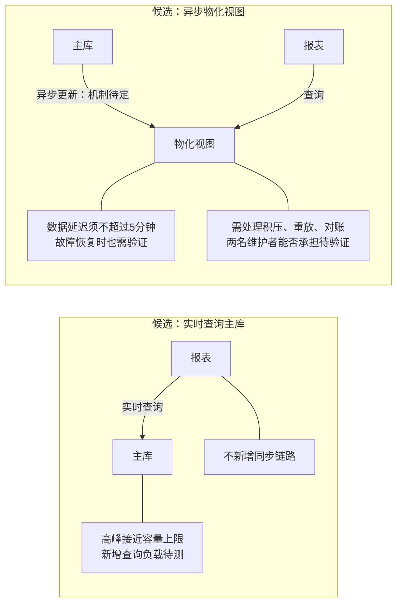

未渲染验证。两种方案均未决定；物化视图可能减少报表直接查询主库的压力，但同步和构建仍有成本。

**有条件建议：优先验证物化视图。** 5分钟延迟容忍度提供了空间，主库高峰容量则限制实时查询；但只有证明延迟达标、恢复可靠且两人能维护，才建议选择它。若代表性高峰压测证明实时查询仍有足够余量、业务延迟可接受，则实时方案因少一条同步链路更合适。两者都不达标时，应调整报表范围或容量后再评估。

选择前需要三组证据：

- **查询成本与容量：** 用真实报表查询、数据规模和并发压测，比较业务延迟、主库CPU/IO与容量余量；物化方案计入同步及构建负载。
- **新鲜度与正确性：** 测量端到端数据延迟，模拟积压、停机和重放，验证5分钟上限及对账结果，明确超限时的产品行为。
- **维护成本：** 演练告警、恢复和对账，记录维护工时、故障处理时间及基础设施成本，确认两人团队可承担。
