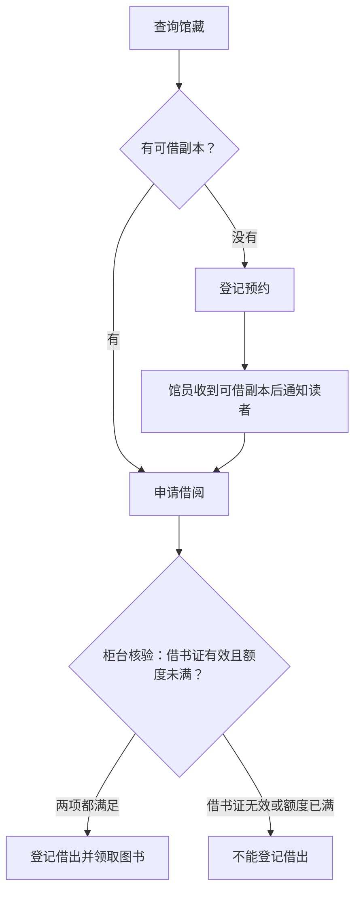
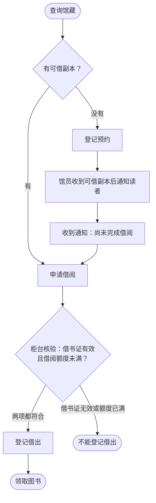
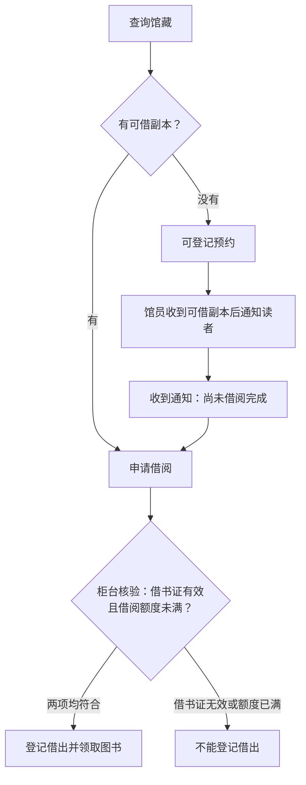
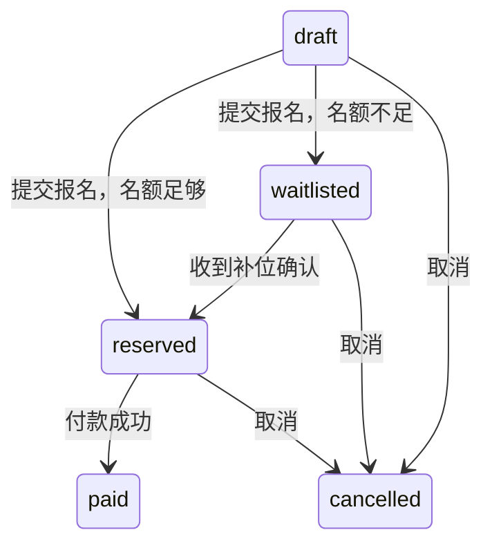
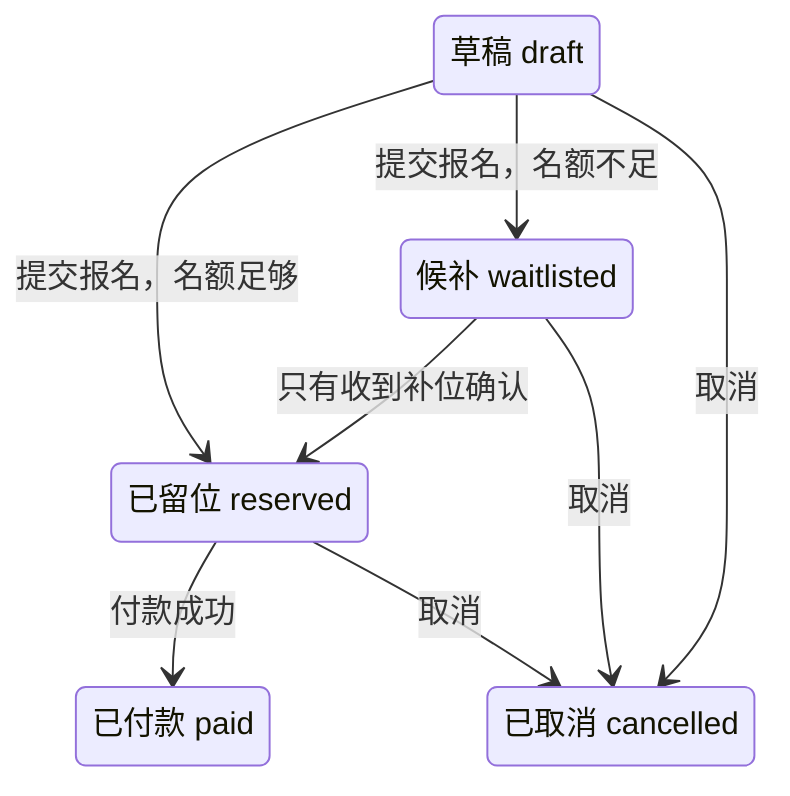
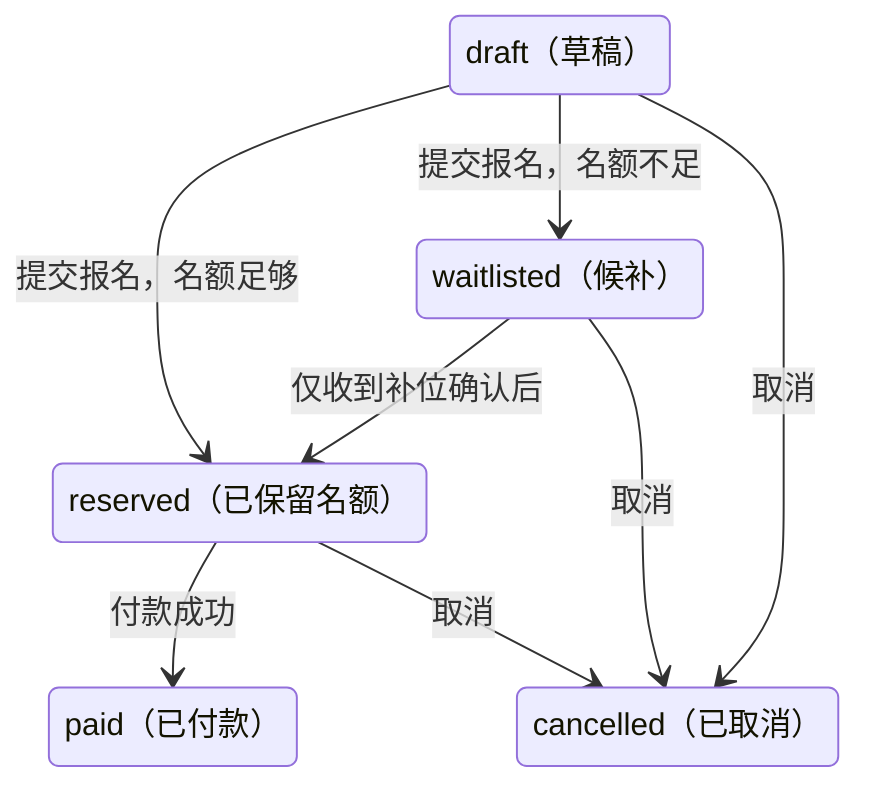

# 三组指引、两题独立生成对照

原始回答未改写。方法、读取记录和检查结果见[报告](README.md)。

## 01-library

请把下面的图书馆借阅规则用最容易看懂的视觉方式说明，面向第一次借书的读者：读者先查询馆藏；有可借副本则可申请借阅；没有可借副本则可登记预约，馆员收到可借副本后通知读者；收到通知不等于借阅完成。无论直接申请还是预约后申请，都必须在柜台核验借书证有效、借阅额度未满，才能登记借出并领取图书。借书证无效或额度已满时不能登记借出。预约优先级、通知期限和逾期处理规则未提供。简短中文，不补新规则，不写项目文档。

### show-me

[原文件](outputs/show-me/01-library.md)

**收到通知 ≠ 借阅完成。** 直接申请和预约后申请，都要通过柜台核验。

预约优先级、通知期限和逾期处理规则未提供。

### mermaid-diagrams

[原文件](outputs/mermaid-diagrams/01-library.md)

先查馆藏，两条路径都要经过柜台核验：

预约优先级、通知期限和逾期处理规则未提供。

### visual-v041

[原文件](outputs/visual-v041/01-library.md)

预约优先级、通知期限和逾期处理规则未提供。

*以上为 Mermaid 源码，未进行语法检查或实际渲染。*

## 02-enrollment

请用图解释课程报名的状态关系及候补与付款的区别：状态有draft、waitlisted、reserved、paid、cancelled。draft提交报名后，名额足够进入reserved，名额不足进入waitlisted；waitlisted只有收到补位确认才进入reserved；reserved付款成功后进入paid。draft、waitlisted、reserved可以取消进入cancelled。paid取消与退款是否允许尚未规定。reserved超时是否自动取消也未规定。排队通知本身不代表补位确认，更不代表已付款。简短中文，保留已知条件与未知，不替课程制定政策。

### show-me

[原文件](outputs/show-me/02-enrollment.md)

- **waitlisted（候补）**：等待补位；排队通知 ≠ 补位确认。
- **reserved（保留名额）**：尚未付款成功；只有付款成功才进入 **paid（已付款）**。
- **未规定**：paid 是否允许取消与退款；reserved 超时是否自动取消。图中不添加这些转换。

### mermaid-diagrams

[原文件](outputs/mermaid-diagrams/02-enrollment.md)

候补是等待名额；已留位仍需付款，付款成功才是 paid。排队通知 ≠ 补位确认 ≠ 已付款。

尚未规定：paid 是否允许取消与退款；reserved 超时是否自动取消。

### visual-v041

[原文件](outputs/visual-v041/02-enrollment.md)

候补不等于已保留名额；已保留名额不等于已付款。**排队通知 ≠ 补位确认 ≠ 付款成功。**

尚未规定：paid 是否允许取消及退款；reserved 超时是否自动取消。图中未将这些未知画成确定的转换。

图为可编辑 Mermaid 源码，未进行语法检查或实际渲染。

