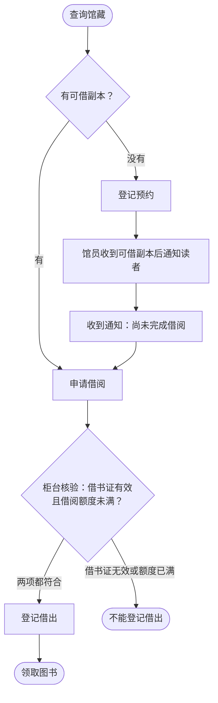

先查馆藏，两条路径都要经过柜台核验：

```mermaid
flowchart TD
    A([查询馆藏]) --> B{有可借副本？}
    B -->|有| C[申请借阅]
    B -->|没有| D[登记预约]
    D --> E[馆员收到可借副本后通知读者]
    E --> F[收到通知：尚未完成借阅]
    F --> C
    C --> G{柜台核验：借书证有效<br/>且借阅额度未满？}
    G -->|两项都符合| H[登记借出]
    H --> I([领取图书])
    G -->|借书证无效或额度已满| J([不能登记借出])
```

预约优先级、通知期限和逾期处理规则未提供。
