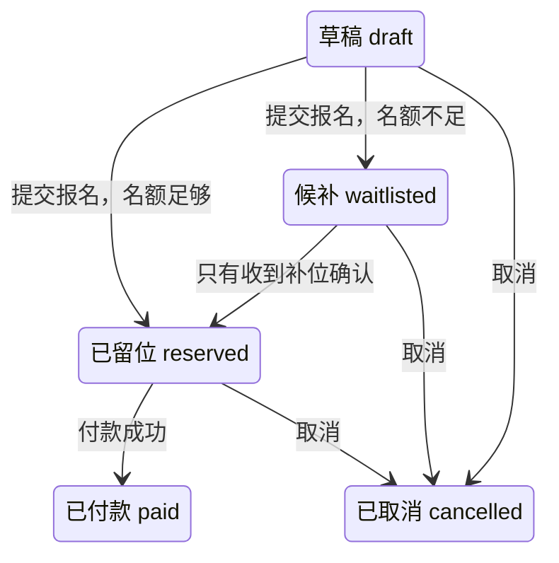

```mermaid
stateDiagram-v2
    state "草稿 draft" as draft
    state "候补 waitlisted" as waitlisted
    state "已留位 reserved" as reserved
    state "已付款 paid" as paid
    state "已取消 cancelled" as cancelled

    draft --> reserved: 提交报名，名额足够
    draft --> waitlisted: 提交报名，名额不足
    waitlisted --> reserved: 只有收到补位确认
    reserved --> paid: 付款成功
    draft --> cancelled: 取消
    waitlisted --> cancelled: 取消
    reserved --> cancelled: 取消
```

候补是等待名额；已留位仍需付款，付款成功才是 paid。排队通知 ≠ 补位确认 ≠ 已付款。

尚未规定：paid 是否允许取消与退款；reserved 超时是否自动取消。
