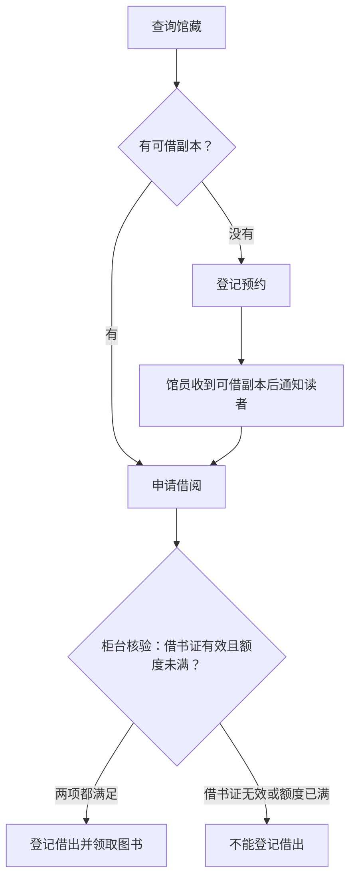

```mermaid
flowchart TD
    A[查询馆藏] --> B{有可借副本？}
    B -->|有| C[申请借阅]
    B -->|没有| D[登记预约]
    D --> E[馆员收到可借副本后通知读者]
    E --> C
    C --> F{柜台核验：借书证有效且额度未满？}
    F -->|两项都满足| G[登记借出并领取图书]
    F -->|借书证无效或额度已满| H[不能登记借出]
```

**收到通知 ≠ 借阅完成。** 直接申请和预约后申请，都要通过柜台核验。

预约优先级、通知期限和逾期处理规则未提供。
