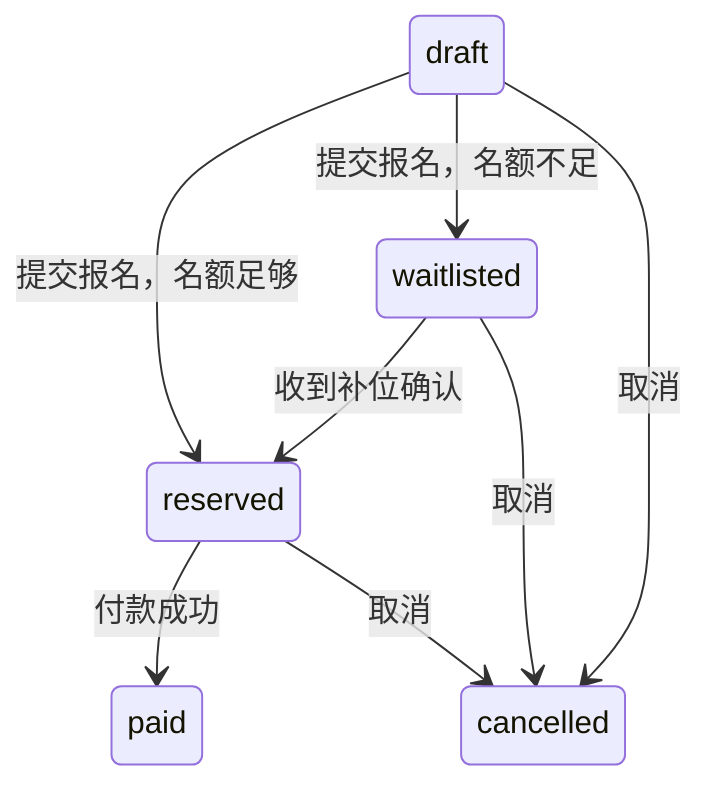

```mermaid
stateDiagram-v2
    draft --> reserved: 提交报名，名额足够
    draft --> waitlisted: 提交报名，名额不足
    waitlisted --> reserved: 收到补位确认
    reserved --> paid: 付款成功
    draft --> cancelled: 取消
    waitlisted --> cancelled: 取消
    reserved --> cancelled: 取消
```

- **waitlisted（候补）**：等待补位；排队通知 ≠ 补位确认。
- **reserved（保留名额）**：尚未付款成功；只有付款成功才进入 **paid（已付款）**。
- **未规定**：paid 是否允许取消与退款；reserved 超时是否自动取消。图中不添加这些转换。
