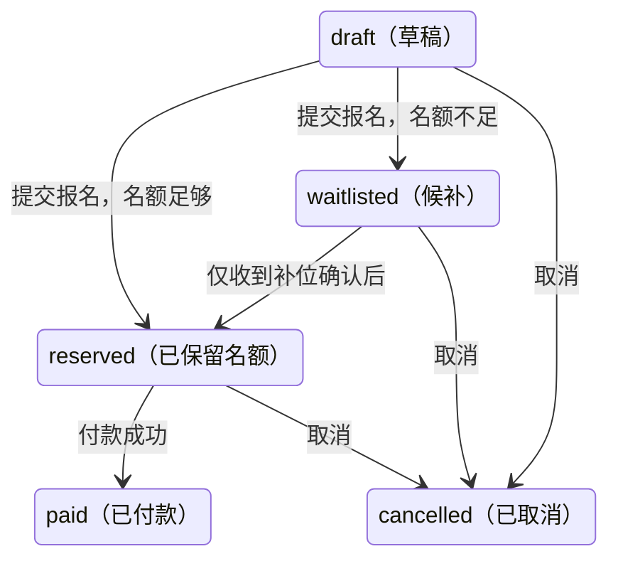

```mermaid
stateDiagram-v2
    state "draft（草稿）" as draft
    state "waitlisted（候补）" as waitlisted
    state "reserved（已保留名额）" as reserved
    state "paid（已付款）" as paid
    state "cancelled（已取消）" as cancelled

    draft --> reserved: 提交报名，名额足够
    draft --> waitlisted: 提交报名，名额不足
    waitlisted --> reserved: 仅收到补位确认后
    reserved --> paid: 付款成功
    draft --> cancelled: 取消
    waitlisted --> cancelled: 取消
    reserved --> cancelled: 取消
```

候补不等于已保留名额；已保留名额不等于已付款。**排队通知 ≠ 补位确认 ≠ 付款成功。**

尚未规定：paid 是否允许取消及退款；reserved 超时是否自动取消。图中未将这些未知画成确定的转换。

图为可编辑 Mermaid 源码，未进行语法检查或实际渲染。
