# 0.4.1 与 0.4.2：原始产出及实际画面对照

**新版质量可用，但本轮没有显示相对 0.4.1 的明确整体优势。** 两版拿到实际图片后都识别并修正了布局问题，关键关系未因拆图而删除。0.4.2 把检查与修图要求写得更明确，建议保留这条小改动；本轮不支持继续增加规则。

每版两题，各一条独立容器/会话轨迹，同一 `gpt-6.1-sol`；两次同等图片反馈，无人工修图提示。完整[方法与限制](README.md)、[运行证据](runs.json)、[评审记录](content-review.json)。这轮不重新测试 show-me/Mermaid 单独组，直接比较本次改动前后的两版。

| 比较项 | 0.4.1 | 0.4.2 | 判断 |
|---|---|---|---|
| 发布体系 | 3→3 图；保留时序，优化标签和状态图 | 3→3 图；将长时序改为批次结果流程图 | 新版的局部决策更直接，两版完整可用 |
| 跨组织 C4 | 2→4 图；拆分订单、付款、查询 | 4→5 图；进一步分开订单发送与交付处理 | 两版最终清楚；新版更多视图，旧版导航更少 |
| 事实与关系 | 未发现关键遗漏或新增机制 | 未发现关键遗漏或新增机制 | 持平 |
| 最终语法与实际渲染 | 7/7 | 8/8 | 持平 |
| 图片检查后交付 | 最终源码与已检查修订图一致 | 最终源码与已检查修订图一致 | 持平 |

初稿共 12 图，修订稿共 15 图，27 个图块均实际生成 SVG/PNG；最终稿的图源码均未再改变，复用已检查修订图。最终 15 图另外通过 Mermaid 12.1.0 语法解析。渲染成功不代表内容正确，内容与可读性由本轮人工评审分别检查。

## 发布体系

两版都保留：不可变产物关联、状态转换、取消限制、失败停批且不自动回滚、重复结果不推进、角色限制与不能审批自己的单；具体校验位置仍标明未提供。0.4.2 把结果处理单独画成流程图，启动顺序和产物访问由其他视图及文字承载。

## 跨组织 C4

两版最终均保留 12 个内部运行单元、19 种不同端点通信关系与 6 条上下文关系；三库独立实例、两个 API 独立部署、只读查询与组织归属完整。回调网关→Kafka 在不同过滤视图中分别展示交付和付款结果，属于同一端点关系的事件细分，不算新增连接。

两版均从 Mermaid 专用 C4 图改为带明确层级和边界的 flowchart；任务要求 C4 体系，没有限定 Mermaid 专用 C4 语法，因此不将语法转换判为错误。新版多一张图，局部路径更少；旧版付款图更紧凑。两版仍有节点名称换行，缩小到整页阅读时宜打开 SVG 放大。

## 发布体系：逐版查看

### v041 最终画面

[最终原始回答](outputs/v041/01-mixed.md) · [初稿](trajectories/v041/01-mixed/stage0/answer.md) · [修订稿](trajectories/v041/01-mixed/stage1/answer.md)

图 1 · `flowchart LR` · [SVG 放大](trajectories/v041/01-mixed/rendered/stage1-1.svg)

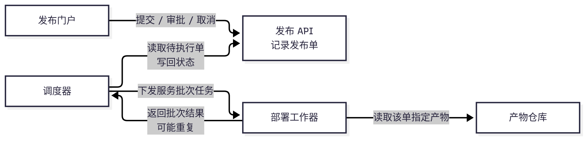

图 2 · `stateDiagram-v2` · [SVG 放大](trajectories/v041/01-mixed/rendered/stage1-2.svg)

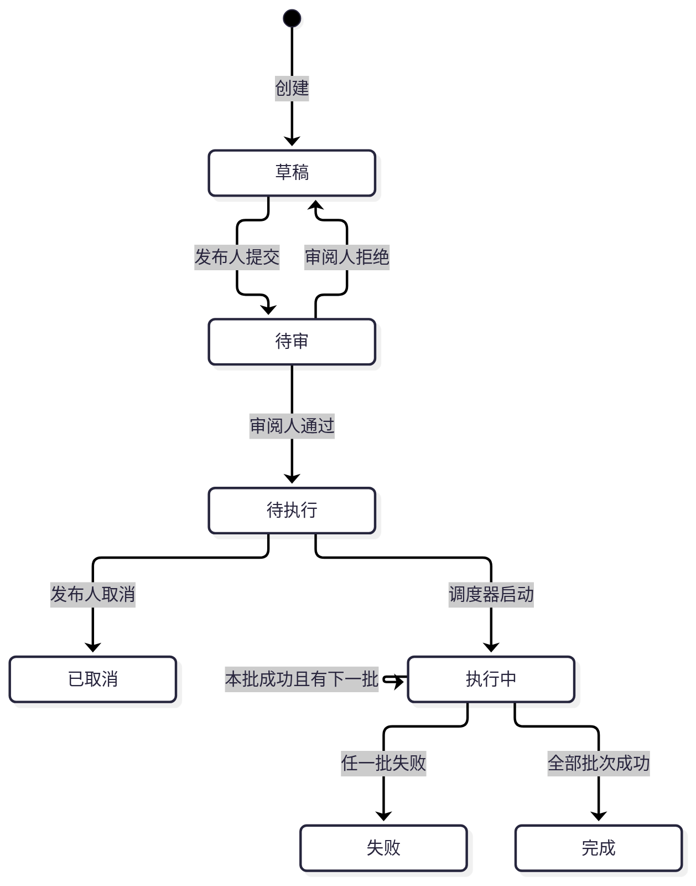

图 3 · `sequenceDiagram` · [SVG 放大](trajectories/v041/01-mixed/rendered/stage1-3.svg)

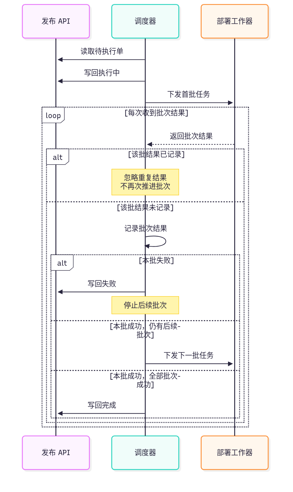

v041 初稿实际图片（3 张）

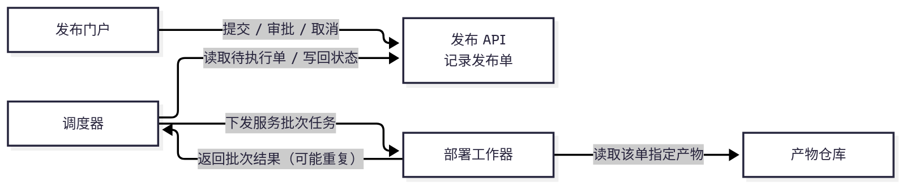

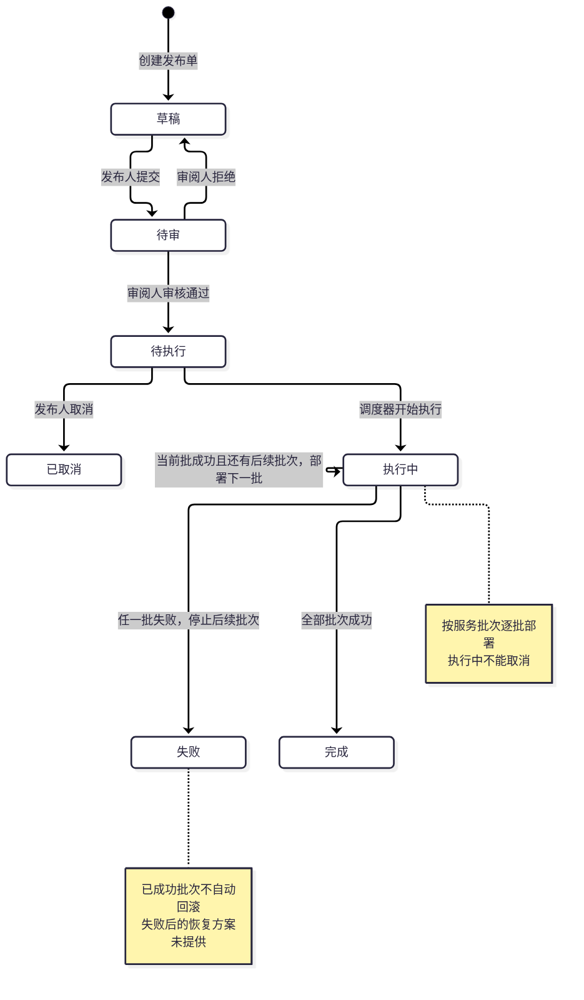

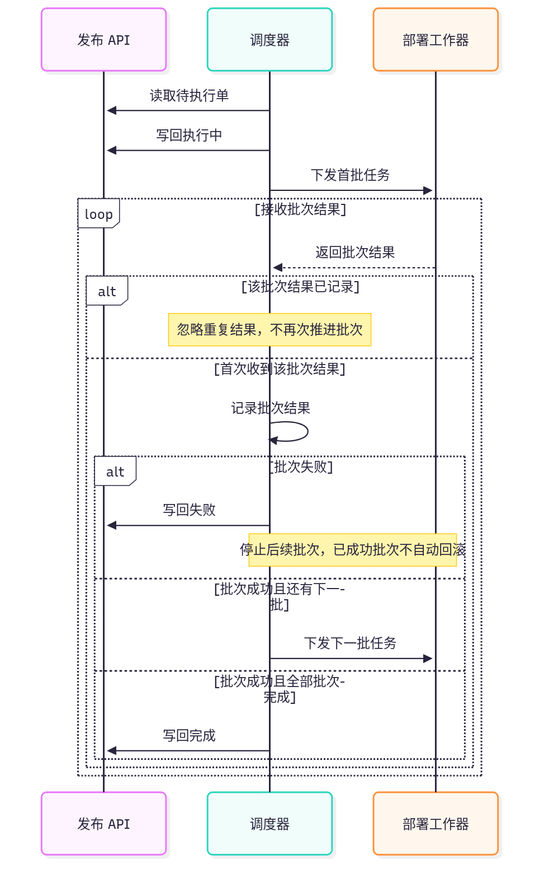

v041 最终原文（未经人工修改）

### 各部分怎样协作

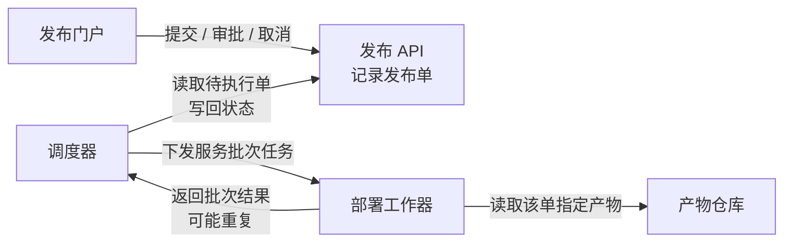
```mermaid
flowchart LR
    P["发布门户"] -->|"提交 / 审批 / 取消"| A["发布 API<br/>记录发布单"]
    S["调度器"] -->|"读取待执行单<br/>写回状态"| A
    S -->|"下发服务批次任务"| W["部署工作器"]
    W -->|"返回批次结果<br/>可能重复"| S
    W -->|"读取该单指定产物"| R["产物仓库"]
```

每张发布单关联且仅关联 **一个不可变构建产物**；同一产物可被多个发布单使用。

### 发布状态与异常

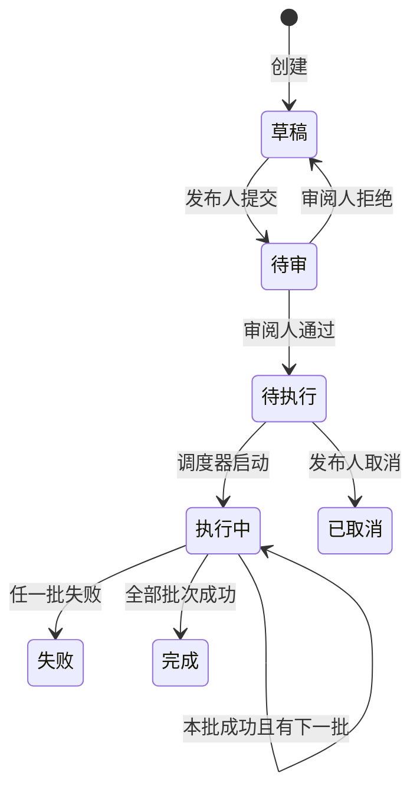
```mermaid
stateDiagram-v2
    state "草稿" as Draft
    state "待审" as Review
    state "待执行" as Ready
    state "执行中" as Running
    state "已取消" as Cancelled
    state "失败" as Failed
    state "完成" as Done

    [*] --> Draft: 创建
    Draft --> Review: 发布人提交
    Review --> Draft: 审阅人拒绝
    Review --> Ready: 审阅人通过
    Ready --> Cancelled: 发布人取消
    Ready --> Running: 调度器启动
    Running --> Running: 本批成功且有下一批
    Running --> Failed: 任一批失败
    Running --> Done: 全部批次成功
```

调度器只启动待执行单，先进入执行中，再按服务批次逐批部署。**每批成功才部署下一批；执行中不能取消。** 任一批失败就停止后续批次，已成功批次不自动回滚。执行阶段的状态转换均由调度器推进。

### 批次结果如何推进状态

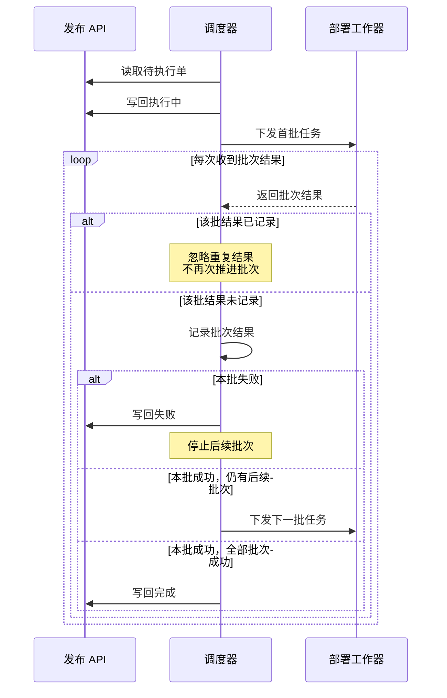
```mermaid
sequenceDiagram
    participant A as 发布 API
    participant S as 调度器
    participant W as 部署工作器

    S->>A: 读取待执行单
    S->>A: 写回执行中
    S->>W: 下发首批任务

    loop 每次收到批次结果
        W-->>S: 返回批次结果
        alt 该批结果已记录
            Note over S: 忽略重复结果<br/>不再次推进批次
        else 该批结果未记录
            S->>S: 记录批次结果
            alt 本批失败
                S->>A: 写回失败
                Note over S: 停止后续批次
            else 本批成功，仍有后续批次
                S->>W: 下发下一批任务
            else 本批成功，全部批次成功
                S->>A: 写回完成
            end
        end
    end
```

失败或完成后，已记录批次的重复回报仍被忽略，不会重新推进批次。

### 审批约束落在哪里

门户是操作入口，API 接收请求并记录发布单。提交、审批、取消请求须满足以下规则；具体校验实现未提供。

| 主体 | 允许的动作 | 约束 |
|---|---|---|
| 发布人 | 只能提交、取消 | 草稿可提交；待执行可取消；执行中不可取消 |
| 审阅人 | 只能审批通过、拒绝 | 仅审批待审单；不能审批自己提交的单 |
| 调度器 | 只能推进执行状态 | 只启动待执行单；根据批次结果推进状态 |

**一个人可以拥有两个角色，但同一单的提交人不能审批该单。** 双角色不解除这一限制。

未提供数据库、消息队列、通知、超时、自动重试或失败后恢复方案，图中不作补充。

三张图的源码保持上一版不变，已查看实际渲染画面，文字及连线可辨；未另行运行语法检查。

### v042 最终画面

[最终原始回答](outputs/v042/01-mixed.md) · [初稿](trajectories/v042/01-mixed/stage0/answer.md) · [修订稿](trajectories/v042/01-mixed/stage1/answer.md)

图 1 · `flowchart LR` · [SVG 放大](trajectories/v042/01-mixed/rendered/stage1-1.svg)

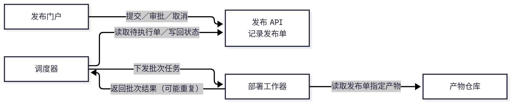

图 2 · `stateDiagram-v2` · [SVG 放大](trajectories/v042/01-mixed/rendered/stage1-2.svg)

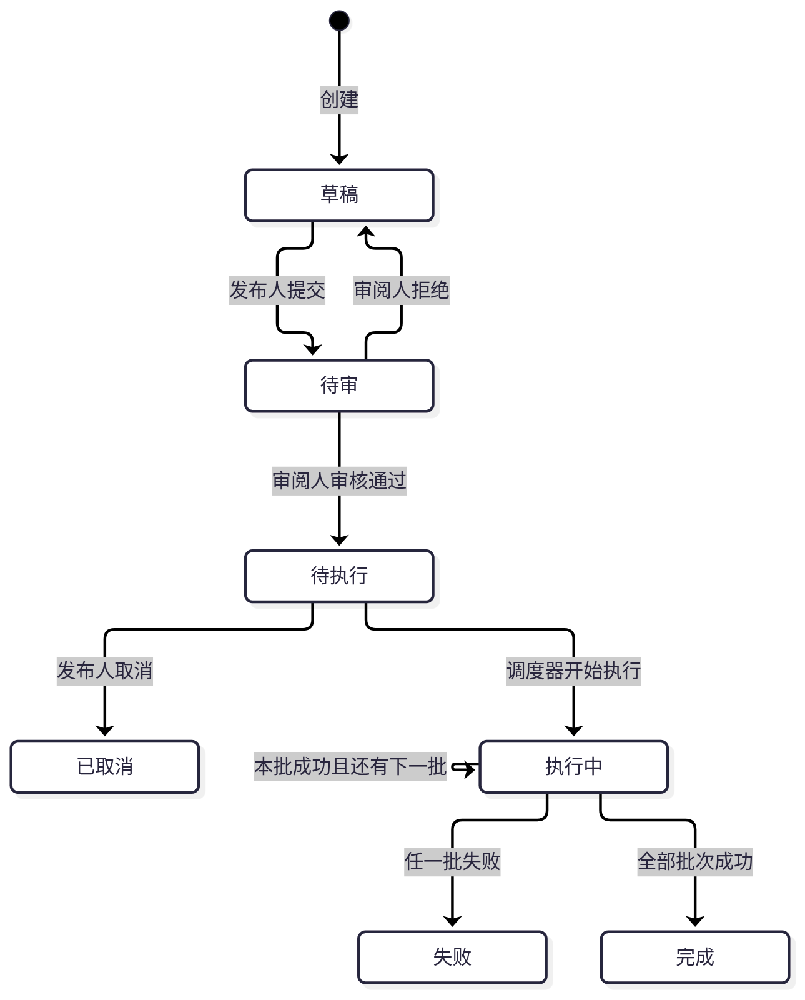

图 3 · `flowchart TD` · [SVG 放大](trajectories/v042/01-mixed/rendered/stage1-3.svg)

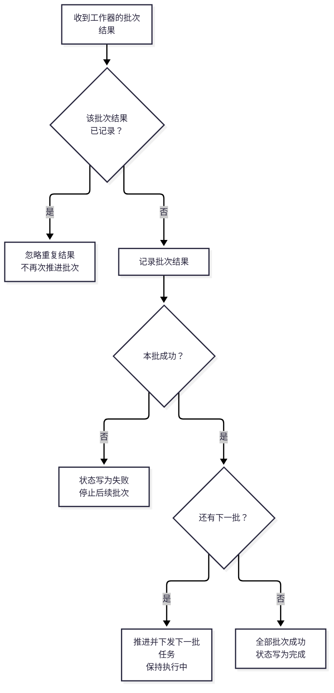

v042 初稿实际图片（3 张）

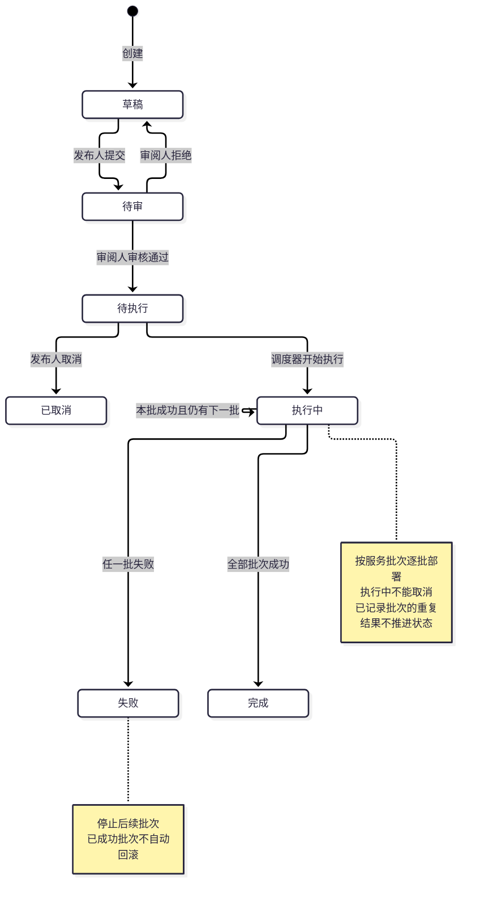

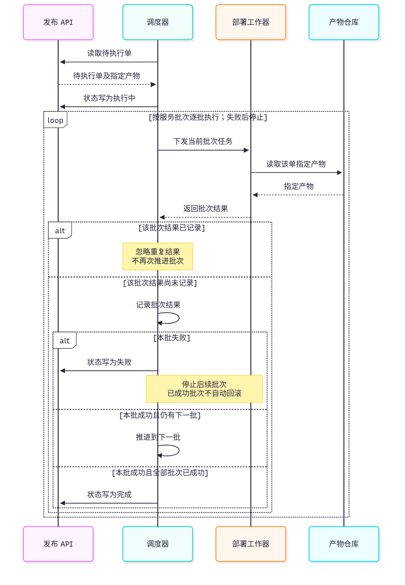

v042 最终原文（未经人工修改）

### 各部分怎样协作

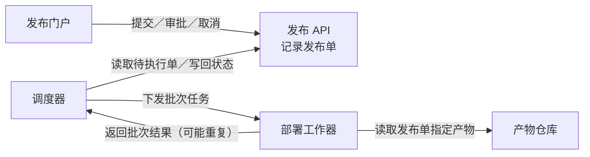
```mermaid
flowchart LR
    P["发布门户"] -->|"提交／审批／取消"| A["发布 API<br/>记录发布单"]
    S["调度器"] -->|"读取待执行单／写回状态"| A
    S -->|"下发批次任务"| W["部署工作器"]
    W -->|"返回批次结果（可能重复）"| S
    W -->|"读取发布单指定产物"| R["产物仓库"]
```

每个发布单**仅关联一个不可变构建产物**；同一产物可供多个发布单使用。工作器执行部署并返回批次结果，调度器负责推进批次和更新发布状态。

### 发布状态怎样演变

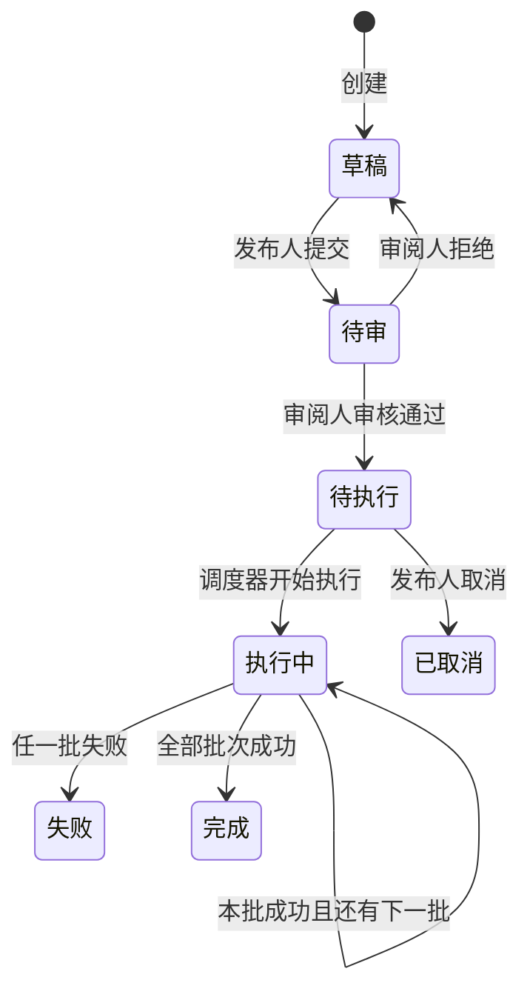
```mermaid
stateDiagram-v2
    direction TB
    state "草稿" as Draft
    state "待审" as Review
    state "待执行" as Ready
    state "执行中" as Running
    state "已取消" as Cancelled
    state "失败" as Failed
    state "完成" as Done

    [*] --> Draft: 创建
    Draft --> Review: 发布人提交
    Review --> Draft: 审阅人拒绝
    Review --> Ready: 审阅人审核通过
    Ready --> Cancelled: 发布人取消
    Ready --> Running: 调度器开始执行
    Running --> Running: 本批成功且还有下一批
    Running --> Failed: 任一批失败
    Running --> Done: 全部批次成功
```

调度器**只执行待执行单**，先将状态改为执行中，再按服务批次逐批部署。**执行中不能取消**；失败时停止后续批次，已成功批次不自动回滚。

### 批次结果怎样处理

此图展开调度器收到结果后的逻辑。只有尚未记录的批次结果才能触发推进；重复结果不会再次下发下一批。

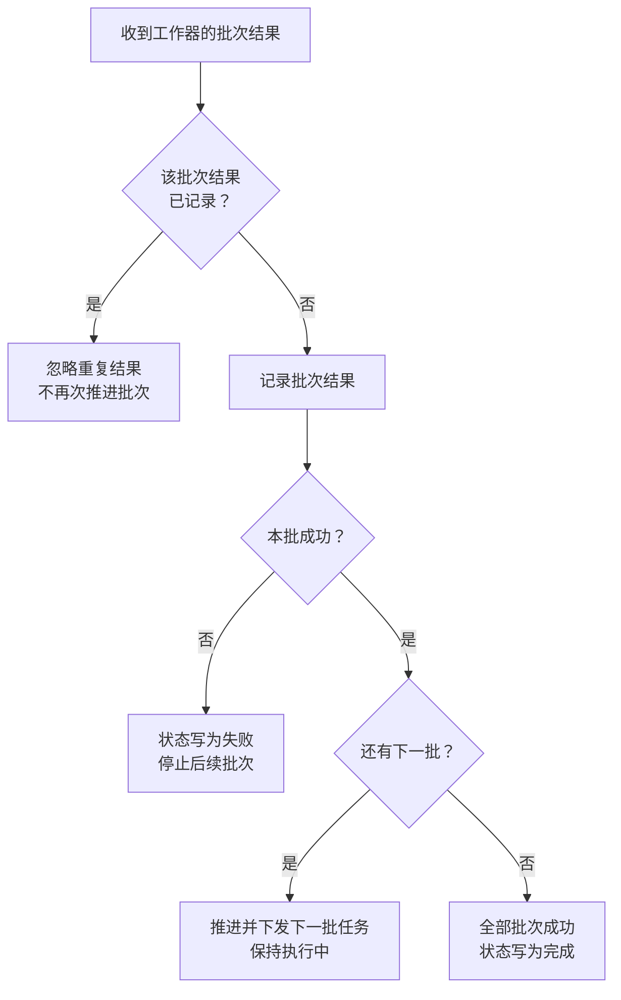
```mermaid
flowchart TD
    R["收到工作器的批次结果"] --> D{"该批次结果<br/>已记录？"}
    D -->|"是"| I["忽略重复结果<br/>不再次推进批次"]
    D -->|"否"| N["记录批次结果"]
    N --> S{"本批成功？"}
    S -->|"否"| F["状态写为失败<br/>停止后续批次"]
    S -->|"是"| M{"还有下一批？"}
    M -->|"是"| B["推进并下发下一批任务<br/>保持执行中"]
    M -->|"否"| C["全部批次成功<br/>状态写为完成"]
```

### 审批与操作约束

门户向 API 发起操作。下表给出操作必须遵守的约束；具体校验实现位置未提供。

| 主体 | 允许的操作 | 必须满足的约束 |
|---|---|---|
| 发布人 | 只能提交、取消 | 草稿可提交；仅待执行可取消 |
| 审阅人 | 只能审批：通过或拒绝 | 仅审批待审单；不能审批自己提交的同一单 |
| 调度器 | 只能推进执行状态 | 只执行待执行单；依据批次结果推进 |

一个人可以拥有发布人和审阅人两个角色，但**同一单的提交人不能审批该单**。

未提供数据库、消息队列、通知、超时、自动重试或失败后恢复方案，图中不补设这些机制。

已检查回传画面：文字可读，未见标签重叠或连线遮挡关键内容。本次保留已检查的三段图源码。

## 跨组织 C4：逐版查看

### v041 最终画面

[最终原始回答](outputs/v041/02-c4.md) · [初稿](trajectories/v041/02-c4/stage0/answer.md) · [修订稿](trajectories/v041/02-c4/stage1/answer.md)

图 1 · `flowchart TB` · [SVG 放大](trajectories/v041/02-c4/rendered/stage1-1.svg)

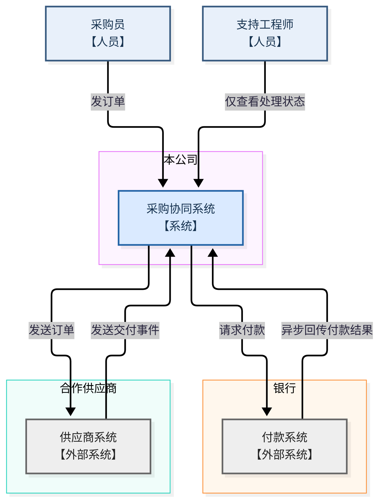

图 2 · `flowchart LR` · [SVG 放大](trajectories/v041/02-c4/rendered/stage1-2.svg)

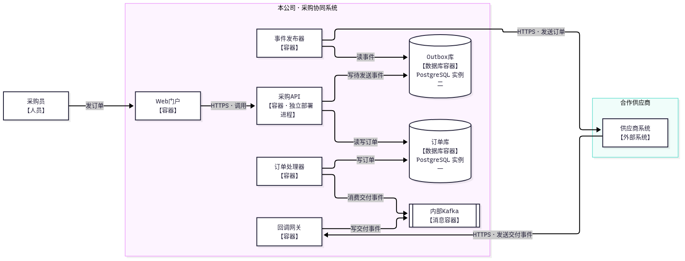

图 3 · `flowchart LR` · [SVG 放大](trajectories/v041/02-c4/rendered/stage1-3.svg)

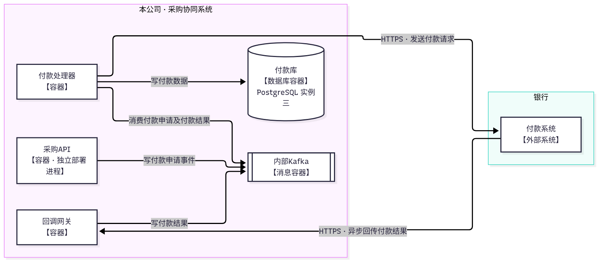

图 4 · `flowchart LR` · [SVG 放大](trajectories/v041/02-c4/rendered/stage1-4.svg)

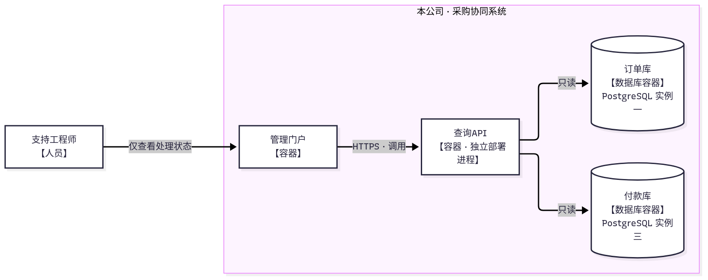

v041 初稿实际图片（2 张）

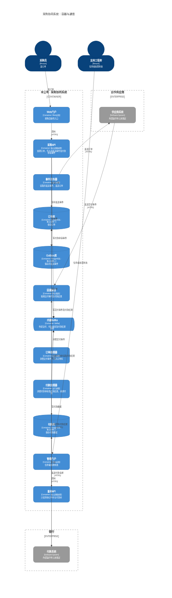

v041 最终原文（未经人工修改）

采用 C4 的两层视图：**系统上下文**展示组织归属和跨组织协作；**容器视图**展示本公司内部运行单元，按三个通信场景分别展开。同名节点代表同一个运行单元。

### 系统上下文：组织与系统边界

此层只展示人员和系统，不展开内部容器。

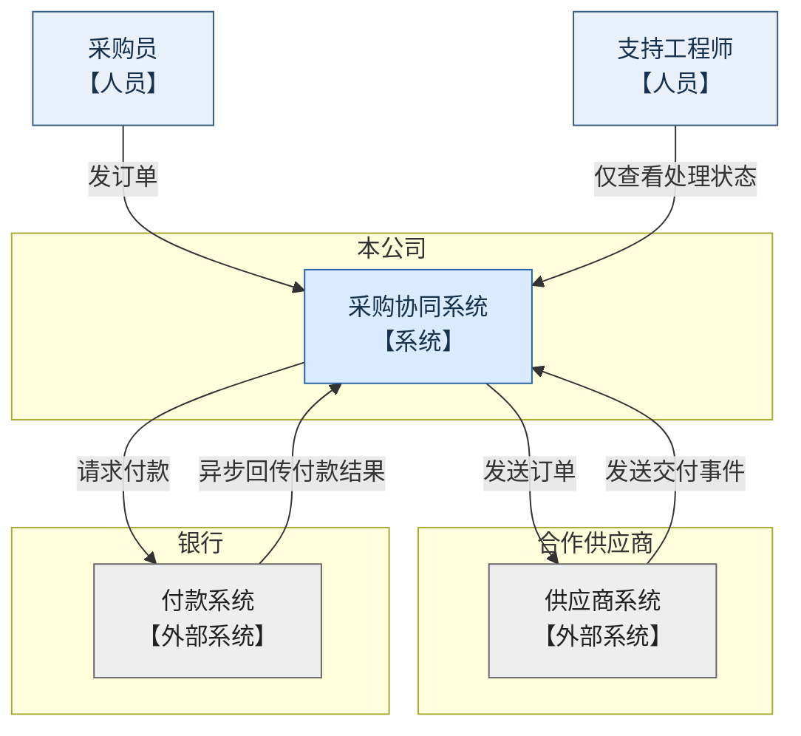
```mermaid
flowchart TB
    buyer["采购员<br/>【人员】"]
    support["支持工程师<br/>【人员】"]

    subgraph company["本公司"]
        procurement["采购协同系统<br/>【系统】"]
    end

    subgraph supplierOrg["合作供应商"]
        supplier["供应商系统<br/>【外部系统】"]
    end

    subgraph bankOrg["银行"]
        bank["付款系统<br/>【外部系统】"]
    end

    buyer -->|"发订单"| procurement
    support -->|"仅查看处理状态"| procurement
    procurement -->|"发送订单"| supplier
    supplier -->|"发送交付事件"| procurement
    procurement -->|"请求付款"| bank
    bank -->|"异步回传付款结果"| procurement

    classDef person fill:#e8f0fa,stroke:#375a7f,color:#16324f
    classDef internal fill:#daeaff,stroke:#2463a6,color:#16324f
    classDef external fill:#eeeeee,stroke:#666666,color:#222222
    class buyer,support person
    class procurement internal
    class supplier,bank external
```

### 容器视图：订单发送与交付处理

内部节点均为容器级运行单元，供应商仍以外部系统呈现。箭头表示调用或访问方向：读取指向数据库，消费指向 Kafka；边上的文字说明具体操作。

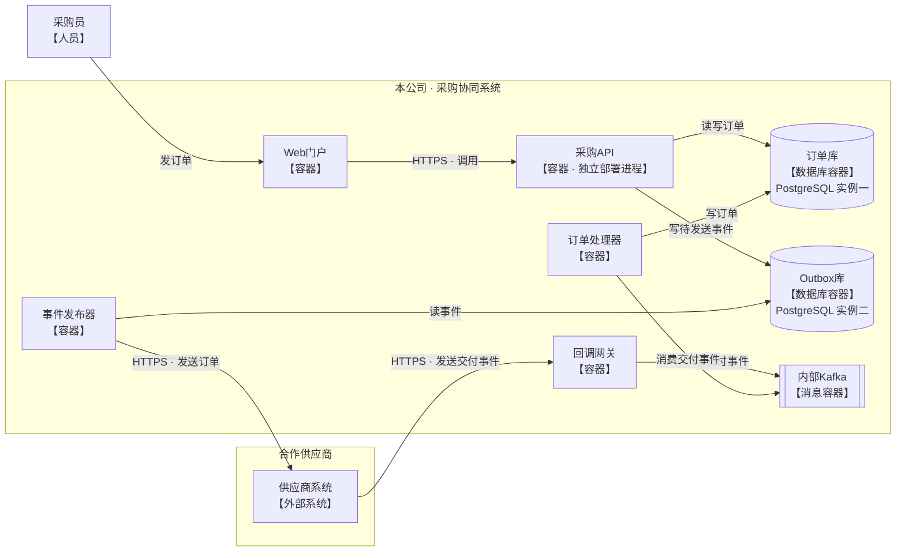
```mermaid
flowchart LR
    buyer["采购员<br/>【人员】"]

    subgraph company["本公司 · 采购协同系统"]
        web["Web门户<br/>【容器】"]
        api["采购API<br/>【容器 · 独立部署进程】"]
        orders[("订单库<br/>【数据库容器】<br/>PostgreSQL 实例一")]
        outbox[("Outbox库<br/>【数据库容器】<br/>PostgreSQL 实例二")]
        publisher["事件发布器<br/>【容器】"]
        callback["回调网关<br/>【容器】"]
        kafka[["内部Kafka<br/>【消息容器】"]]
        worker["订单处理器<br/>【容器】"]

        web -->|"HTTPS · 调用"| api
        api -->|"读写订单"| orders
        api -->|"写待发送事件"| outbox
        publisher -->|"读事件"| outbox
        callback -->|"写交付事件"| kafka
        worker -->|"消费交付事件"| kafka
        worker -->|"写订单"| orders
    end

    subgraph supplierOrg["合作供应商"]
        supplier["供应商系统<br/>【外部系统】"]
    end

    buyer -->|"发订单"| web
    publisher -->|"HTTPS · 发送订单"| supplier
    supplier -->|"HTTPS · 发送交付事件"| callback
```

### 容器视图：付款申请与异步结果

采购API写入付款申请事件，付款处理器消费申请并请求银行付款。银行异步结果经回调网关写入 Kafka，再由付款处理器消费并写付款库。

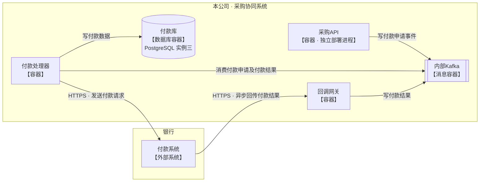
```mermaid
flowchart LR
    subgraph company["本公司 · 采购协同系统"]
        api["采购API<br/>【容器 · 独立部署进程】"]
        kafka[["内部Kafka<br/>【消息容器】"]]
        worker["付款处理器<br/>【容器】"]
        callback["回调网关<br/>【容器】"]
        payments[("付款库<br/>【数据库容器】<br/>PostgreSQL 实例三")]

        api -->|"写付款申请事件"| kafka
        worker -->|"消费付款申请及付款结果"| kafka
        callback -->|"写付款结果"| kafka
        worker -->|"写付款数据"| payments
    end

    subgraph bankOrg["银行"]
        bank["付款系统<br/>【外部系统】"]
    end

    worker -->|"HTTPS · 发送付款请求"| bank
    bank -->|"HTTPS · 异步回传付款结果"| callback
```

### 容器视图：处理状态只读查询

支持工程师只通过管理门户查看处理状态；查询API只读订单库和付款库。

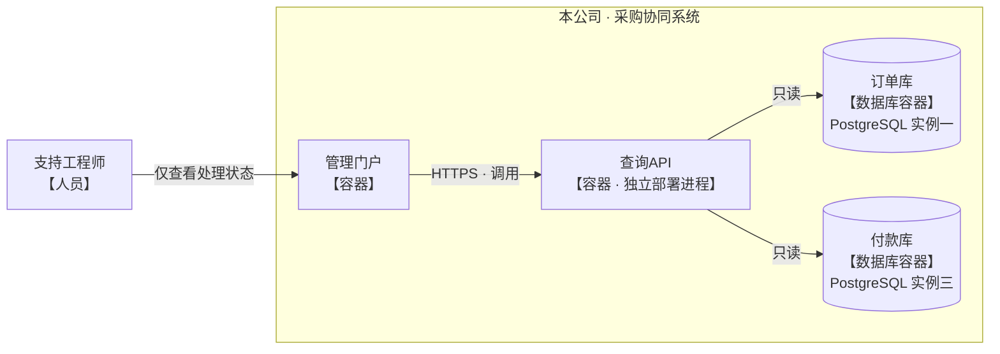
```mermaid
flowchart LR
    support["支持工程师<br/>【人员】"]

    subgraph company["本公司 · 采购协同系统"]
        admin["管理门户<br/>【容器】"]
        query["查询API<br/>【容器 · 独立部署进程】"]
        orders[("订单库<br/>【数据库容器】<br/>PostgreSQL 实例一")]
        payments[("付款库<br/>【数据库容器】<br/>PostgreSQL 实例三")]

        admin -->|"HTTPS · 调用"| query
        query -->|"只读"| orders
        query -->|"只读"| payments
    end

    support -->|"仅查看处理状态"| admin
```

订单库、Outbox库、付款库是**三个独立 PostgreSQL 实例**；采购API与查询API是**两个独立部署进程**。未规定的通信协议、Kafka主题和外部系统内部容器未展开，也未添加其他服务或连接。

这四个图块的源码与本轮已看到的渲染版本一致；画面中的关系标签可辨识，未见上一版的文字重叠或过度狭长问题。

### v042 最终画面

[最终原始回答](outputs/v042/02-c4.md) · [初稿](trajectories/v042/02-c4/stage0/answer.md) · [修订稿](trajectories/v042/02-c4/stage1/answer.md)

图 1 · `flowchart TB` · [SVG 放大](trajectories/v042/02-c4/rendered/stage1-1.svg)

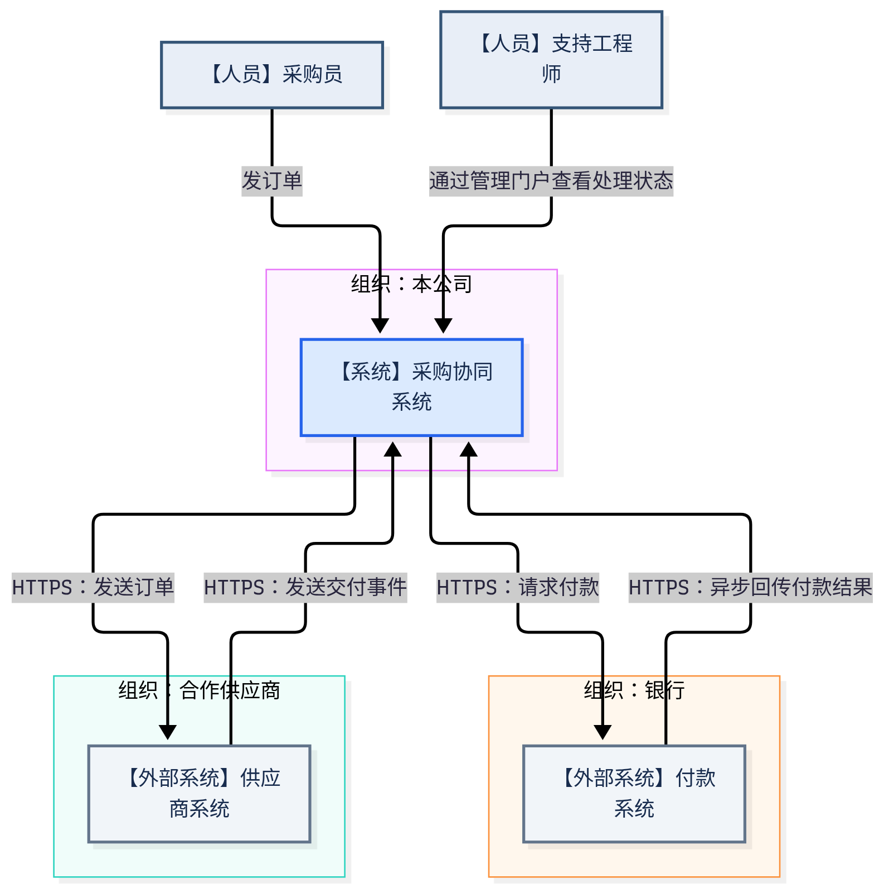

图 2 · `flowchart LR` · [SVG 放大](trajectories/v042/02-c4/rendered/stage1-2.svg)

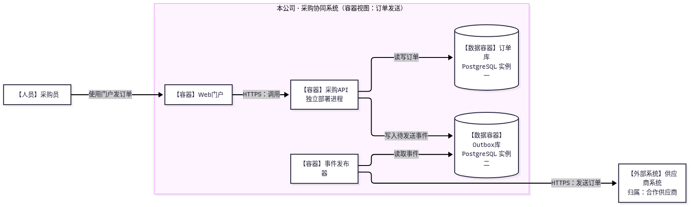

图 3 · `flowchart LR` · [SVG 放大](trajectories/v042/02-c4/rendered/stage1-3.svg)

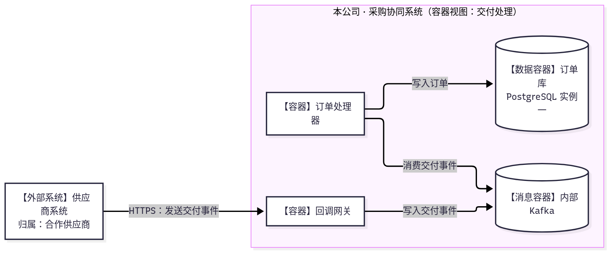

图 4 · `flowchart TB` · [SVG 放大](trajectories/v042/02-c4/rendered/stage1-4.svg)

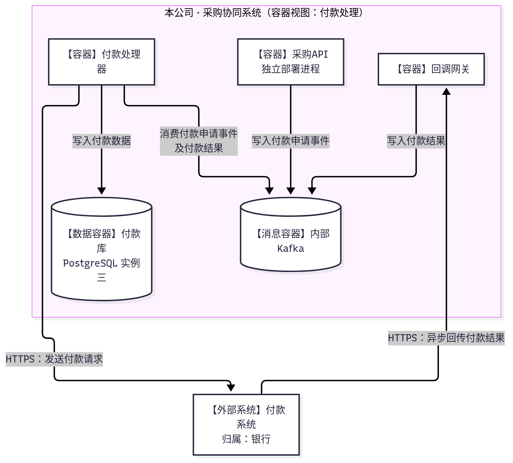

图 5 · `flowchart LR` · [SVG 放大](trajectories/v042/02-c4/rendered/stage1-5.svg)

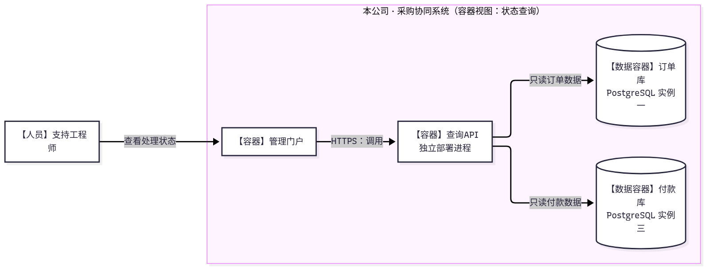

v042 初稿实际图片（4 张）

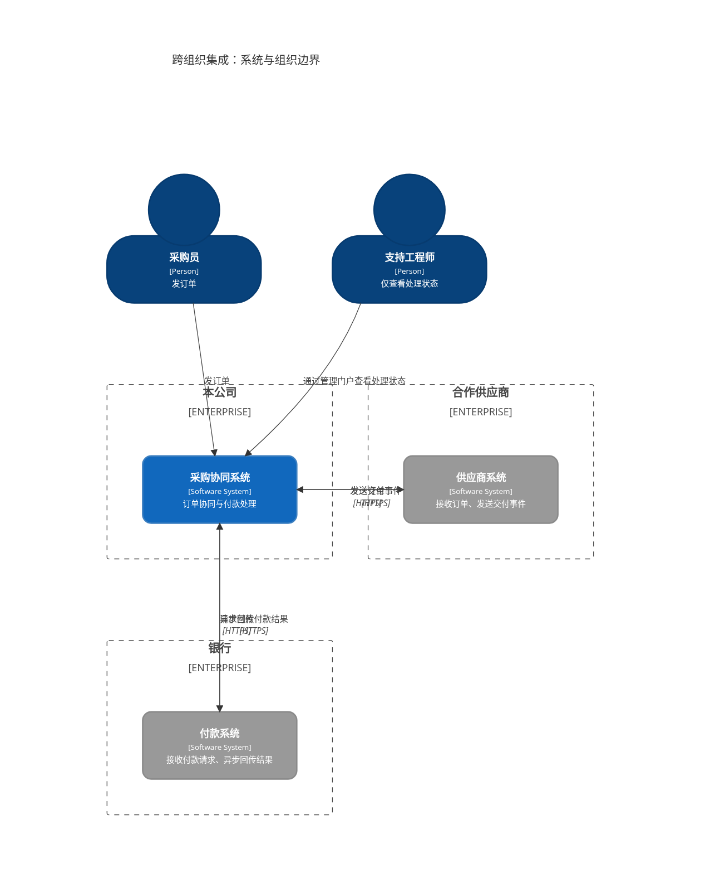

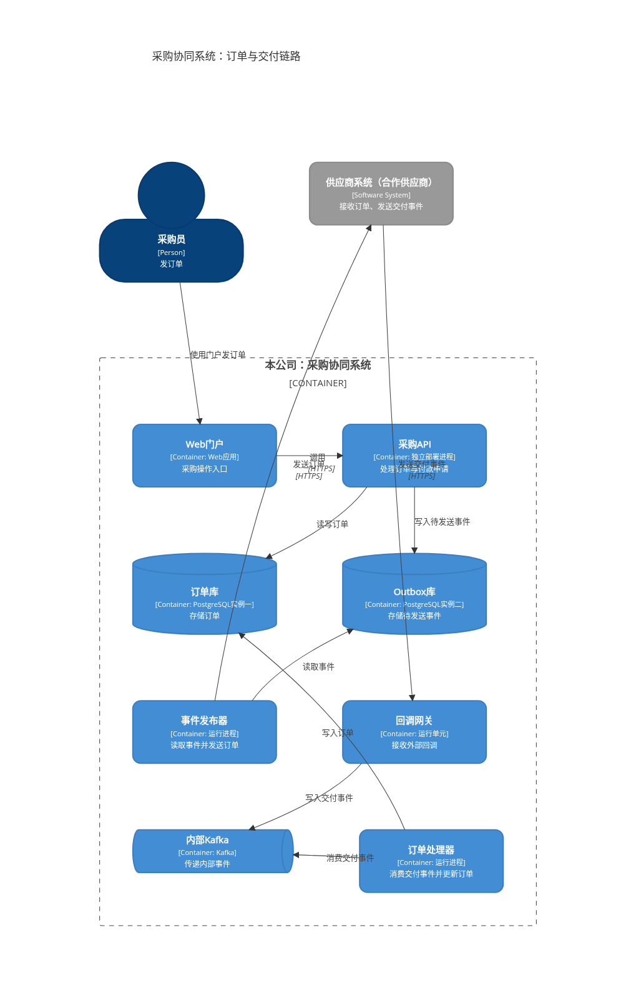

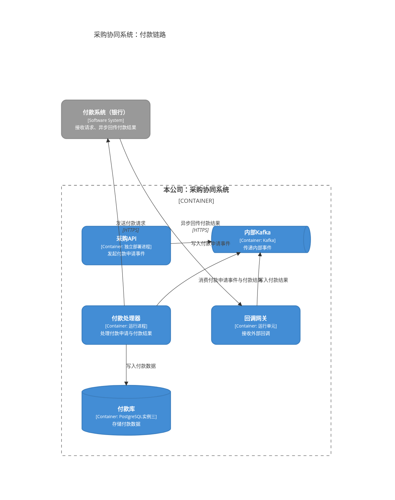

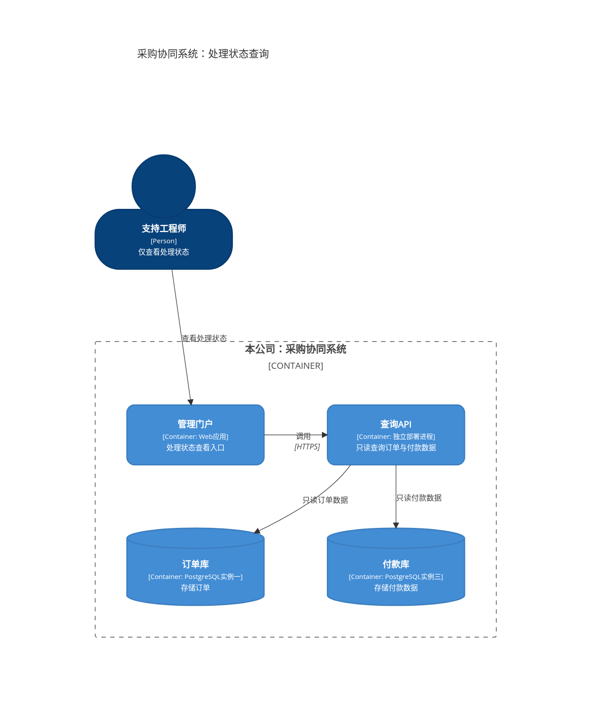

v042 最终原文（未经人工修改）

已检查五张实际渲染图：通信标签已分开，未见连线遮挡关键节点；部分名称有自动换行，但仍可辨认。以下保留已检查的图源码。

**阅读规则：**C4 上下文视图展示人员、系统和组织边界；容器视图展开本公司系统的运行单元，外部系统保持整体。箭头表示调用或访问方向，标签说明读取、写入和消费。同名节点在各图中代表同一运行单元。

### 1. 系统上下文：组织边界

采购协同系统归本公司所有，供应商系统和付款系统分别归合作供应商、银行所有。

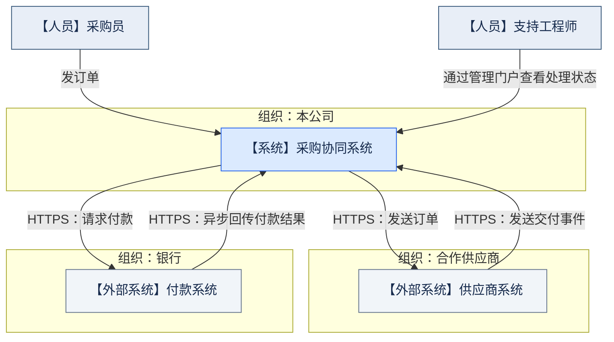
```mermaid
flowchart TB
    buyer["【人员】采购员"]
    support["【人员】支持工程师"]

    subgraph company["组织：本公司"]
        procurement["【系统】采购协同系统"]
    end

    subgraph supplierOrg["组织：合作供应商"]
        supplier["【外部系统】供应商系统"]
    end

    subgraph bankOrg["组织：银行"]
        bank["【外部系统】付款系统"]
    end

    buyer -->|"发订单"| procurement
    support -->|"通过管理门户查看处理状态"| procurement
    procurement -->|"HTTPS：发送订单"| supplier
    supplier -->|"HTTPS：发送交付事件"| procurement
    procurement -->|"HTTPS：请求付款"| bank
    bank -->|"HTTPS：异步回传付款结果"| procurement

    classDef person fill:#e8eef7,stroke:#345577,color:#172b4d
    classDef internal fill:#dbeafe,stroke:#2563eb,color:#172b4d
    classDef external fill:#f1f5f9,stroke:#64748b,color:#172b4d
    class buyer,support person
    class procurement internal
    class supplier,bank external
```

### 2. 容器视图：订单发送

采购API读写订单库、写入Outbox库；事件发布器读取Outbox事件，向供应商发送订单。

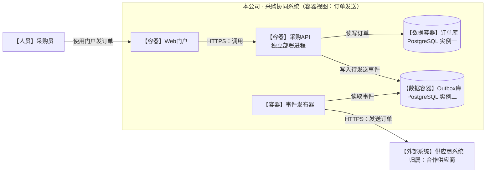
```mermaid
flowchart LR
    buyer["【人员】采购员"]

    subgraph company["本公司 · 采购协同系统（容器视图：订单发送）"]
        web["【容器】Web门户"]
        api["【容器】采购API<br/>独立部署进程"]
        orders[("【数据容器】订单库<br/>PostgreSQL 实例一")]
        outbox[("【数据容器】Outbox库<br/>PostgreSQL 实例二")]
        publisher["【容器】事件发布器"]

        web -->|"HTTPS：调用"| api
        api -->|"读写订单"| orders
        api -->|"写入待发送事件"| outbox
        publisher -->|"读取事件"| outbox
    end

    supplier["【外部系统】供应商系统<br/>归属：合作供应商"]

    buyer -->|"使用门户发订单"| web
    publisher -->|"HTTPS：发送订单"| supplier
```

### 3. 容器视图：交付事件处理

供应商回调经网关写入Kafka；订单处理器消费交付事件并写订单库。

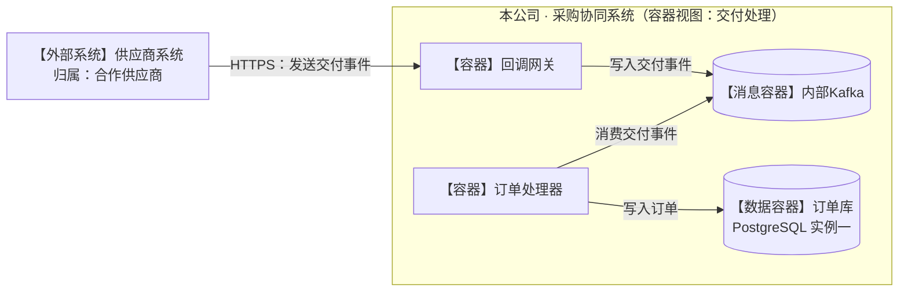
```mermaid
flowchart LR
    supplier["【外部系统】供应商系统<br/>归属：合作供应商"]

    subgraph company["本公司 · 采购协同系统（容器视图：交付处理）"]
        callback["【容器】回调网关"]
        kafka[("【消息容器】内部Kafka")]
        worker["【容器】订单处理器"]
        orders[("【数据容器】订单库<br/>PostgreSQL 实例一")]

        callback -->|"写入交付事件"| kafka
        worker -->|"消费交付事件"| kafka
        worker -->|"写入订单"| orders
    end

    supplier -->|"HTTPS：发送交付事件"| callback
```

### 4. 容器视图：付款申请与异步结果

付款处理器消费付款申请事件，向银行请求付款；银行异步回传的结果经回调网关进入Kafka，由付款处理器消费并写付款库。

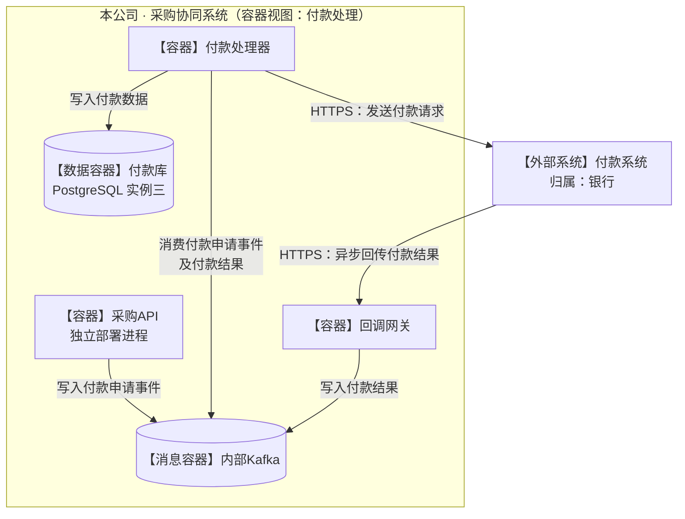
```mermaid
flowchart TB
    subgraph company["本公司 · 采购协同系统（容器视图：付款处理）"]
        api["【容器】采购API<br/>独立部署进程"]
        kafka[("【消息容器】内部Kafka")]
        worker["【容器】付款处理器"]
        callback["【容器】回调网关"]
        payments[("【数据容器】付款库<br/>PostgreSQL 实例三")]

        api -->|"写入付款申请事件"| kafka
        worker -->|"消费付款申请事件<br/>及付款结果"| kafka
        callback -->|"写入付款结果"| kafka
        worker -->|"写入付款数据"| payments
    end

    bank["【外部系统】付款系统<br/>归属：银行"]

    worker -->|"HTTPS：发送付款请求"| bank
    bank -->|"HTTPS：异步回传付款结果"| callback
```

### 5. 容器视图：支持工程师只读查询

支持工程师只通过管理门户查看处理状态；查询API只读订单库与付款库。

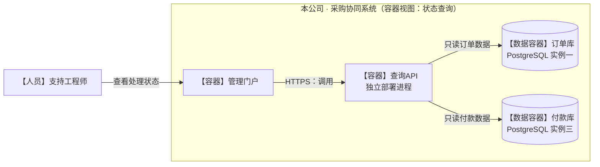
```mermaid
flowchart LR
    support["【人员】支持工程师"]

    subgraph company["本公司 · 采购协同系统（容器视图：状态查询）"]
        admin["【容器】管理门户"]
        query["【容器】查询API<br/>独立部署进程"]
        orders[("【数据容器】订单库<br/>PostgreSQL 实例一")]
        payments[("【数据容器】付款库<br/>PostgreSQL 实例三")]

        admin -->|"HTTPS：调用"| query
        query -->|"只读订单数据"| orders
        query -->|"只读付款数据"| payments
    end

    support -->|"查看处理状态"| admin
```

| 部署边界 | 已确认事实 |
|---|---|
| 采购API、查询API | 两个独立部署进程 |
| 订单库、Outbox库、付款库 | 三个独立运行的PostgreSQL实例 |
| 内部Kafka、回调网关 | 各容器视图中重复出现的是同一运行单元 |
| 供应商系统、银行付款系统 | 内部容器未规定，保持外部系统层级 |

图中未补充缓存、身份服务、补偿或重试机制，也未指定Kafka主题。

## 如何理解本轮结果

本轮更有力地支持“看实际图片再修图”，而不是“新增一句规则就普遍画得更好”。两版同样获得反馈，0.4.1 也会主动修图；每题每版只有一个样本，不能排除生成差异。没有验证自主选择渲染工具、原生 Skill 加载或其他客户端效果。
