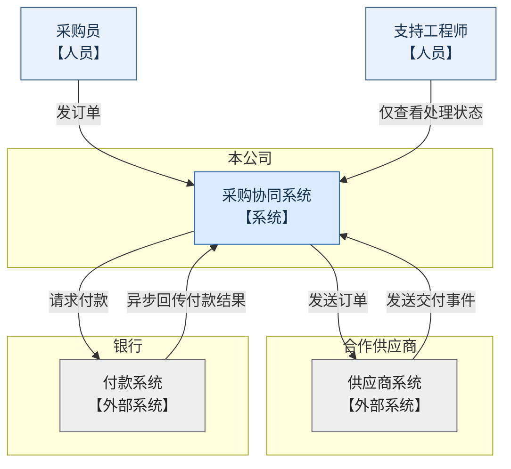
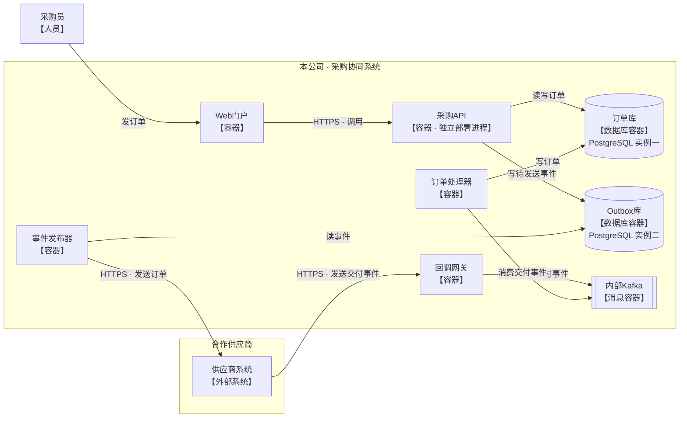
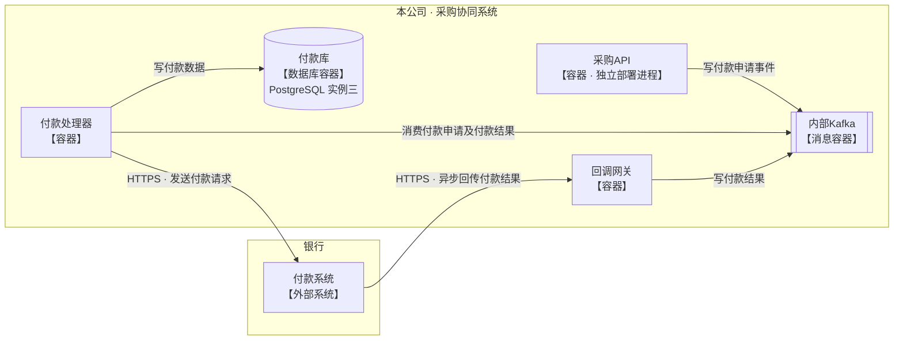
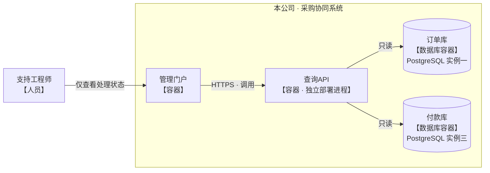

采用 C4 的两层视图：**系统上下文**展示组织归属和跨组织协作；**容器视图**展示本公司内部运行单元，按三个通信场景分别展开。同名节点代表同一个运行单元。

### 系统上下文：组织与系统边界

此层只展示人员和系统，不展开内部容器。

### 容器视图：订单发送与交付处理

内部节点均为容器级运行单元，供应商仍以外部系统呈现。箭头表示调用或访问方向：读取指向数据库，消费指向 Kafka；边上的文字说明具体操作。

### 容器视图：付款申请与异步结果

采购API写入付款申请事件，付款处理器消费申请并请求银行付款。银行异步结果经回调网关写入 Kafka，再由付款处理器消费并写付款库。

### 容器视图：处理状态只读查询

支持工程师只通过管理门户查看处理状态；查询API只读订单库和付款库。

订单库、Outbox库、付款库是**三个独立 PostgreSQL 实例**；采购API与查询API是**两个独立部署进程**。未规定的通信协议、Kafka主题和外部系统内部容器未展开，也未添加其他服务或连接。

这四个图块的源码与本轮已看到的渲染版本一致；画面中的关系标签可辨识，未见上一版的文字重叠或过度狭长问题。