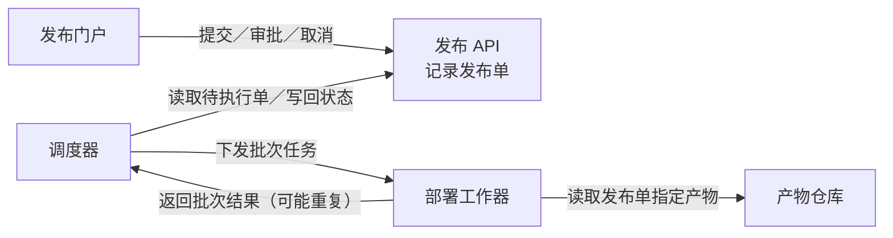
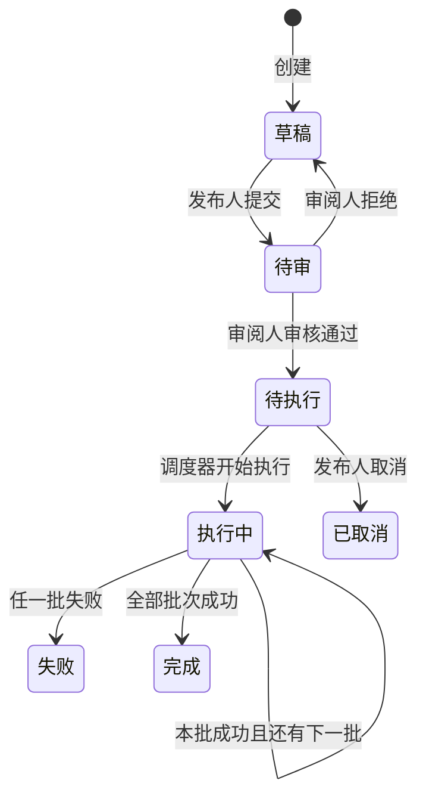
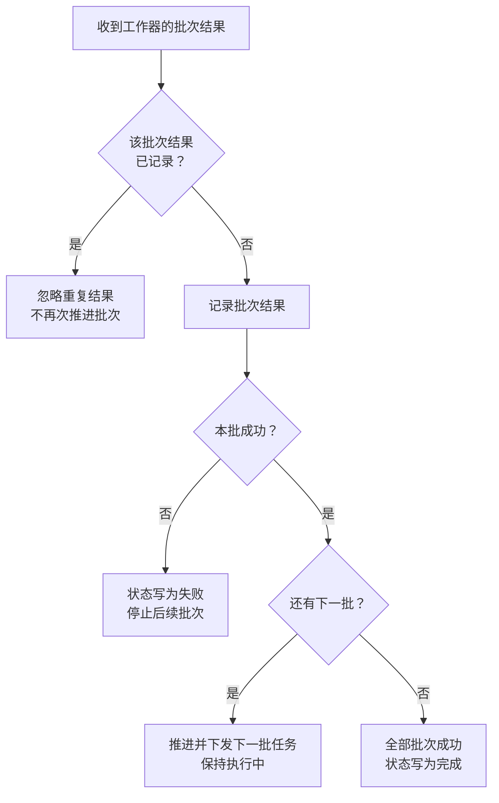

### 各部分怎样协作

每个发布单**仅关联一个不可变构建产物**；同一产物可供多个发布单使用。工作器执行部署并返回批次结果，调度器负责推进批次和更新发布状态。

### 发布状态怎样演变

调度器**只执行待执行单**，先将状态改为执行中，再按服务批次逐批部署。**执行中不能取消**；失败时停止后续批次，已成功批次不自动回滚。

### 批次结果怎样处理

此图展开调度器收到结果后的逻辑。只有尚未记录的批次结果才能触发推进；重复结果不会再次下发下一批。

### 审批与操作约束

门户向 API 发起操作。下表给出操作必须遵守的约束；具体校验实现位置未提供。

| 主体 | 允许的操作 | 必须满足的约束 |
|---|---|---|
| 发布人 | 只能提交、取消 | 草稿可提交；仅待执行可取消 |
| 审阅人 | 只能审批：通过或拒绝 | 仅审批待审单；不能审批自己提交的同一单 |
| 调度器 | 只能推进执行状态 | 只执行待执行单；依据批次结果推进 |

一个人可以拥有发布人和审阅人两个角色，但**同一单的提交人不能审批该单**。

未提供数据库、消息队列、通知、超时、自动重试或失败后恢复方案，图中不补设这些机制。

已检查回传画面：文字可读，未见标签重叠或连线遮挡关键内容。本次保留已检查的三段图源码。