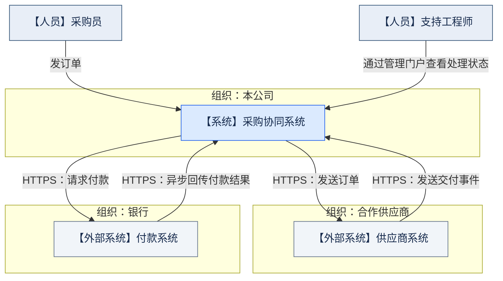
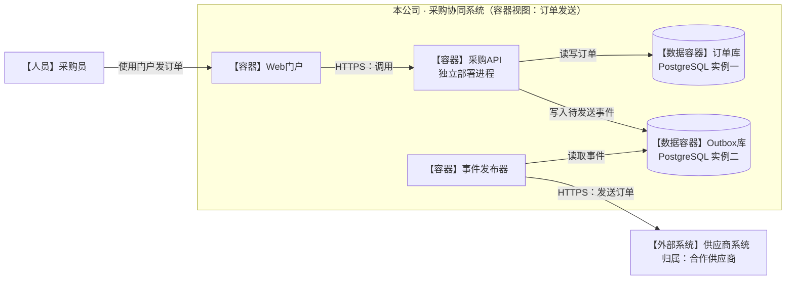
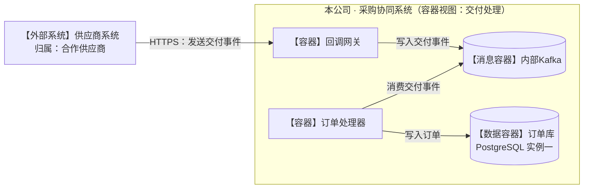
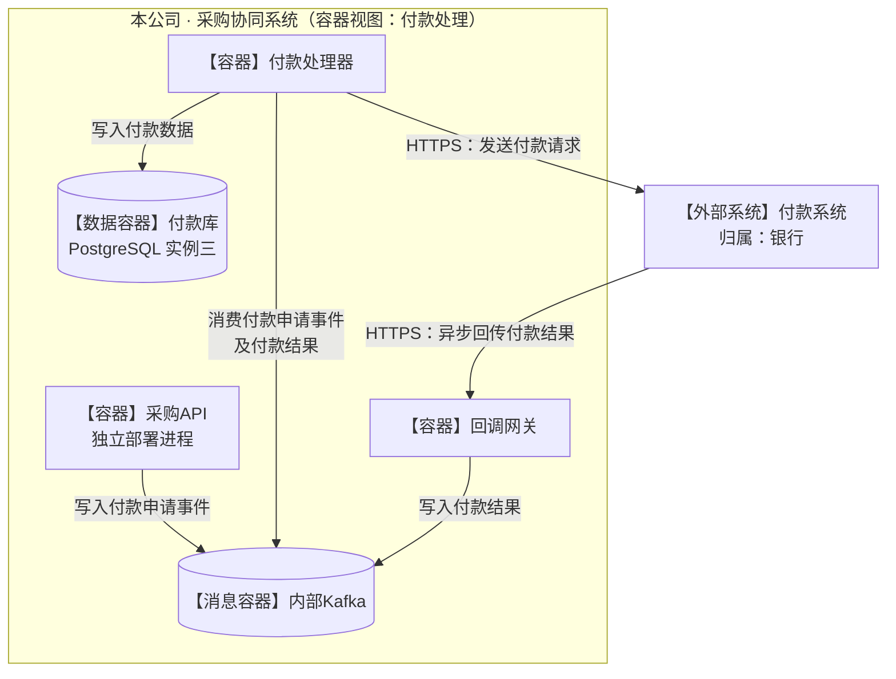
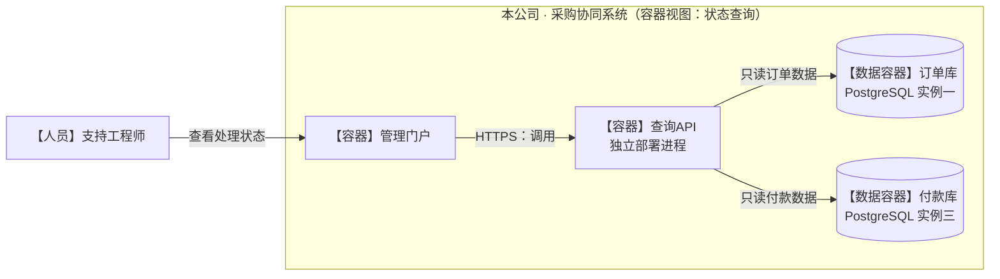

已检查五张实际渲染图：通信标签已分开，未见连线遮挡关键节点；部分名称有自动换行，但仍可辨认。以下保留已检查的图源码。

**阅读规则：**C4 上下文视图展示人员、系统和组织边界；容器视图展开本公司系统的运行单元，外部系统保持整体。箭头表示调用或访问方向，标签说明读取、写入和消费。同名节点在各图中代表同一运行单元。

### 1. 系统上下文：组织边界

采购协同系统归本公司所有，供应商系统和付款系统分别归合作供应商、银行所有。

### 2. 容器视图：订单发送

采购API读写订单库、写入Outbox库；事件发布器读取Outbox事件，向供应商发送订单。

### 3. 容器视图：交付事件处理

供应商回调经网关写入Kafka；订单处理器消费交付事件并写订单库。

### 4. 容器视图：付款申请与异步结果

付款处理器消费付款申请事件，向银行请求付款；银行异步回传的结果经回调网关进入Kafka，由付款处理器消费并写付款库。

### 5. 容器视图：支持工程师只读查询

支持工程师只通过管理门户查看处理状态；查询API只读订单库与付款库。

| 部署边界 | 已确认事实 |
|---|---|
| 采购API、查询API | 两个独立部署进程 |
| 订单库、Outbox库、付款库 | 三个独立运行的PostgreSQL实例 |
| 内部Kafka、回调网关 | 各容器视图中重复出现的是同一运行单元 |
| 供应商系统、银行付款系统 | 内部容器未规定，保持外部系统层级 |

图中未补充缓存、身份服务、补偿或重试机制，也未指定Kafka主题。