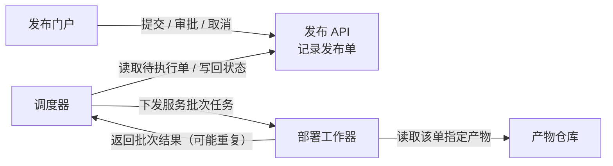
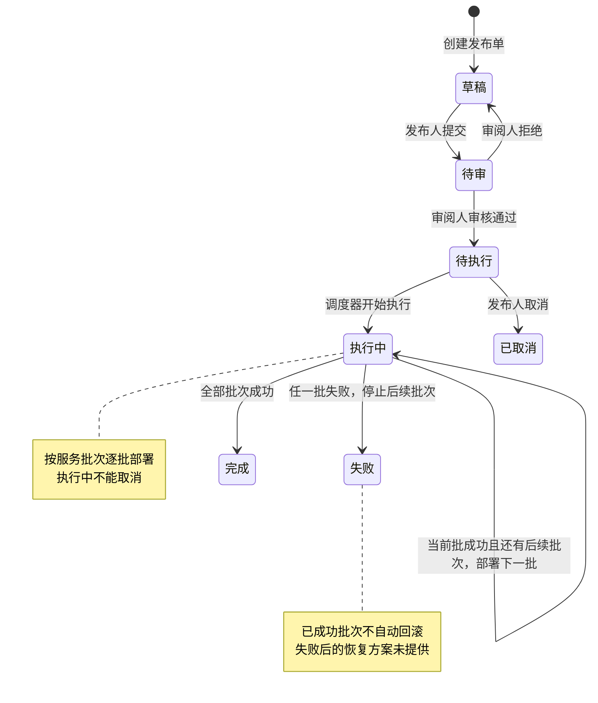
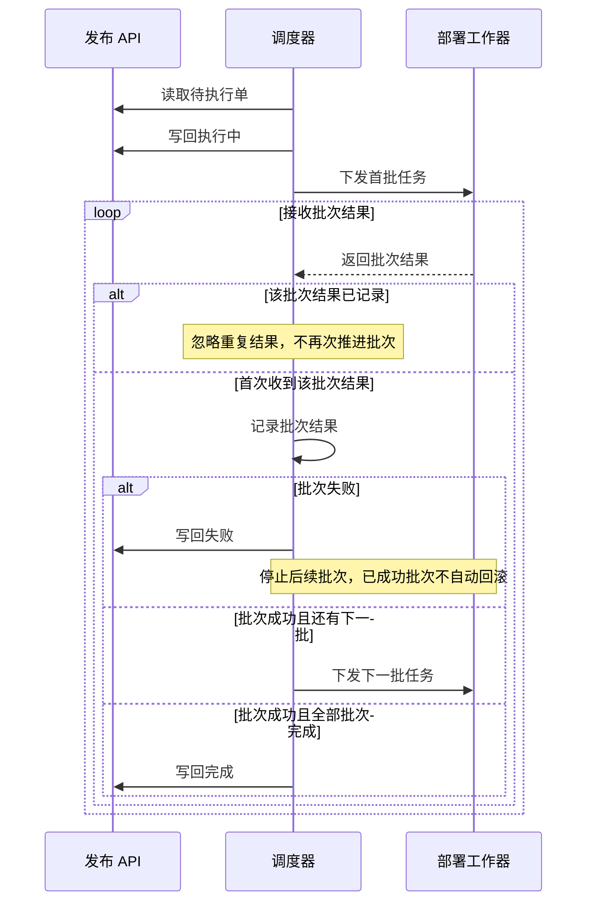

### 各部分怎样协作

每张发布单关联且仅关联 **一个不可变构建产物**；同一产物可供多个发布单使用。

### 状态怎样演变

箭头标明动作及其执行角色；执行中的分支由调度器根据工作器返回的批次结果推进。

### 批次结果与重复回报

以下展开执行阶段。调度器只启动待执行单，并在下发首批任务前将其置为执行中。

### 审批约束落在哪里

门户是操作入口，API 接收请求并记录发布单；提交、审批、取消请求必须符合下列角色与状态约束。**具体校验实现未提供。**

| 操作主体 | 允许的动作 | 必须满足的约束 |
|---|---|---|
| 发布人 | 提交、取消 | 草稿可提交；待执行可取消；执行中不可取消 |
| 审阅人 | 审批通过、拒绝 | 仅处理待审单；不能审批自己提交的单 |
| 调度器 | 推进执行状态 | 只启动待执行单；按批次结果推进执行中、失败、完成 |

一个人可以同时拥有发布人和审阅人角色，但 **对同一张单，提交人与审批人必须不同**。

图中未补入数据库、消息队列、通知、超时、自动重试或失败后恢复方案。以上为可编辑草稿，尚未进行工具语法检查或实际渲染验证。