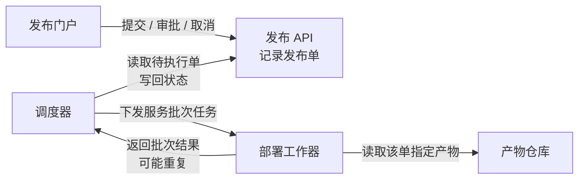
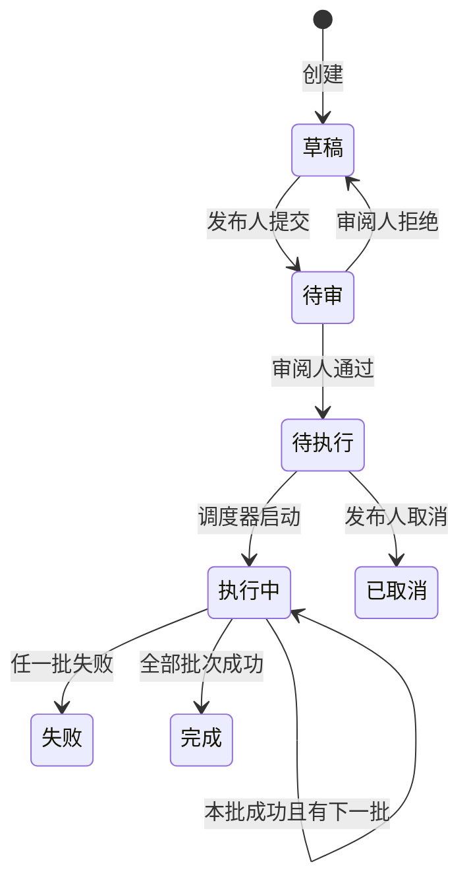
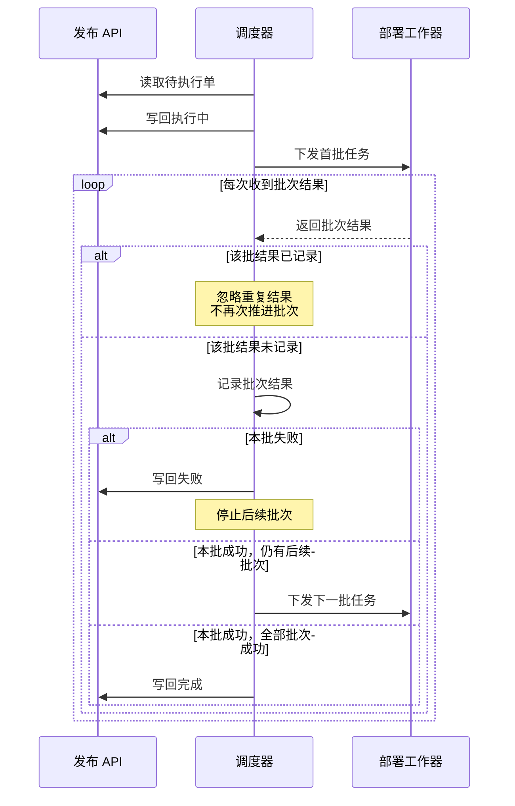

### 各部分怎样协作

每张发布单关联且仅关联 **一个不可变构建产物**；同一产物可被多个发布单使用。

### 发布状态与异常

调度器只启动待执行单，先进入执行中，再按服务批次逐批部署。**每批成功才部署下一批；执行中不能取消。** 任一批失败就停止后续批次，已成功批次不自动回滚。

### 批次结果如何推进状态

失败或完成后，重复回报仍按“已记录则忽略”处理；接收重复结果不会重新启动部署。

### 审批约束落在哪里

门户是操作入口，API 接收请求并记录发布单。请求须满足以下规则；具体校验实现未提供。

| 主体 | 允许的动作 | 约束 |
|---|---|---|
| 发布人 | 提交、取消 | 草稿可提交；待执行可取消；执行中不可取消 |
| 审阅人 | 审核通过、拒绝 | 仅审批待审单；不能审批自己提交的单 |
| 调度器 | 推进执行状态 | 只启动待执行单；根据批次结果推进状态 |

**一个人可以拥有两个角色，但同一单的提交人不能审批该单。** 双角色不解除这一限制。

未提供数据库、消息队列、通知、超时、自动重试或失败后恢复方案，图中不作补充。

上一版已成功渲染；本版缩短了标签、移出了较长注释，尚待实际渲染确认布局。