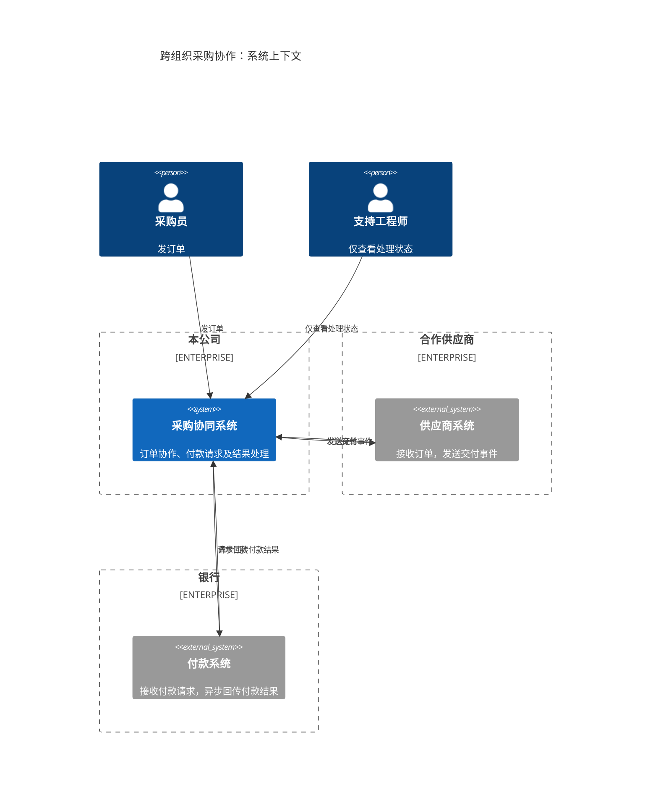
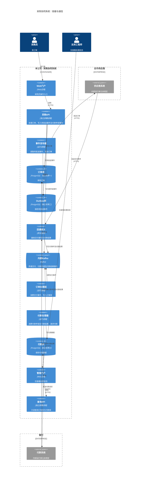

业务视图把每个组织拥有的系统作为整体；工程视图展开本公司的独立运行单元，供应商和银行系统仍作为外部系统。

### 业务视图：系统与组织边界

### 工程视图：运行单元与关键通信

每个应用节点表示独立运行单元；三个数据库节点分别表示独立的 PostgreSQL 实例。箭头表示调用或访问方向，因此“读取／消费”的箭头从读取者指向数据源。

除已标明的 HTTPS 外，其余通信协议未规定；Kafka 主题及外部系统内部结构也未规定。以上为可编辑草稿，尚未执行解析器语法检查或实际渲染检查。