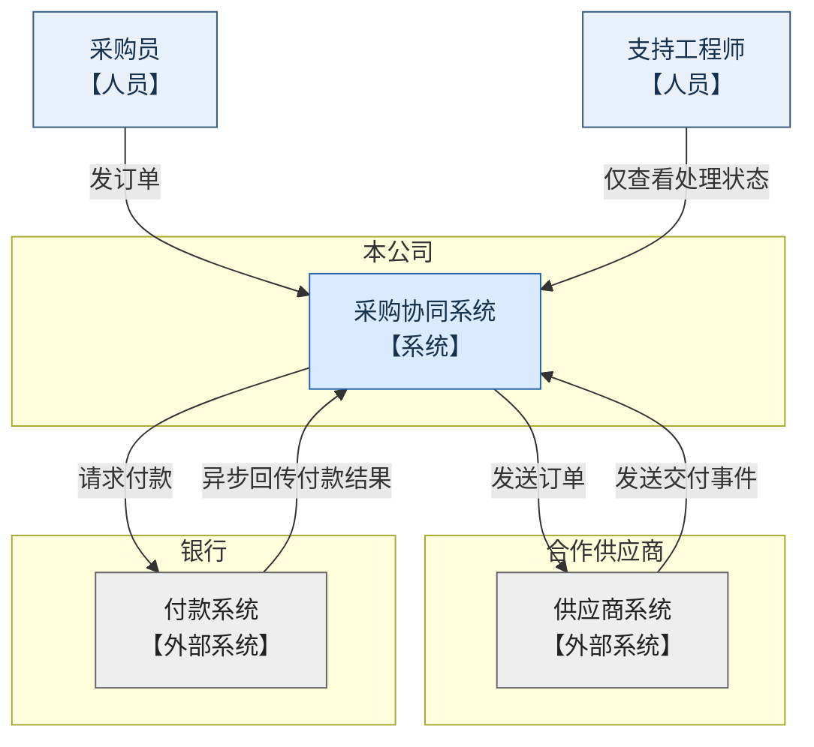
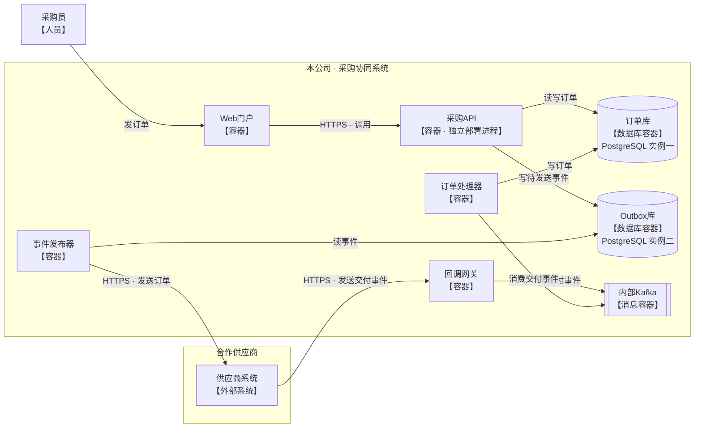
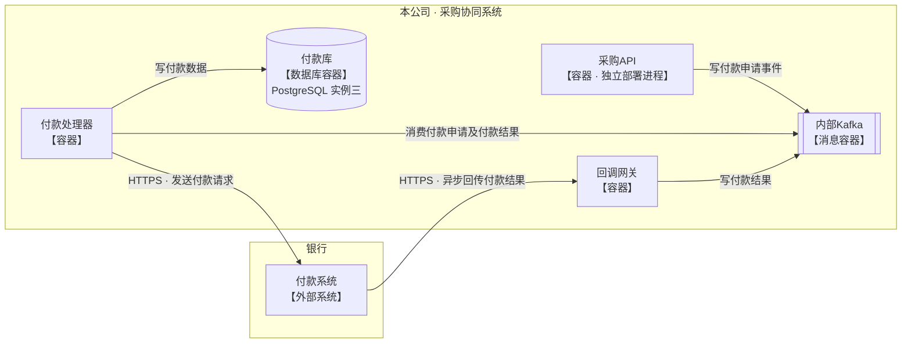
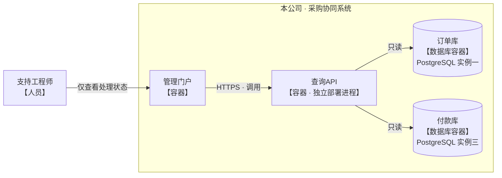

上次渲染中，双向关系的文字重叠，完整容器图也过于狭长。下面保留 C4 的系统上下文与容器层级，采用 Mermaid 流程图排版，并把容器视图分为三个通信场景。同名节点均代表同一个运行单元。

### 系统上下文：组织各自拥有什么

本图只展示人员、系统和组织边界，不展开系统内部。

### 容器视图一：订单发送与交付处理

本公司边界内的节点均为容器级运行单元。数据库访问箭头从访问者指向数据库；消费箭头从消费者指向 Kafka。

### 容器视图二：付款申请与异步结果

付款处理器同时消费付款申请和付款结果；付款请求由付款处理器发送，异步结果通过回调网关进入 Kafka。

### 容器视图三：支持工程师只读查询

支持工程师仅通过管理门户查看处理状态。查询API与采购API为两个独立部署进程。

订单库、Outbox库、付款库是三个独立的 PostgreSQL 实例。未规定的协议、Kafka 主题及供应商／银行内部结构均未展开，也未补入其他服务或通信。

上一版已成功渲染；本版调整后的源码尚未进行解析器检查或实际渲染验证。