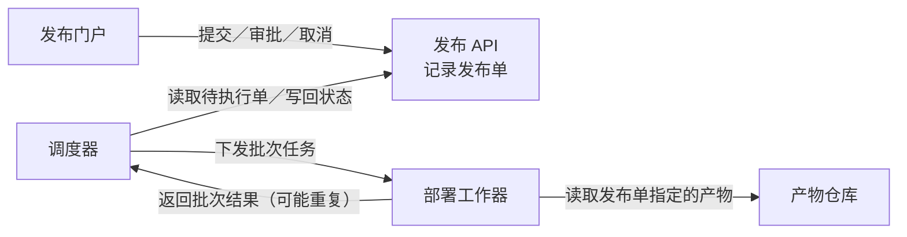
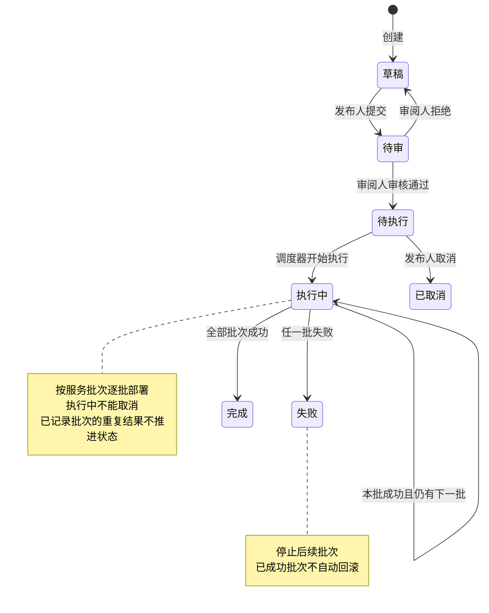
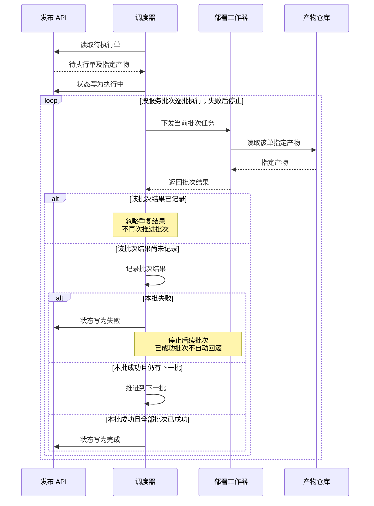

### 各部分怎样协作

每个发布单**仅关联一个不可变构建产物**；同一产物可供多个发布单使用。工作器负责部署并返回结果，调度器据此更新发布状态。

### 发布状态怎样演变

### 批次结果怎样影响执行

下图展开“执行中”的处理；重复结果不会触发下一批。

### 审批与操作约束

门户向 API 发起操作；下表说明各操作必须遵守的约束。具体校验实现位置未提供。

| 主体 | 允许的操作 | 约束 |
|---|---|---|
| 发布人 | 提交、取消 | 草稿可提交；仅待执行可取消 |
| 审阅人 | 审核通过、拒绝 | 仅审批待审单；不能审批自己提交的同一单 |
| 调度器 | 推进执行状态 | 只执行待执行单；根据批次结果推进 |

一个人可以同时拥有发布人和审阅人角色，**双角色仍不能绕过同一单的提交人与审批人分离约束**。

未提供数据库、消息队列、通知、超时、自动重试或失败后恢复方案。以上为可编辑草稿，尚未检查实际渲染画面。