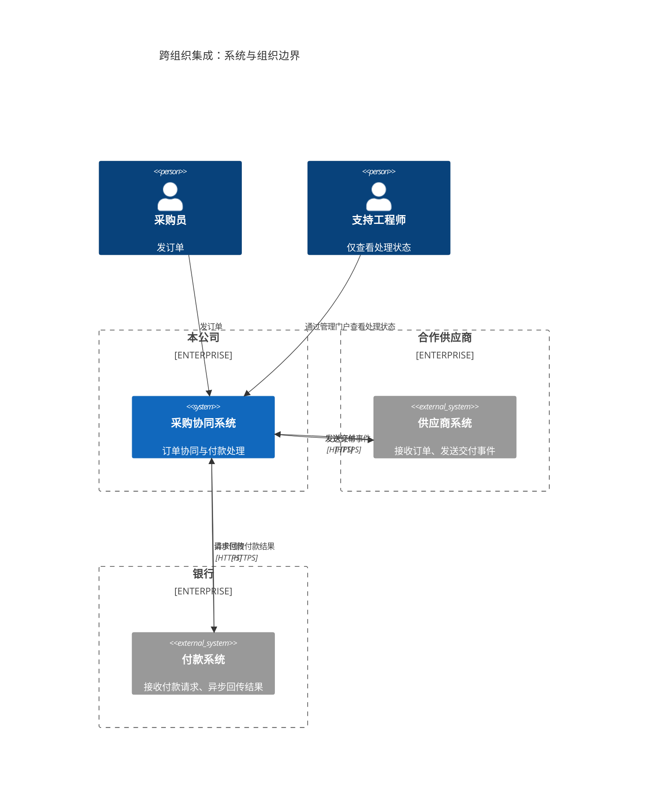
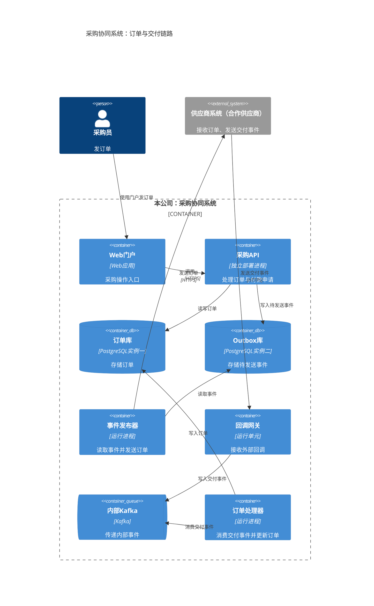
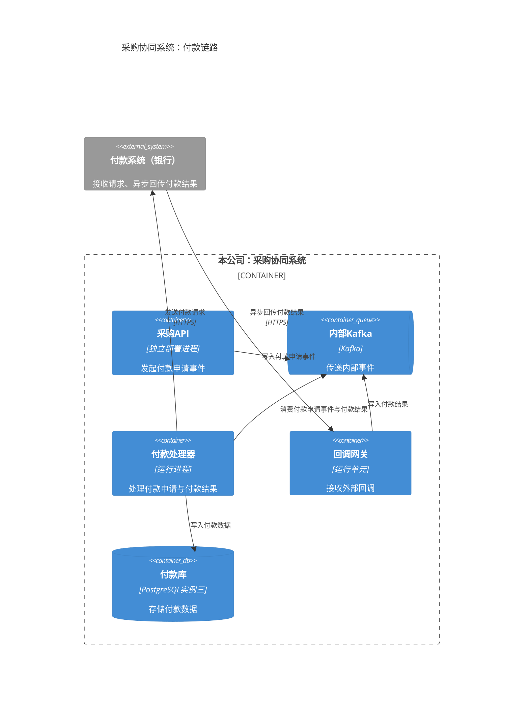
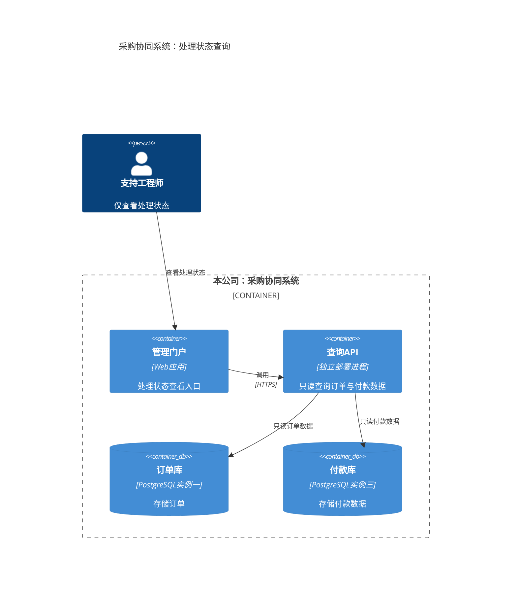

组织边界用上下文图说明；内部运行单元用三张容器视图展开。三张容器图中的同名节点是同一个运行单元，按业务链路重复展示。箭头表示调用或访问方向，标签区分写入、读取与消费。

### 系统上下文：组织归属与跨组织通信

### 容器视图：订单发送与交付处理

供应商系统保持系统级外部节点，不展开其内部容器。

### 容器视图：付款申请与异步结果

付款处理器同时消费付款申请事件和付款结果；付款结果经回调网关进入内部 Kafka。

### 容器视图：支持工程师只读查询

查询API与采购API是两个独立部署进程。订单库、Outbox库、付款库分别是三个独立运行的 PostgreSQL 实例。

以上为可编辑初稿，尚未检查实际渲染画面。