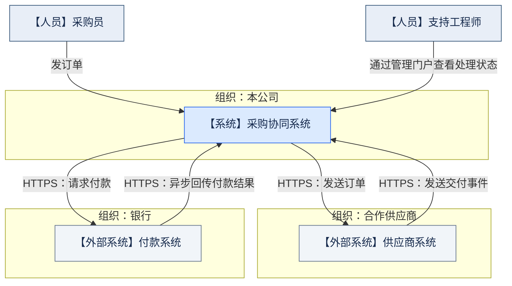
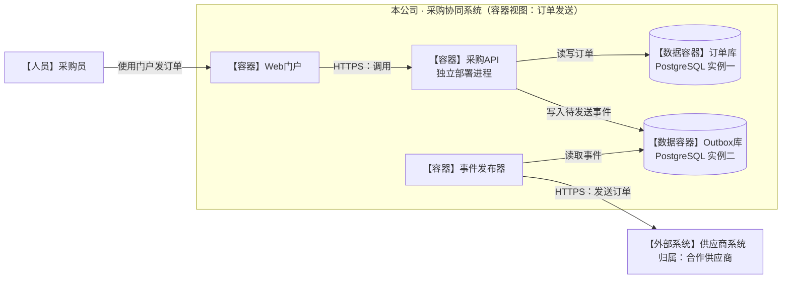
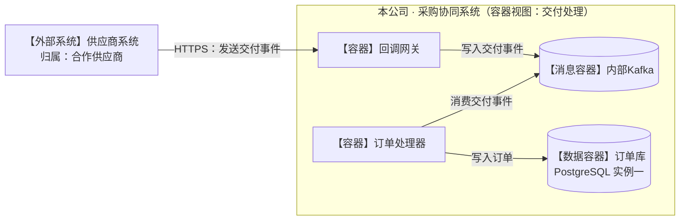
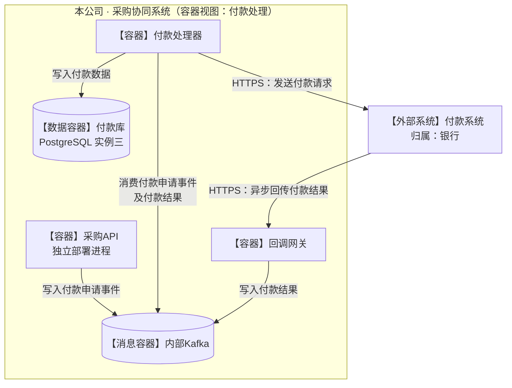
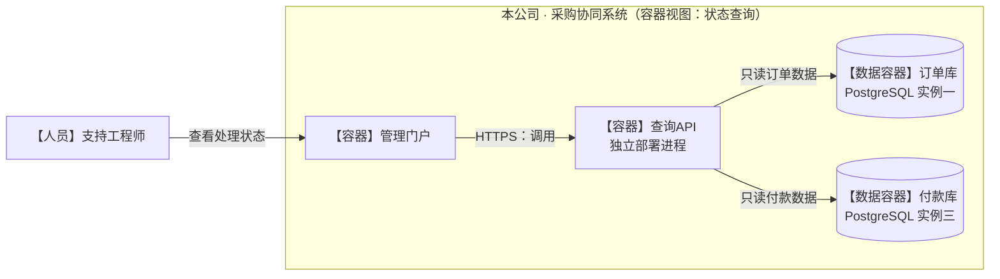

实际画面中，双向通信标签重叠，部分跨组织连线穿过节点。下面保留原有架构，改用 Mermaid 流程图表达 C4 层级，并将订单发送与交付回调拆开。

**阅读规则：**上下文图只展示人员、系统和组织；容器图只展开本公司系统的运行单元，外部系统保持整体。箭头表示调用或访问方向，读取、写入和消费由标签说明。同名节点在不同视图中代表同一运行单元。

### 1. 系统上下文：组织边界

### 2. 容器视图：订单发送

订单库与 Outbox 库分别是独立运行的 PostgreSQL 实例。

### 3. 容器视图：交付事件处理

供应商向回调网关发送交付事件；订单处理器消费内部事件并写订单库。

### 4. 容器视图：付款申请与异步结果

付款处理器消费付款申请和付款结果，向银行发送付款请求，并写入第三个独立 PostgreSQL 实例。

### 5. 容器视图：支持工程师只读查询

支持工程师只通过管理门户查看处理状态。查询API与采购API是两个独立部署进程。

未展开供应商或银行内部容器，也未补充未规定的服务、机制或 Kafka 主题。本次修改后的实际排版仍待渲染确认。