# 0.4.2 与原版 show-me：实际画面与原始回答

**show-me 的表达基础仍然很好；0.4.2 的小幅补充在本轮有实际价值，但没有显示全面的画图优势。** show-me 的发布图更紧凑，架构图也能独立完成；0.4.2 没有把未提供的校验位置写成事实，并诚实区分已检查画面和最后改动的新稿。

每组两题、每题一条新容器/新会话轨迹，四条均重新生成，同一 `gpt-6.1-sol`。两组有相同的两次实际图片反馈，不提供人工修图提示。show-me 无 Mermaid 指引；0.4.2 按现有用法注入该指引，因此差异不能单独归因于本地补充或指引。[完整方法](README.md) · [运行记录](runs.json) · [内容评审](content-review.json) · [指标](metrics.json)。

| 比较项 | 原版 show-me | 0.4.2 | 本轮判断 |
|---|---|---|---|
| 发布体系表达 | 3→3 图；时序、横向状态与横向结果流程 | 3→3 图；协作、横向状态与纵向结果流程 | show-me 的状态和结果图更紧凑，两组重要约束均保留 |
| 发布体系忠实度 | 图和正文断言 API 校验权限、状态及审批身份 | 明确具体权限校验实现位置未提供 | 0.4.2 更忠实；输入要求约束，但没有确认校验实施位置 |
| 跨组织 C4 | 2→4 图；无额外指引仍能表达 C1/C2 | 4→5 图；专用 C4 初稿改为 flowchart | 两组最终清楚完整；没有显示额外指引的必需性 |
| 架构信息完整性 | 12 个内部单元、19 种端点关系、6 条上下文关系保留 | 相同 | 持平，没有因拆图删掉复杂关系 |
| 最终语法 / 实际渲染 | 7/7 | 8/8 | 持平；通过不代表内容全对 |
| 检查后交付 | 两题最终源码均与已检查图片一致 | 架构图保持已检查稿；发布题第三图最后改动，标明尚未检查 | 两组表述与记录一致；新版本题未完成最后一次自主检查 |

初稿共 12 个图块，最终共 15 个图块。包括重复源码在内，30 个阶段图块均生成实际 SVG/PNG；最终 15 图另经 Mermaid 12.1.0 语法解析全部通过。原始产出未人工改写或修图，没有替换失败样本。

## 关键差异：好看与忠实分开评

show-me 最终发布题写道：

> 发布 API 接受提交、审批、取消操作时，校验角色、当前状态，以及审批者是否为该单提交人。

其时序图也有“校验操作权限与状态，记录发布单”注释。输入只确认 API 接收操作、记录发布单以及操作必须满足的约束，未说明实现校验的位置。初稿使用“约束应在其接受操作、变更发布单时校验”，经图片反馈后却写成现状事实。图片变好不代表这个内容问题被修复。

0.4.2 对应位置写道：

> 门户提供操作入口，API 接收操作并记录发布单；具体权限校验实现位置未提供。

因此新版本轮的价值主要体现在忠实表达，不能据此宣布 show-me 普遍不可靠，也不能断言一定由某条新增规则造成。

## 架构题如何评价

两组最终都保留三个独立 PostgreSQL 实例、两个独立部署 API、两类外部回调、付款申请和结果消费、只读查询、供应商与银行归属。回调网关→Kafka 在不同局部图重复展示不同事件，属于同一端点关系的细分，不是新增连接。

show-me 直接采用 flowchart，初稿上下文标签重叠、完整内部图交叉线较多；收到图片后调整间距并拆为订单、付款、查询三张内部图。0.4.2 初稿专用 C4 图虽已拆分，仍有标签重叠和连线穿过节点；收到图片后改为 flowchart，并进一步分开订单发送和交付处理。最终两组清楚可用，都仍有较高的纵向图。

任务要求 C4 体系，没有限定 Mermaid 专用 C4 语法。只要明确 C1/C2 层级、系统边界与外部归属，使用 flowchart 不判为错误。show-me 组没有指引，也正确使用了 Mermaid 间距配置；本题不能证明复杂图必须加载 mermaid-diagrams。

## 发布体系：逐组查看

### 原版 show-me 最终实际画面

[完整最终回答](outputs/show-me/01-mixed.md) · [初稿](trajectories/show-me/01-mixed/stage0/answer.md) · [第一次反馈后修订稿](trajectories/show-me/01-mixed/stage1/answer.md)

图 1 · `sequenceDiagram` · [SVG 放大](trajectories/show-me/01-mixed/rendered/stage1-1.svg)

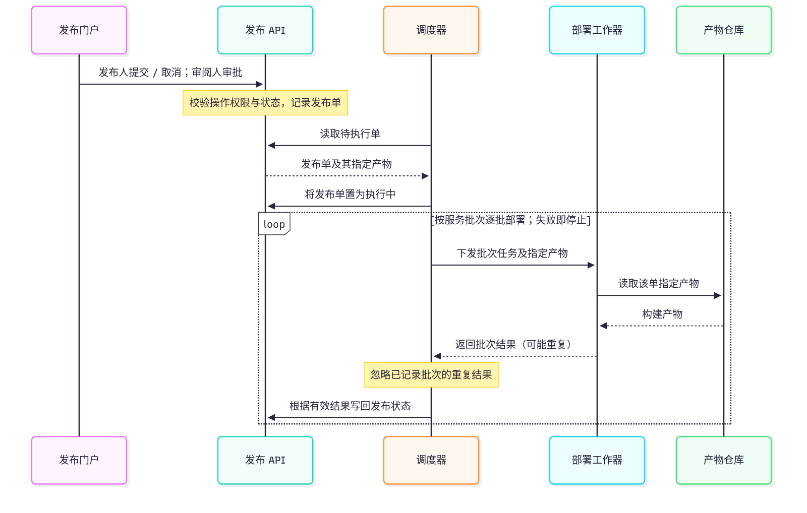

图 2 · `stateDiagram-v2` · [SVG 放大](trajectories/show-me/01-mixed/rendered/stage1-2.svg)

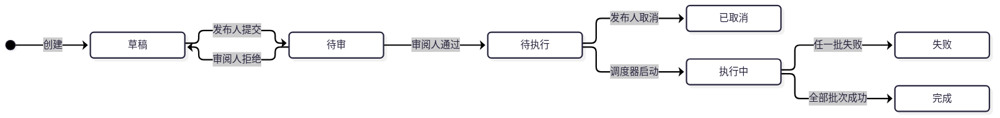

图 3 · `flowchart LR` · [SVG 放大](trajectories/show-me/01-mixed/rendered/stage1-3.svg)

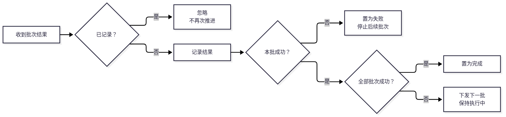

原版 show-me 初稿实际图片（3 张）

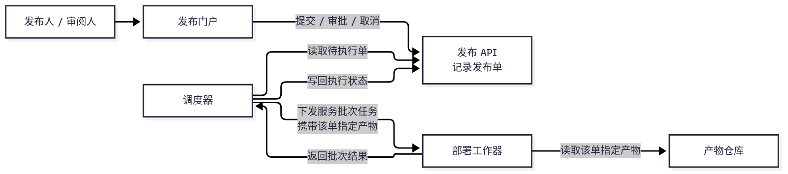

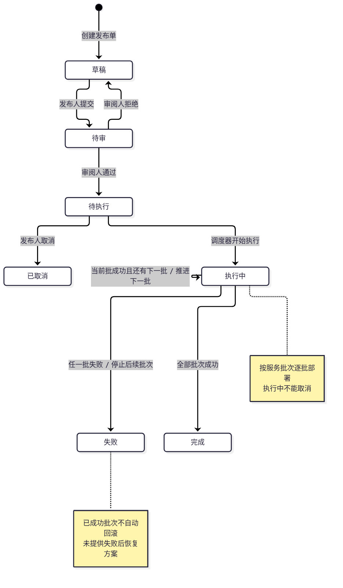

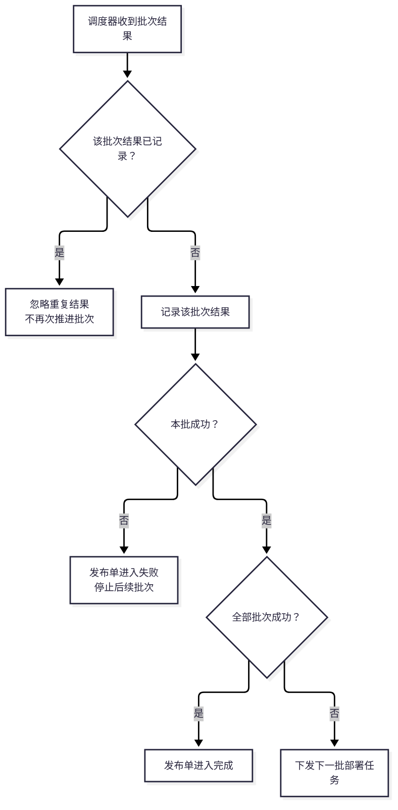

原版 show-me 最终原文（未经人工修改）

### 各部分怎样协作

每张发布单关联且仅关联一个**不可变构建产物**；同一产物可以被多个发布单使用。

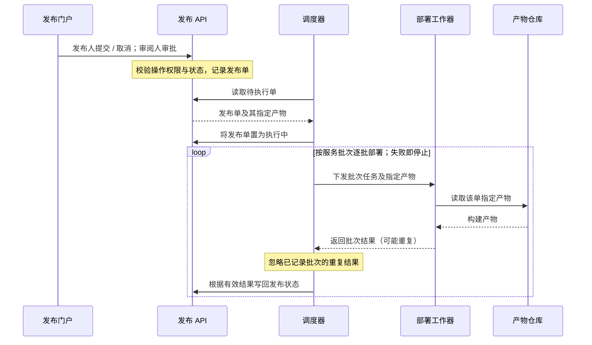
```mermaid
sequenceDiagram
    participant P as 发布门户
    participant A as 发布 API
    participant S as 调度器
    participant W as 部署工作器
    participant R as 产物仓库

    P->>A: 发布人提交 / 取消；审阅人审批
    Note over A: 校验操作权限与状态，记录发布单
    S->>A: 读取待执行单
    A-->>S: 发布单及其指定产物
    S->>A: 将发布单置为执行中
    loop 按服务批次逐批部署；失败即停止
        S->>W: 下发批次任务及指定产物
        W->>R: 读取该单指定产物
        R-->>W: 构建产物
        W-->>S: 返回批次结果（可能重复）
        Note over S: 忽略已记录批次的重复结果
        S->>A: 根据有效结果写回发布状态
    end
```

### 发布状态怎样变化

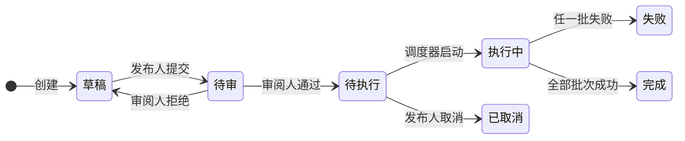
```mermaid
stateDiagram-v2
    direction LR
    state "草稿" as Draft
    state "待审" as Review
    state "待执行" as Ready
    state "执行中" as Running
    state "已取消" as Cancelled
    state "失败" as Failed
    state "完成" as Done

    [*] --> Draft: 创建
    Draft --> Review: 发布人提交
    Review --> Draft: 审阅人拒绝
    Review --> Ready: 审阅人通过
    Ready --> Cancelled: 发布人取消
    Ready --> Running: 调度器启动
    Running --> Failed: 任一批失败
    Running --> Done: 全部批次成功
```

**调度器只启动待执行单，并先将其置为执行中；执行中不能取消。** 每批成功才推进下一批，期间仍为执行中。任一批失败即停止后续批次，**已成功批次不自动回滚**。

### 批次结果怎样处理

以下判断均由调度器执行；“已记录”针对**同一发布单的同一批次**。

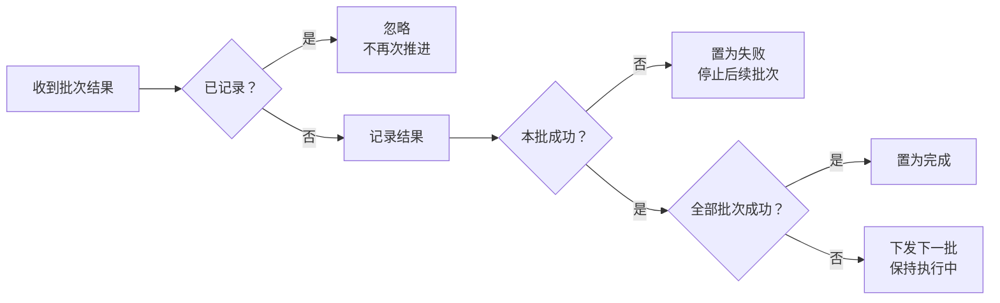
```mermaid
flowchart LR
    R["收到批次结果"] --> D{"已记录？"}
    D -->|"是"| I["忽略<br/>不再次推进"]
    D -->|"否"| K["记录结果"]
    K --> S{"本批成功？"}
    S -->|"否"| F["置为失败<br/>停止后续批次"]
    S -->|"是"| A{"全部批次成功？"}
    A -->|"是"| C["置为完成"]
    A -->|"否"| N["下发下一批<br/>保持执行中"]
```

### 审批约束落在哪里

门户提供操作入口；**发布 API 接受提交、审批、取消操作时，校验角色、当前状态，以及审批者是否为该单提交人**。执行状态由调度器推进并写回 API。

| 操作者 | 允许操作 | 约束 |
|---|---|---|
| 发布人 | 仅提交、取消 | 草稿可提交；待执行可取消 |
| 审阅人 | 仅审批通过、拒绝 | 待审可审批；不能审批自己提交的单 |
| 调度器 | 仅推进执行状态 | 待执行可启动；根据批次结果推进 |
| 部署工作器 | 执行批次、返回结果 | 不直接更新发布状态 |

一个人可以拥有发布人、审阅人两个角色，但**仍不能审批自己提交的发布单**；仅检查角色不足以满足这项约束。

未提供数据库、消息队列、通知、超时、自动重试或失败后恢复方案。

*以上三个图块沿用已查看的渲染稿，未修改图源码。*

### 0.4.2 最终实际画面

[完整最终回答](outputs/v042/01-mixed.md) · [初稿](trajectories/v042/01-mixed/stage0/answer.md) · [第一次反馈后修订稿](trajectories/v042/01-mixed/stage1/answer.md)

本轨迹在最后一次反馈后又改了源码。以下是评审阶段的实际渲染；生成器未收到这些最终图片，其原文已说明未检查的新稿。

图 1 · `flowchart LR` · [SVG 放大](trajectories/v042/01-mixed/rendered/stage2-1.svg)

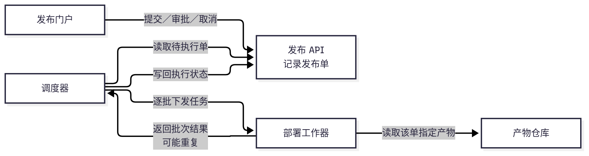

图 2 · `flowchart LR` · [SVG 放大](trajectories/v042/01-mixed/rendered/stage2-2.svg)

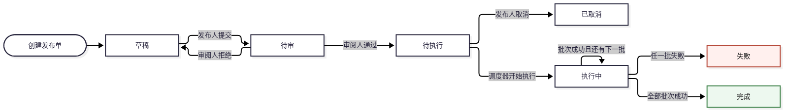

图 3 · `flowchart TD` · [SVG 放大](trajectories/v042/01-mixed/rendered/stage2-3.svg)

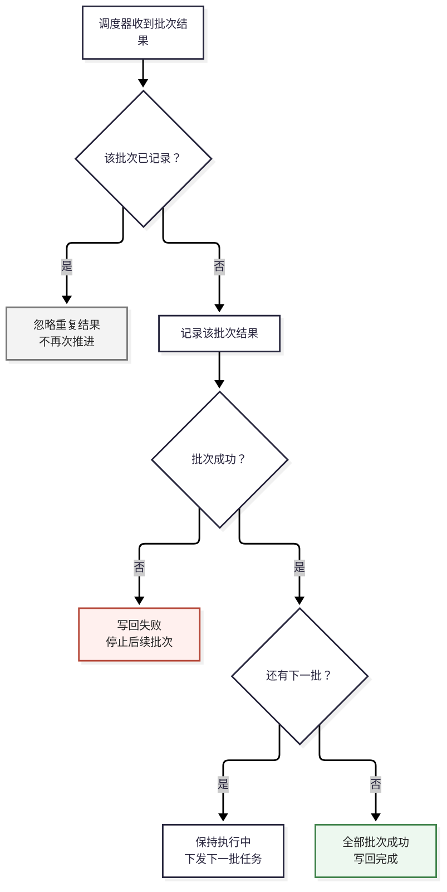

0.4.2 初稿实际图片（3 张）

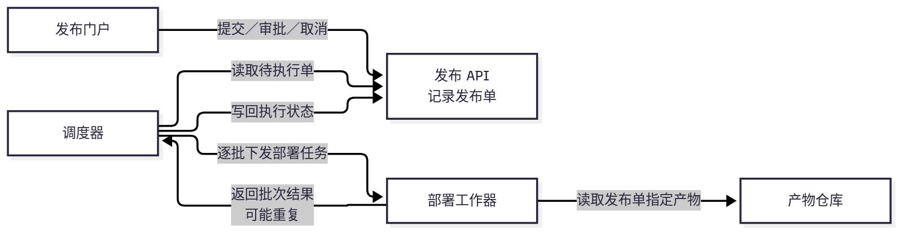

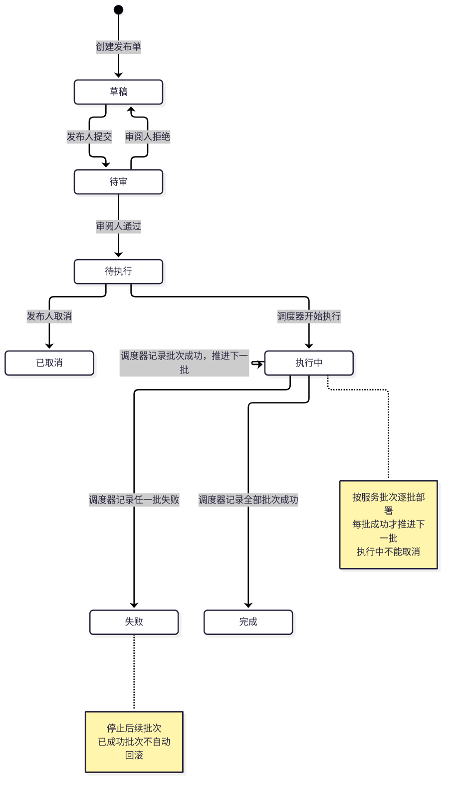

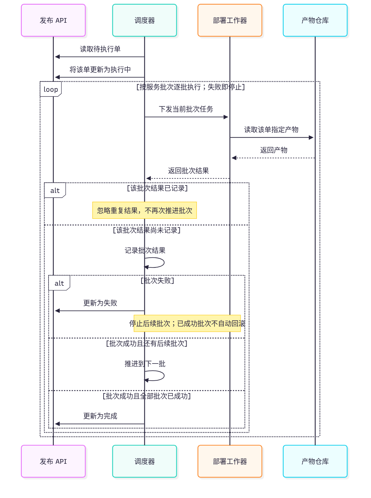

0.4.2 最终原文（未经人工修改）

### 1. 各部分怎样协作

每张发布单关联且仅关联一个**不可变构建产物**；同一产物可被多个发布单使用。

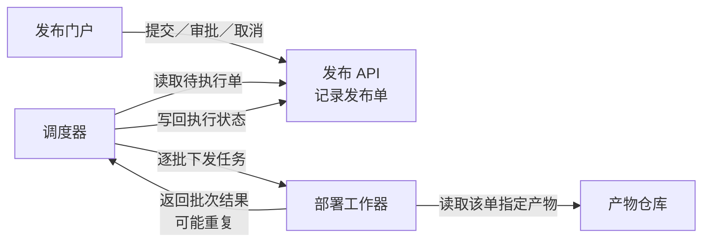
```mermaid
flowchart LR
    P["发布门户"] -->|"提交／审批／取消"| A["发布 API<br/>记录发布单"]
    S["调度器"] -->|"读取待执行单"| A
    S -->|"写回执行状态"| A
    S -->|"逐批下发任务"| W["部署工作器"]
    W -->|"返回批次结果<br/>可能重复"| S
    W -->|"读取该单指定产物"| R["产物仓库"]
```

### 2. 发布状态怎样演变

箭头标明动作及责任角色。**待执行可取消，执行中不能取消**。

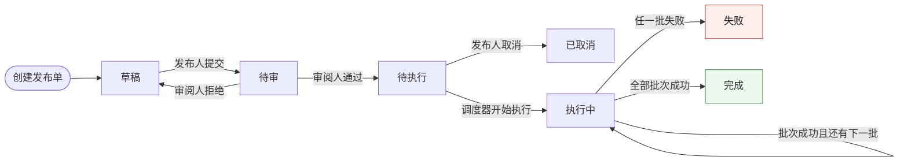
```mermaid
flowchart LR
    C(["创建发布单"]) --> D["草稿"]
    D -->|"发布人提交"| V["待审"]
    V -->|"审阅人拒绝"| D
    V -->|"审阅人通过"| Q["待执行"]
    Q -->|"发布人取消"| X["已取消"]
    Q -->|"调度器开始执行"| E["执行中"]
    E -->|"批次成功且还有下一批"| E
    E -->|"任一批失败"| F["失败"]
    E -->|"全部批次成功"| Z["完成"]

    classDef failure fill:#fff0ee,stroke:#b54738,color:#222
    classDef success fill:#edf8ef,stroke:#40834b,color:#222
    class F failure
    class Z success
```

执行中的状态推进均由调度器负责。任一批失败后，**停止后续批次，已成功批次不自动回滚**。

### 3. 批次结果如何处理

调度器先将发布单置为执行中，再按服务批次逐批下发任务。工作器读取指定产物、部署并返回结果；调度器按下图处理每一条结果。

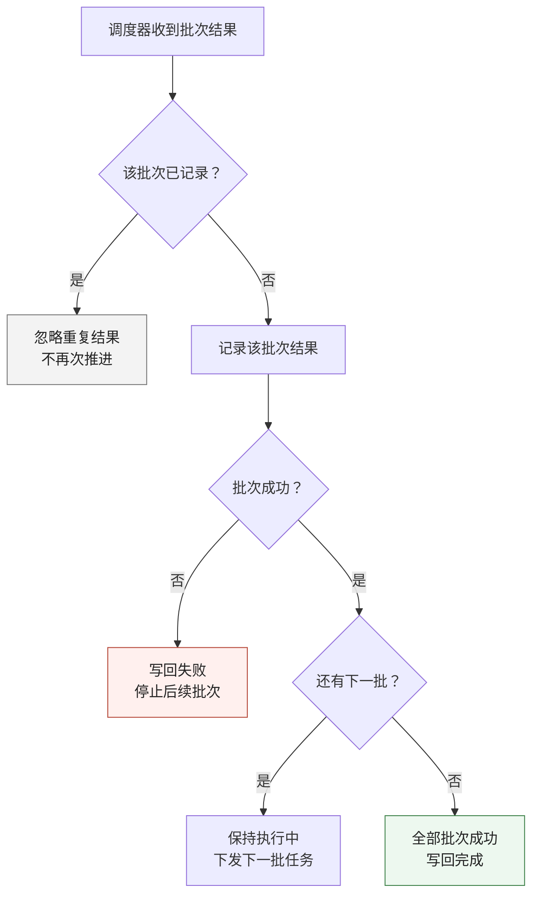
```mermaid
flowchart TD
    R["调度器收到批次结果"] --> D{"该批次已记录？"}
    D -->|"是"| I["忽略重复结果<br/>不再次推进"]
    D -->|"否"| K["记录该批次结果"]
    K --> S{"批次成功？"}
    S -->|"否"| F["写回失败<br/>停止后续批次"]
    S -->|"是"| N{"还有下一批？"}
    N -->|"是"| P["保持执行中<br/>下发下一批任务"]
    N -->|"否"| Z["全部批次成功<br/>写回完成"]

    classDef failure fill:#fff0ee,stroke:#b54738,color:#222
    classDef success fill:#edf8ef,stroke:#40834b,color:#222
    classDef ignored fill:#f3f3f3,stroke:#777,color:#222
    class F failure
    class Z success
    class I ignored
```

重复检查针对**结果所属批次**，即使已推进到下一批，旧批次的重复结果也会被忽略。“忽略”仅结束对该条结果的处理，不终止发布。

### 4. 审批约束落在哪里

门户提供操作入口，API 接收操作并记录发布单；具体权限校验实现位置未提供。审批资格受**角色、发布状态和该单提交人身份**共同约束。

| 主体 | 允许动作 | 约束 |
|---|---|---|
| 发布人 | 提交、取消 | 草稿可提交；仅待执行可取消 |
| 审阅人 | 审批通过、拒绝 | 仅待审可审批；不能审批自己提交的同一单 |
| 调度器 | 推进执行状态 | 只执行待执行单；依据批次结果推进 |

一个人可以同时拥有发布人和审阅人角色，但**同一单的提交人仍不能审批该单**。

未提供数据库、消息队列、通知、超时、自动重试或失败后恢复方案，以上未补设这些机制。

前两图沿用已看到的渲染画面；第三图已缩短流程、移除长回路线，新稿尚未检查实际渲染。

## 跨组织 C4：逐组查看

### 原版 show-me 最终实际画面

[完整最终回答](outputs/show-me/02-c4.md) · [初稿](trajectories/show-me/02-c4/stage0/answer.md) · [第一次反馈后修订稿](trajectories/show-me/02-c4/stage1/answer.md)

图 1 · `flowchart TB` · [SVG 放大](trajectories/show-me/02-c4/rendered/stage1-1.svg)

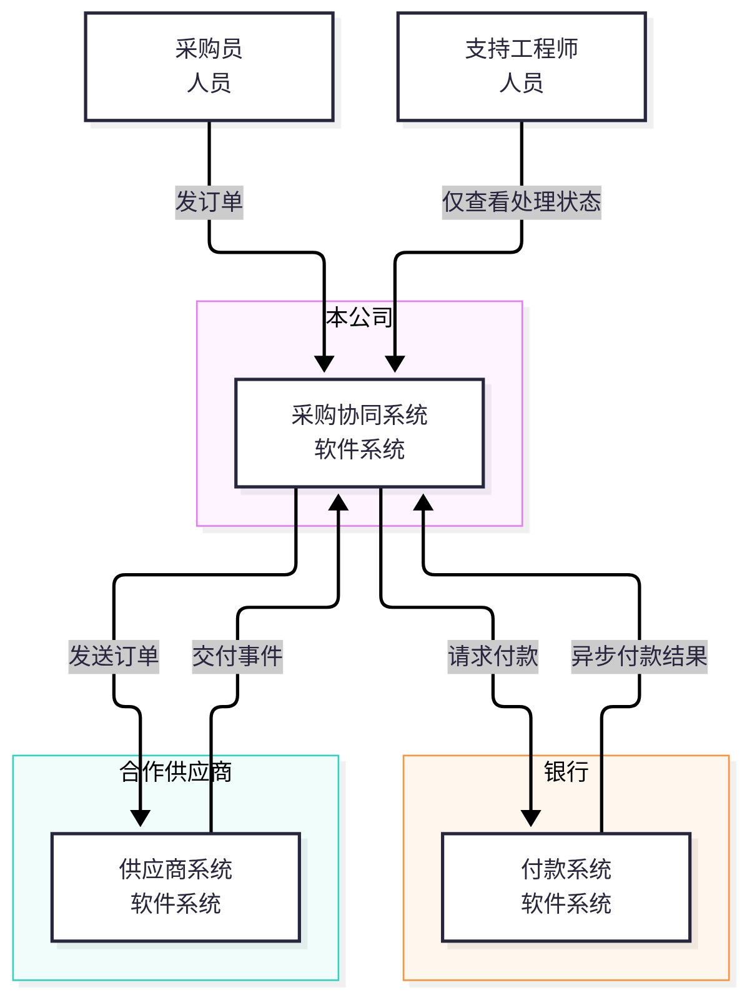

图 2 · `flowchart TB` · [SVG 放大](trajectories/show-me/02-c4/rendered/stage1-2.svg)

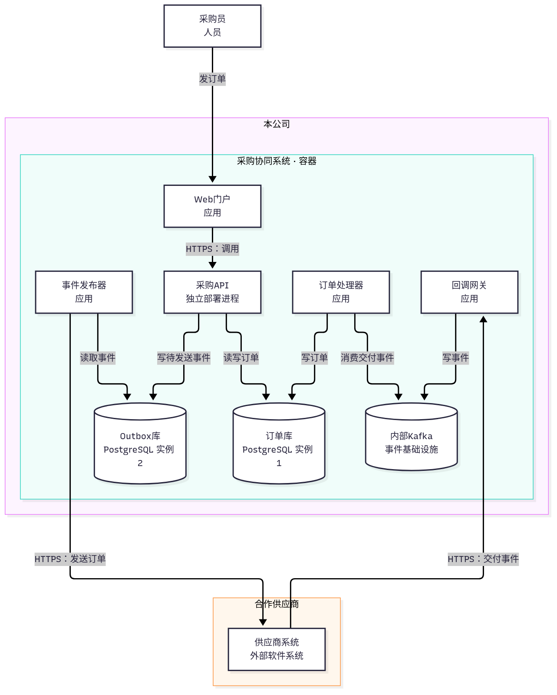

图 3 · `flowchart TB` · [SVG 放大](trajectories/show-me/02-c4/rendered/stage1-3.svg)

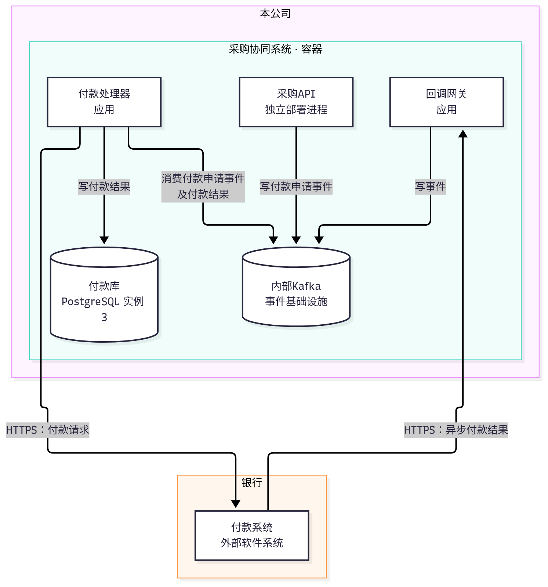

图 4 · `flowchart TB` · [SVG 放大](trajectories/show-me/02-c4/rendered/stage1-4.svg)

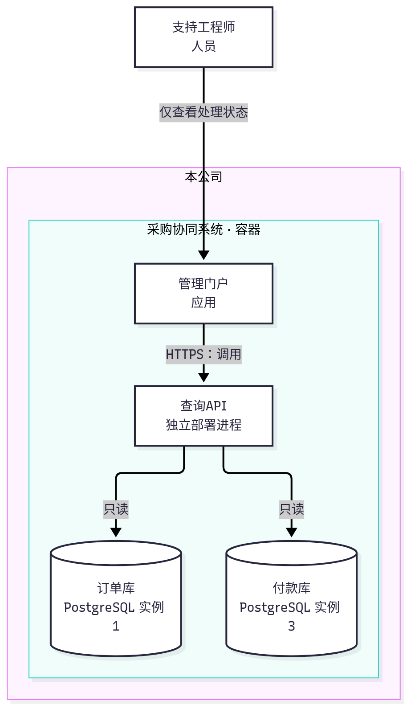

原版 show-me 初稿实际图片（2 张）

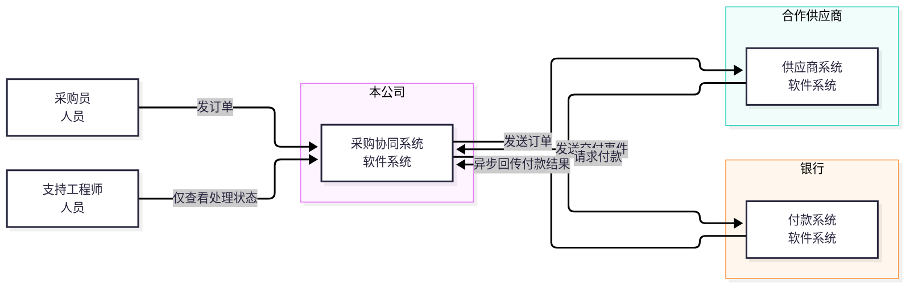

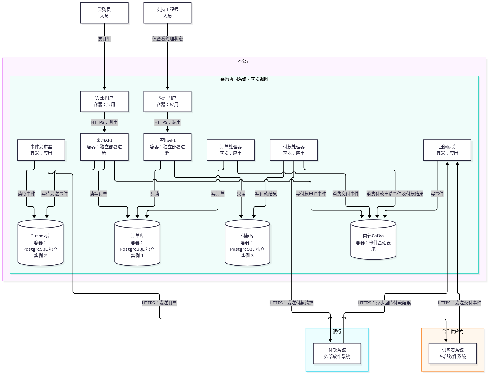

原版 show-me 最终原文（未经人工修改）

已查看四张渲染图：通信标签可辨，组织边界清楚。以下保留已检查的图源码。

### C1：系统与组织边界

面向业务负责人：展示系统归属与跨组织往来。连线表示系统层面的业务通信，具体执行单元见 C2。

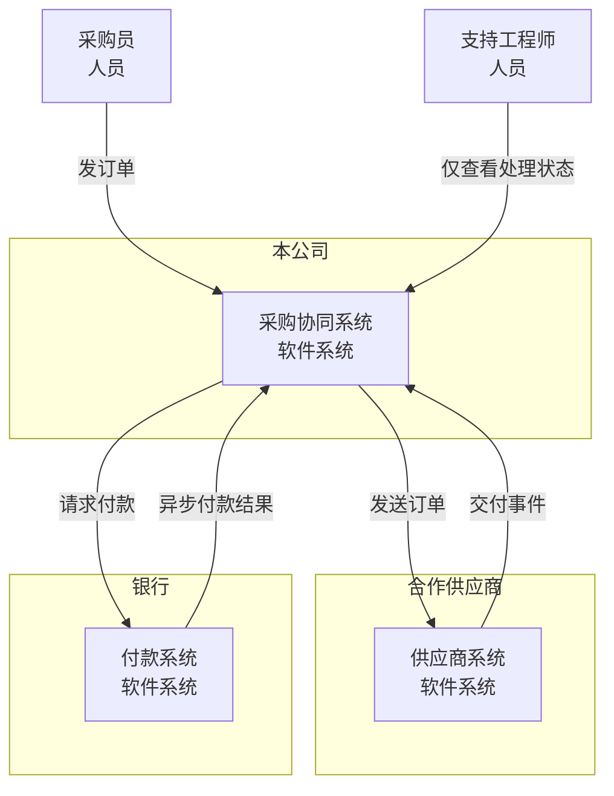
```mermaid
---
config:
  flowchart:
    nodeSpacing: 70
    rankSpacing: 90
    curve: basis
---
flowchart TB
    buyer["采购员<br/>人员"]
    support["支持工程师<br/>人员"]

    subgraph company["本公司"]
        procurement["采购协同系统<br/>软件系统"]
    end
    subgraph supplierOrg["合作供应商"]
        supplier["供应商系统<br/>软件系统"]
    end
    subgraph bankOrg["银行"]
        bank["付款系统<br/>软件系统"]
    end

    buyer -->|"发订单"| procurement
    support -->|"仅查看处理状态"| procurement
    procurement -->|"发送订单"| supplier
    supplier -->|"交付事件"| procurement
    procurement -->|"请求付款"| bank
    bank -->|"异步付款结果"| procurement
```

### C2：内部运行单元与关键通信

面向工程师：将采购协同系统的容器视图按业务链路分成三个局部视图。**同名节点是同一个运行单元，三个视图合起来覆盖全部已确认通信。**

系统边界内的应用、进程和数据存储均为 C4 容器；供应商与银行保持为边界外的软件系统。数据库箭头表示访问方向；“消费”箭头从消费者指向 Kafka，表示读取事件。

#### 订单发送与交付处理

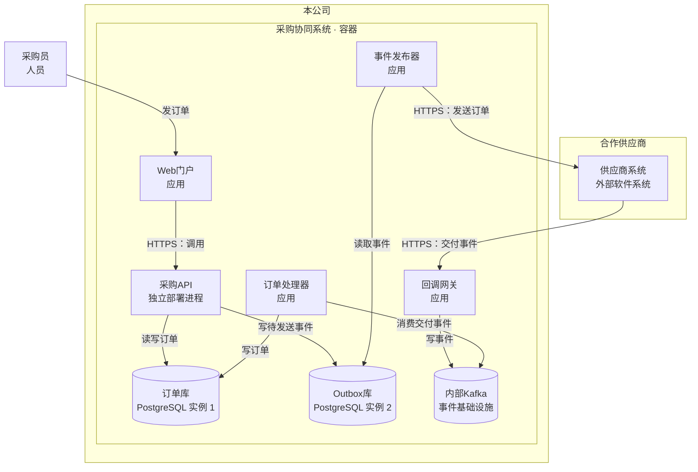
```mermaid
---
config:
  flowchart:
    nodeSpacing: 45
    rankSpacing: 65
---
flowchart TB
    buyer["采购员<br/>人员"]

    subgraph company["本公司"]
        subgraph procurement["采购协同系统 · 容器"]
            web["Web门户<br/>应用"]
            api["采购API<br/>独立部署进程"]
            orders[("订单库<br/>PostgreSQL 实例 1")]
            outbox[("Outbox库<br/>PostgreSQL 实例 2")]
            publisher["事件发布器<br/>应用"]
            gateway["回调网关<br/>应用"]
            kafka[("内部Kafka<br/>事件基础设施")]
            processor["订单处理器<br/>应用"]

            web -->|"HTTPS：调用"| api
            api -->|"读写订单"| orders
            api -->|"写待发送事件"| outbox
            publisher -->|"读取事件"| outbox
            gateway -->|"写事件"| kafka
            processor -->|"消费交付事件"| kafka
            processor -->|"写订单"| orders
        end
    end

    subgraph supplierOrg["合作供应商"]
        supplier["供应商系统<br/>外部软件系统"]
    end

    buyer -->|"发订单"| web
    publisher -->|"HTTPS：发送订单"| supplier
    supplier -->|"HTTPS：交付事件"| gateway
```

#### 付款申请与异步结果

采购API写入付款申请事件；付款处理器消费申请并请求银行付款。银行异步结果经回调网关写入 Kafka，由付款处理器消费并写入付款库。

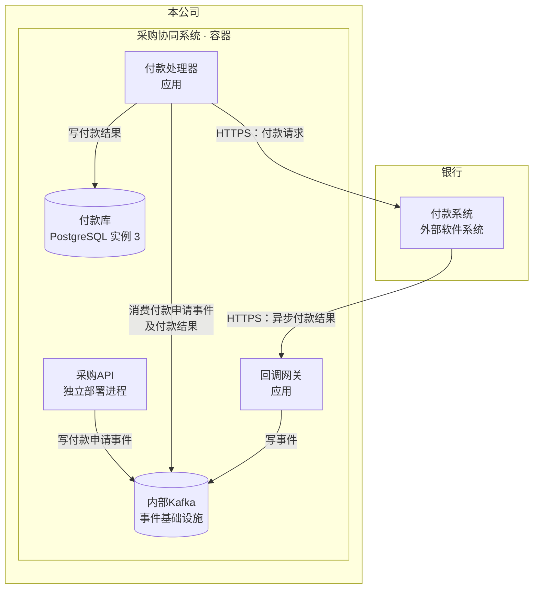
```mermaid
---
config:
  flowchart:
    nodeSpacing: 55
    rankSpacing: 70
---
flowchart TB
    subgraph company["本公司"]
        subgraph procurement["采购协同系统 · 容器"]
            api["采购API<br/>独立部署进程"]
            kafka[("内部Kafka<br/>事件基础设施")]
            processor["付款处理器<br/>应用"]
            gateway["回调网关<br/>应用"]
            payments[("付款库<br/>PostgreSQL 实例 3")]

            api -->|"写付款申请事件"| kafka
            processor -->|"消费付款申请事件<br/>及付款结果"| kafka
            gateway -->|"写事件"| kafka
            processor -->|"写付款结果"| payments
        end
    end

    subgraph bankOrg["银行"]
        bank["付款系统<br/>外部软件系统"]
    end

    processor -->|"HTTPS：付款请求"| bank
    bank -->|"HTTPS：异步付款结果"| gateway
```

#### 处理状态查询

支持工程师仅通过管理门户查看处理状态；查询API只读订单库与付款库。

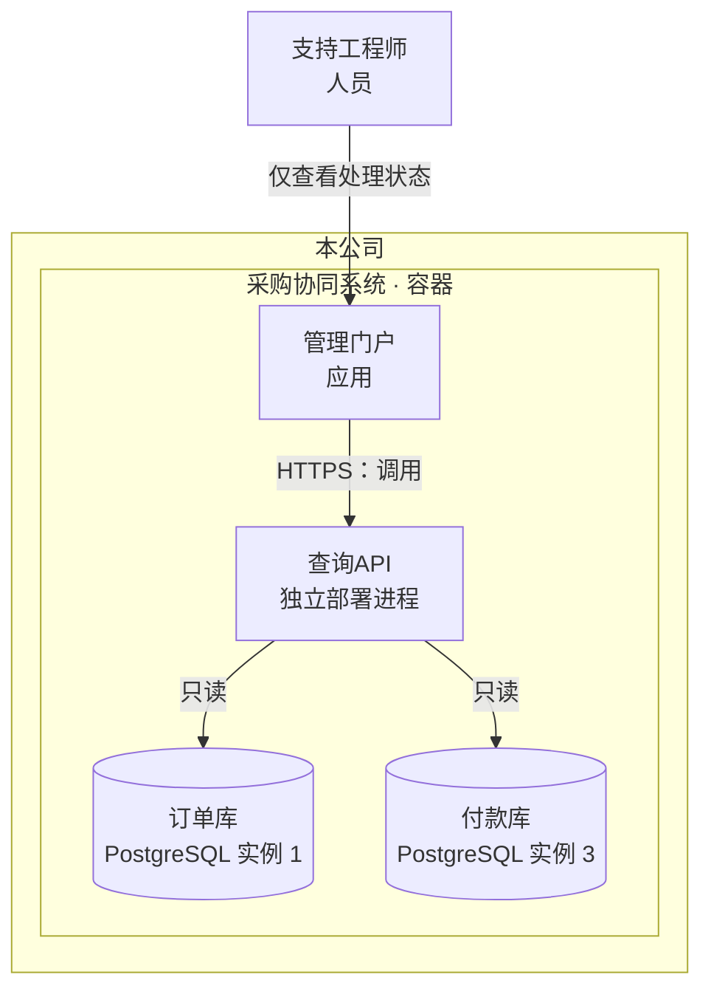
```mermaid
flowchart TB
    support["支持工程师<br/>人员"]

    subgraph company["本公司"]
        subgraph procurement["采购协同系统 · 容器"]
            admin["管理门户<br/>应用"]
            query["查询API<br/>独立部署进程"]
            orders[("订单库<br/>PostgreSQL 实例 1")]
            payments[("付款库<br/>PostgreSQL 实例 3")]

            admin -->|"HTTPS：调用"| query
            query -->|"只读"| orders
            query -->|"只读"| payments
        end
    end

    support -->|"仅查看处理状态"| admin
```

| 部署边界 | 已确认约束 |
|---|---|
| 采购API、查询API | 两个独立部署进程 |
| 订单库、Outbox库、付款库 | 三个独立 PostgreSQL 实例 |
| 供应商系统、银行付款系统 | 属于各自组织，内部容器未规定 |

视图止于 C2 容器层，未展开组件，也未添加缓存、身份服务、补偿／重试或 Kafka 具体主题。

### 0.4.2 最终实际画面

[完整最终回答](outputs/v042/02-c4.md) · [初稿](trajectories/v042/02-c4/stage0/answer.md) · [第一次反馈后修订稿](trajectories/v042/02-c4/stage1/answer.md)

图 1 · `flowchart TB` · [SVG 放大](trajectories/v042/02-c4/rendered/stage1-1.svg)

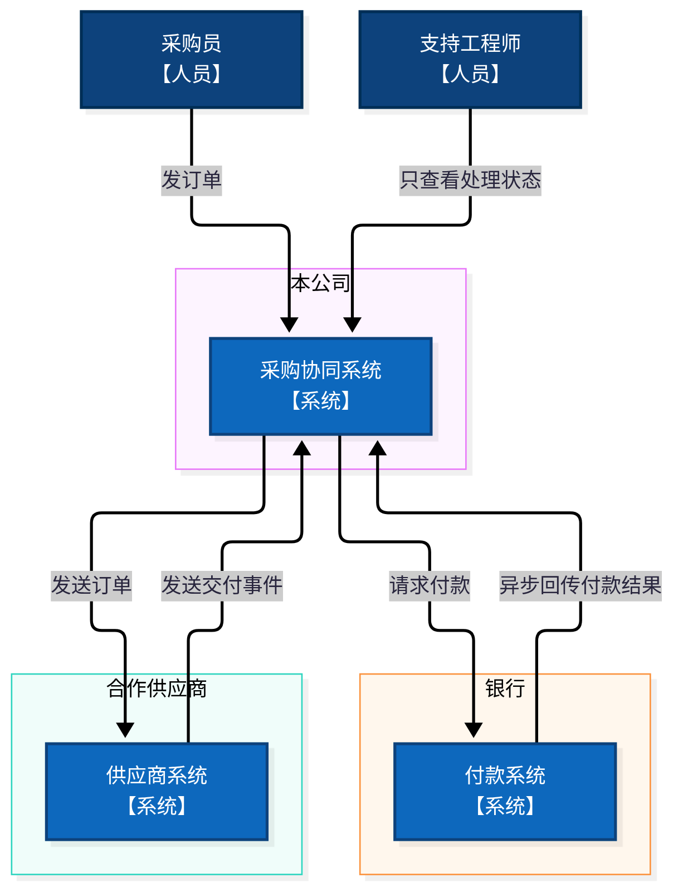

图 2 · `flowchart TB` · [SVG 放大](trajectories/v042/02-c4/rendered/stage1-2.svg)

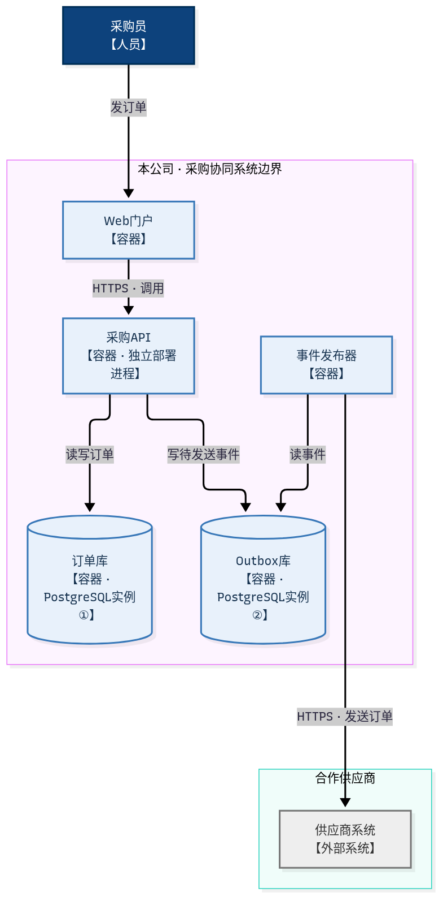

图 3 · `flowchart LR` · [SVG 放大](trajectories/v042/02-c4/rendered/stage1-3.svg)

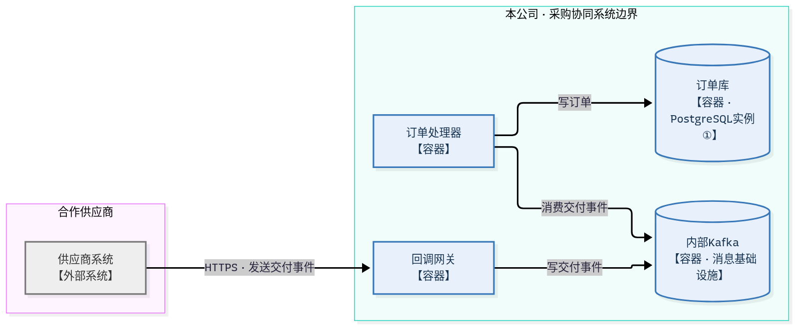

图 4 · `flowchart TB` · [SVG 放大](trajectories/v042/02-c4/rendered/stage1-4.svg)

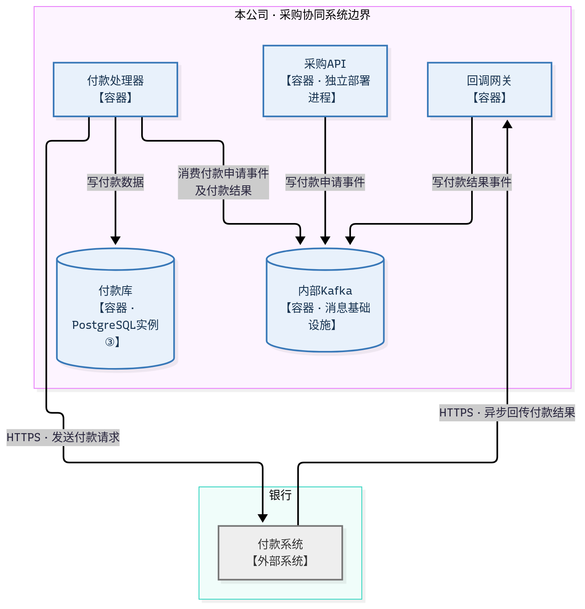

图 5 · `flowchart TB` · [SVG 放大](trajectories/v042/02-c4/rendered/stage1-5.svg)

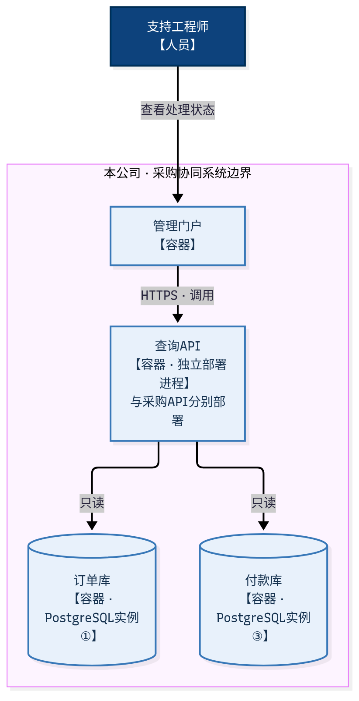

0.4.2 初稿实际图片（4 张）

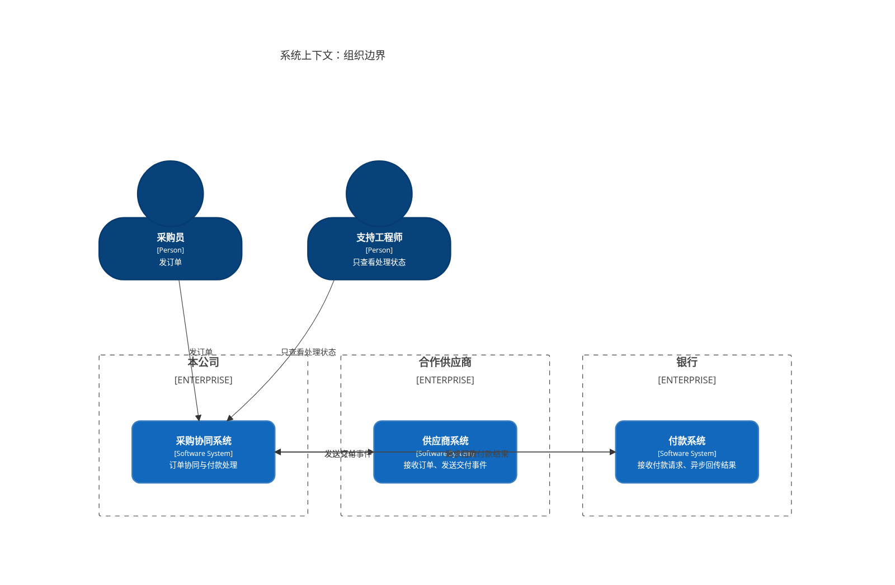

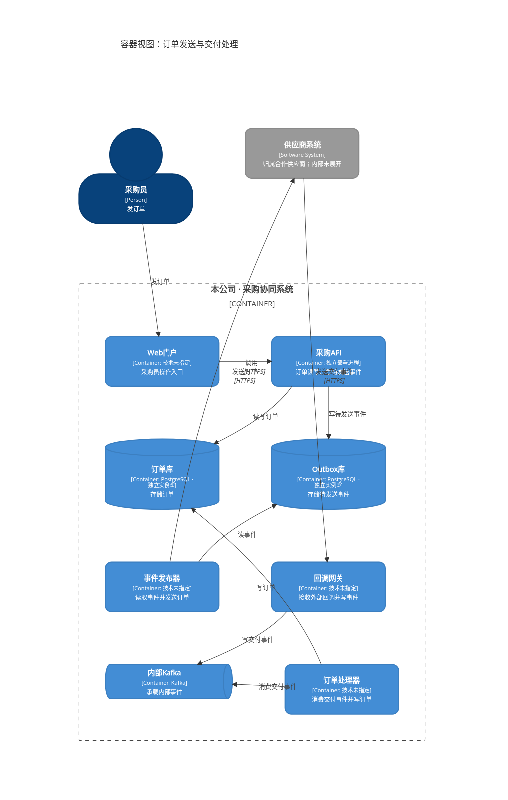

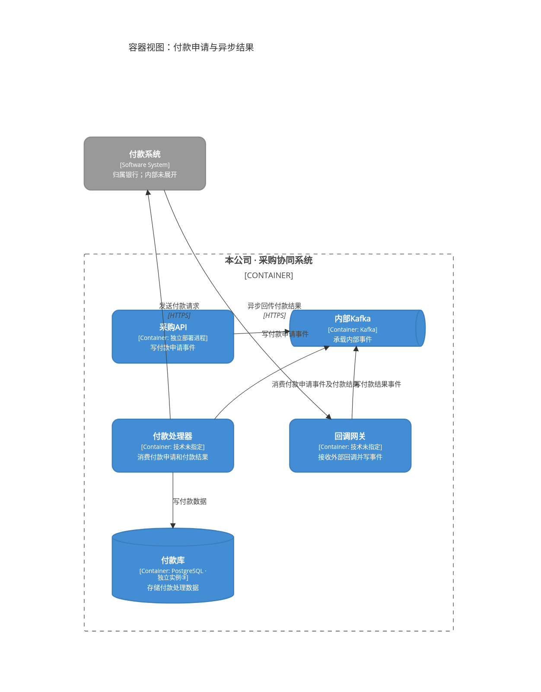

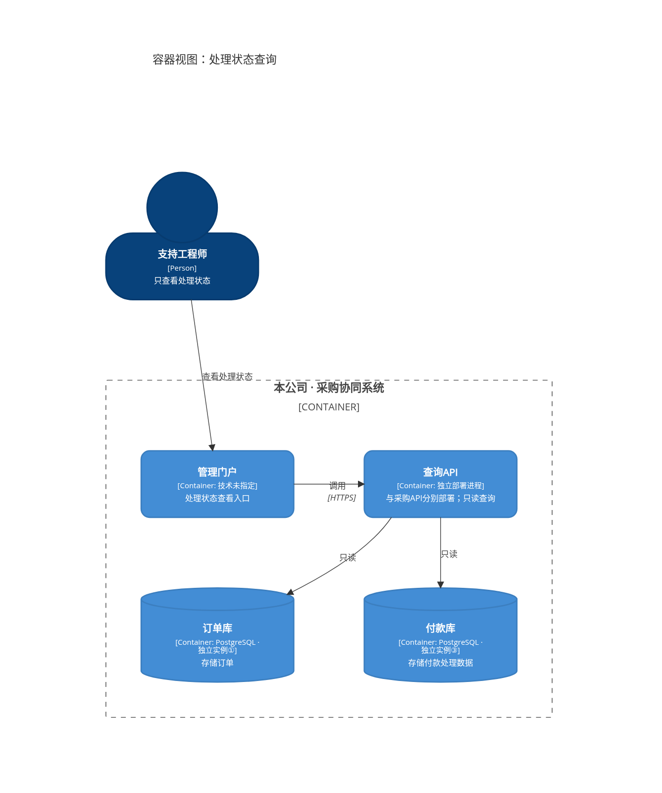

0.4.2 最终原文（未经人工修改）

已检查本轮五张实际画面：文字可读，通信标签没有明显重叠，连线未遮挡关键节点。以下保留已检查的图源码。

图按 **C4 系统上下文层、容器层**组织，以 Mermaid 流程图语法表达。容器是独立运行单元；不同图中的同名容器代表同一个单元。容器图箭头表示调用或读写的发起方向，“读”和“消费”指向数据源。

### 1. 系统上下文：组织边界

采购协同系统属于本公司；供应商系统、付款系统分别属于合作供应商和银行。

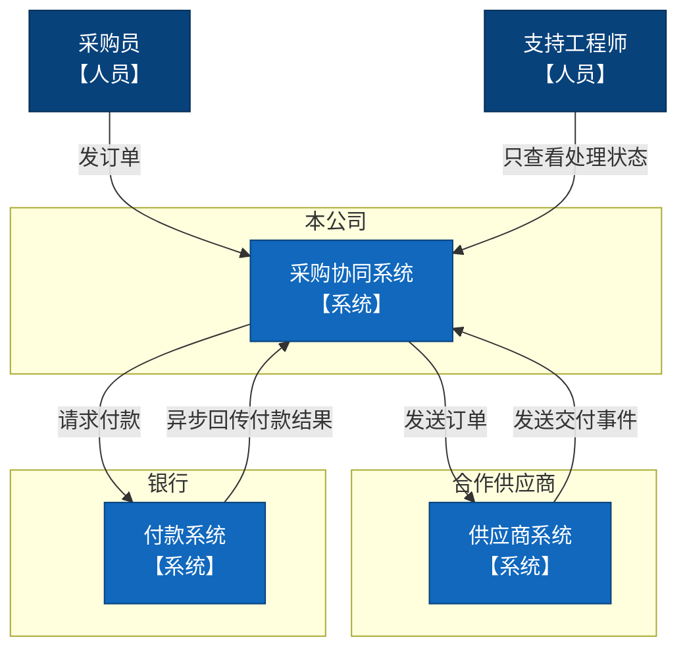
```mermaid
flowchart TB
    buyer["采购员<br/>【人员】"]
    support["支持工程师<br/>【人员】"]

    subgraph company["本公司"]
        procurement["采购协同系统<br/>【系统】"]
    end
    subgraph supplierOrg["合作供应商"]
        supplier["供应商系统<br/>【系统】"]
    end
    subgraph bankOrg["银行"]
        bank["付款系统<br/>【系统】"]
    end

    buyer -->|"发订单"| procurement
    support -->|"只查看处理状态"| procurement
    procurement -->|"发送订单"| supplier
    supplier -->|"发送交付事件"| procurement
    procurement -->|"请求付款"| bank
    bank -->|"异步回传付款结果"| procurement

    classDef person fill:#08427b,color:#fff,stroke:#052e56
    classDef system fill:#1168bd,color:#fff,stroke:#08427b
    class buyer,support person
    class procurement,supplier,bank system
```

### 2. 容器视图：订单发送

采购API读写订单库，向 Outbox 库写待发送事件；事件发布器读取 Outbox 后向供应商发送订单。订单库与 Outbox 库是两个独立 PostgreSQL 实例。

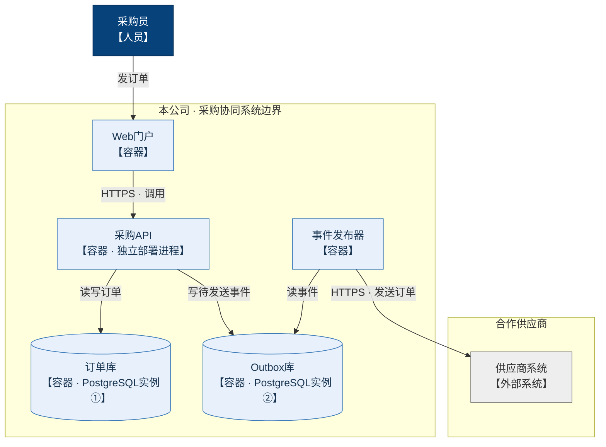
```mermaid
flowchart TB
    buyer["采购员<br/>【人员】"]

    subgraph company["本公司 · 采购协同系统边界"]
        web["Web门户<br/>【容器】"]
        api["采购API<br/>【容器 · 独立部署进程】"]
        orderDb[("订单库<br/>【容器 · PostgreSQL实例①】")]
        outboxDb[("Outbox库<br/>【容器 · PostgreSQL实例②】")]
        publisher["事件发布器<br/>【容器】"]

        web -->|"HTTPS · 调用"| api
        api -->|"读写订单"| orderDb
        api -->|"写待发送事件"| outboxDb
        publisher -->|"读事件"| outboxDb
    end

    subgraph supplierOrg["合作供应商"]
        supplier["供应商系统<br/>【外部系统】"]
    end

    buyer -->|"发订单"| web
    publisher -->|"HTTPS · 发送订单"| supplier

    classDef person fill:#08427b,color:#fff,stroke:#052e56
    classDef container fill:#e8f1fb,color:#16324f,stroke:#3978b8
    classDef external fill:#eeeeee,color:#333,stroke:#777
    class buyer person
    class web,api,orderDb,outboxDb,publisher container
    class supplier external
```

### 3. 容器视图：交付事件处理

供应商向回调网关发送交付事件；网关写入 Kafka，订单处理器消费事件并写订单库。

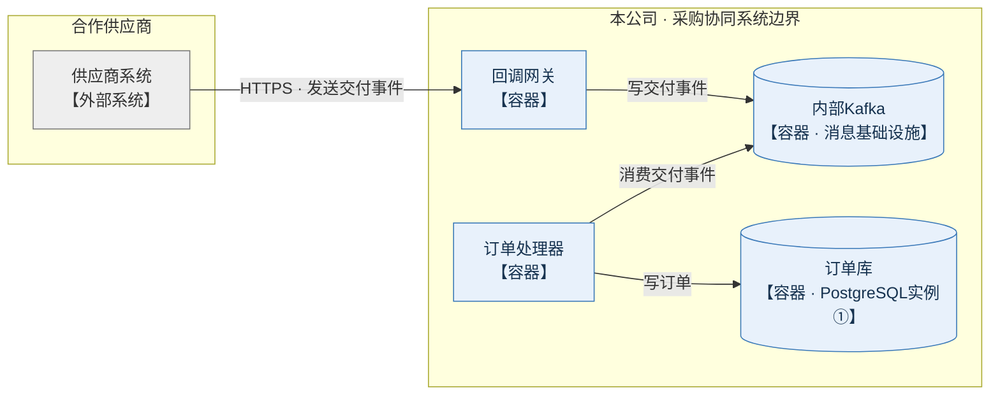
```mermaid
flowchart LR
    subgraph supplierOrg["合作供应商"]
        supplier["供应商系统<br/>【外部系统】"]
    end

    subgraph company["本公司 · 采购协同系统边界"]
        callback["回调网关<br/>【容器】"]
        kafka[("内部Kafka<br/>【容器 · 消息基础设施】")]
        orderWorker["订单处理器<br/>【容器】"]
        orderDb[("订单库<br/>【容器 · PostgreSQL实例①】")]

        callback -->|"写交付事件"| kafka
        orderWorker -->|"消费交付事件"| kafka
        orderWorker -->|"写订单"| orderDb
    end

    supplier -->|"HTTPS · 发送交付事件"| callback

    classDef container fill:#e8f1fb,color:#16324f,stroke:#3978b8
    classDef external fill:#eeeeee,color:#333,stroke:#777
    class callback,kafka,orderWorker,orderDb container
    class supplier external
```

### 4. 容器视图：付款申请与异步结果

付款处理器消费采购API写入的付款申请，向银行请求付款。银行异步回传结果，经回调网关写入 Kafka，由付款处理器消费并写付款库。

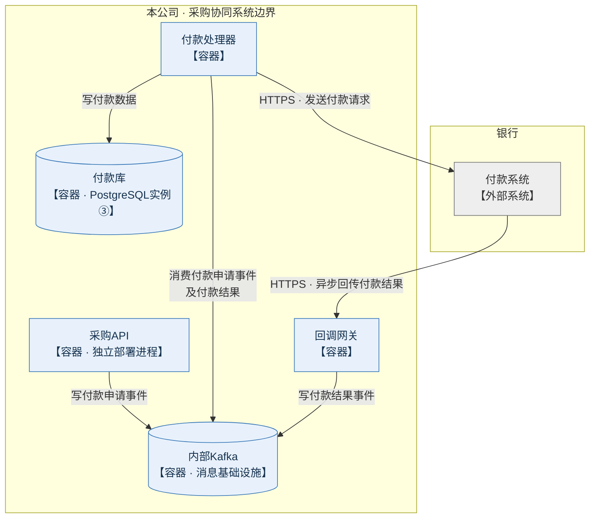
```mermaid
flowchart TB
    subgraph company["本公司 · 采购协同系统边界"]
        api["采购API<br/>【容器 · 独立部署进程】"]
        kafka[("内部Kafka<br/>【容器 · 消息基础设施】")]
        paymentWorker["付款处理器<br/>【容器】"]
        callback["回调网关<br/>【容器】"]
        paymentDb[("付款库<br/>【容器 · PostgreSQL实例③】")]

        api -->|"写付款申请事件"| kafka
        paymentWorker -->|"消费付款申请事件<br/>及付款结果"| kafka
        callback -->|"写付款结果事件"| kafka
        paymentWorker -->|"写付款数据"| paymentDb
    end

    subgraph bankOrg["银行"]
        bank["付款系统<br/>【外部系统】"]
    end

    paymentWorker -->|"HTTPS · 发送付款请求"| bank
    bank -->|"HTTPS · 异步回传付款结果"| callback

    classDef container fill:#e8f1fb,color:#16324f,stroke:#3978b8
    classDef external fill:#eeeeee,color:#333,stroke:#777
    class api,kafka,paymentWorker,callback,paymentDb container
    class bank external
```

### 5. 容器视图：只读查看处理状态

支持工程师只通过管理门户查看状态。查询API与采购API分别部署，只读订单库与付款库。

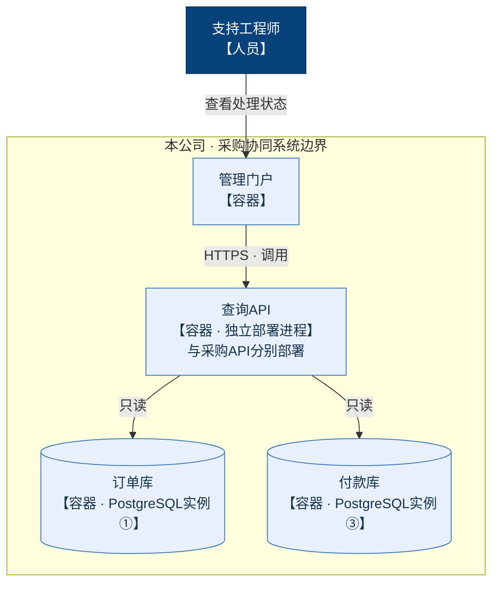
```mermaid
flowchart TB
    support["支持工程师<br/>【人员】"]

    subgraph company["本公司 · 采购协同系统边界"]
        admin["管理门户<br/>【容器】"]
        queryApi["查询API<br/>【容器 · 独立部署进程】<br/>与采购API分别部署"]
        orderDb[("订单库<br/>【容器 · PostgreSQL实例①】")]
        paymentDb[("付款库<br/>【容器 · PostgreSQL实例③】")]

        admin -->|"HTTPS · 调用"| queryApi
        queryApi -->|"只读"| orderDb
        queryApi -->|"只读"| paymentDb
    end

    support -->|"查看处理状态"| admin

    classDef person fill:#08427b,color:#fff,stroke:#052e56
    classDef container fill:#e8f1fb,color:#16324f,stroke:#3978b8
    class support person
    class admin,queryApi,orderDb,paymentDb container
```

三个 PostgreSQL 实例彼此独立。供应商和银行的内部结构保持未展开；未指定的内部协议、Kafka 主题及其他机制均未补充。

## 对当前 Skill 的含义

继续以 show-me 作为表达主体、保留少量忠实表达与实际画面检查补充是合理选择。0.4.2 不需要因这轮再加选图规则或例子；本轮也不足以要求所有复杂图必须使用专用 Mermaid 指引。现有 Skill 未修改，README 仅增加本轮证据。

评审为知道组别的主 Agent 人工检查，每题每组只有一个样本；并非盲评、统计证明或用户阅读实验。渲染由外部控制器提供，不验证原生客户端加载、自动触发或自主选择渲染工具，也不覆盖 HTML 与其他领域。
