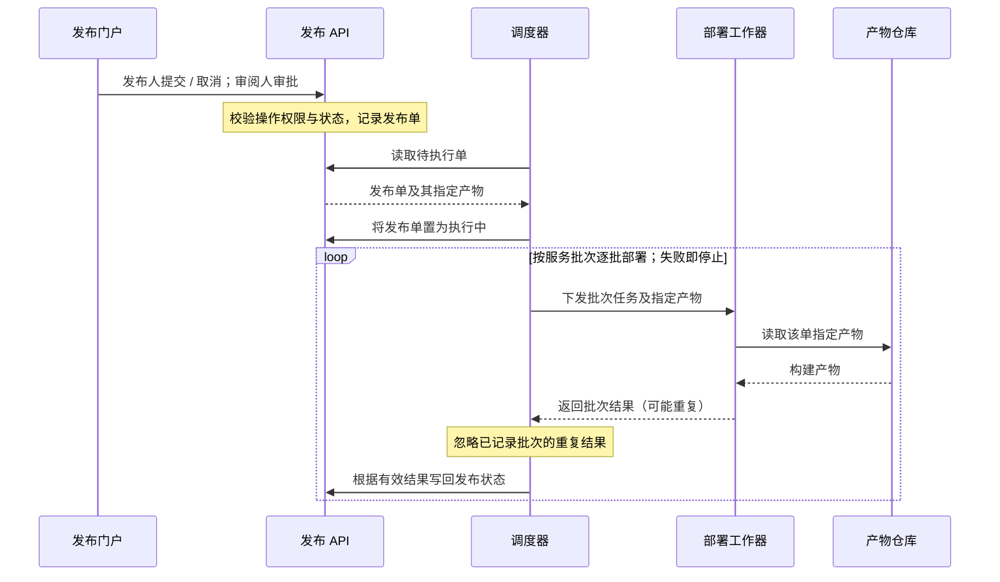
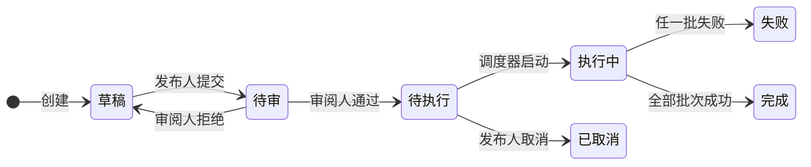
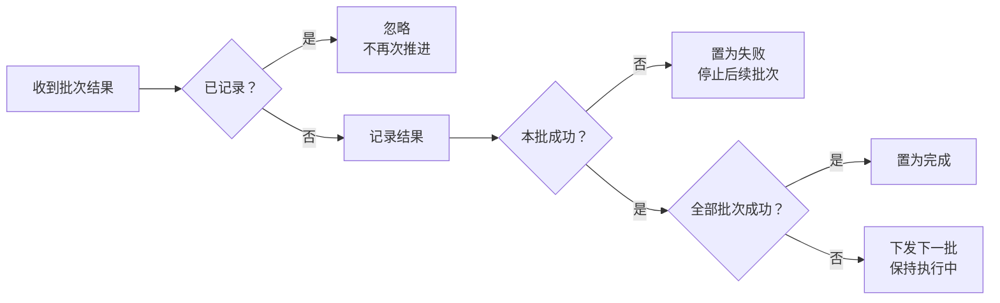

### 各部分怎样协作

每张发布单关联且仅关联一个**不可变构建产物**；同一产物可以被多个发布单使用。

### 发布状态怎样变化

**调度器只启动待执行单，并先将其置为执行中；执行中不能取消。** 每批成功才推进下一批，期间仍为执行中。任一批失败即停止后续批次，**已成功批次不自动回滚**。

### 批次结果怎样处理

以下判断均由调度器执行；“已记录”针对**同一发布单的同一批次**。

### 审批约束落在哪里

门户提供操作入口；**发布 API 接受提交、审批、取消操作时，校验角色、当前状态，以及审批者是否为该单提交人**。执行状态由调度器推进并写回 API。

| 操作者 | 允许操作 | 约束 |
|---|---|---|
| 发布人 | 仅提交、取消 | 草稿可提交；待执行可取消 |
| 审阅人 | 仅审批通过、拒绝 | 待审可审批；不能审批自己提交的单 |
| 调度器 | 仅推进执行状态 | 待执行可启动；根据批次结果推进 |
| 部署工作器 | 执行批次、返回结果 | 不直接更新发布状态 |

一个人可以拥有发布人、审阅人两个角色，但**仍不能审批自己提交的发布单**；仅检查角色不足以满足这项约束。

未提供数据库、消息队列、通知、超时、自动重试或失败后恢复方案。

*以上三个图块沿用已查看的渲染稿，未修改图源码。*