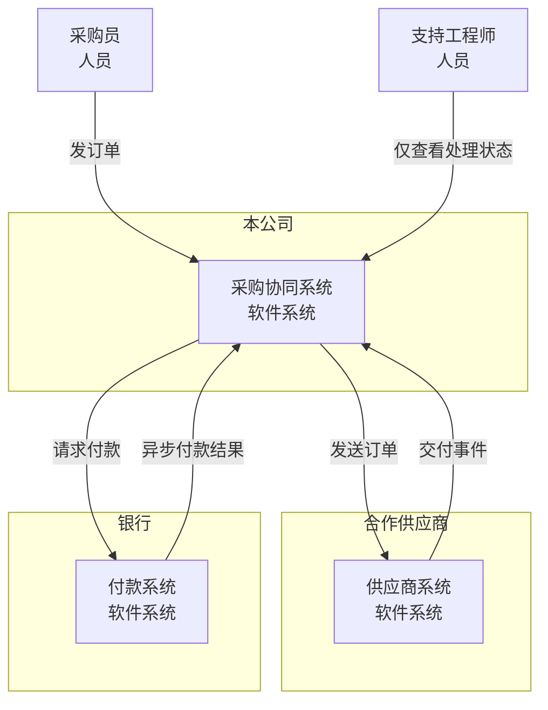
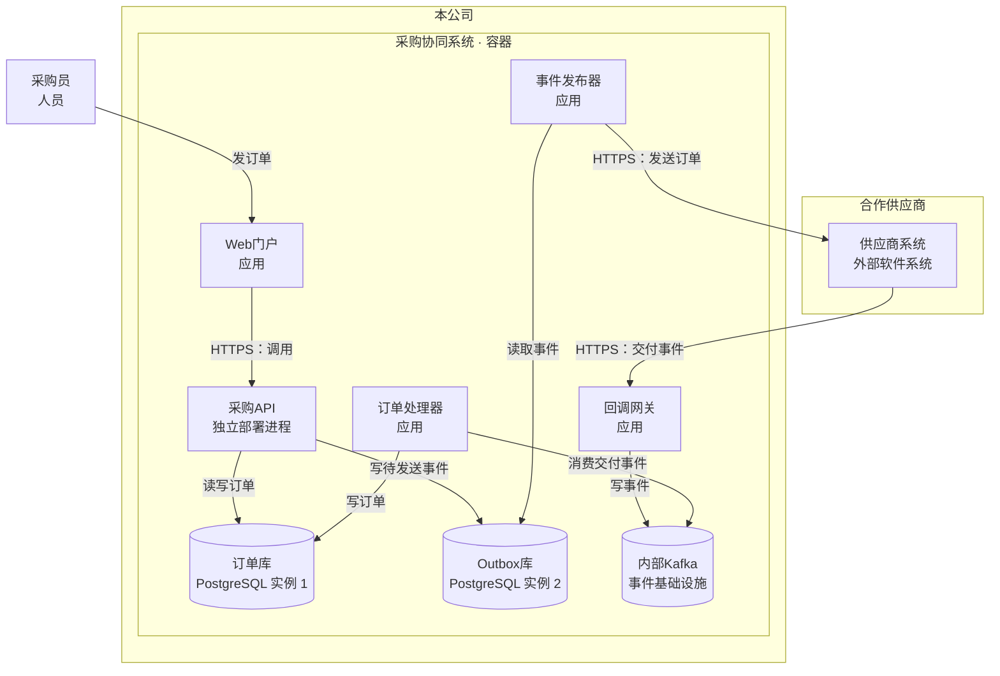
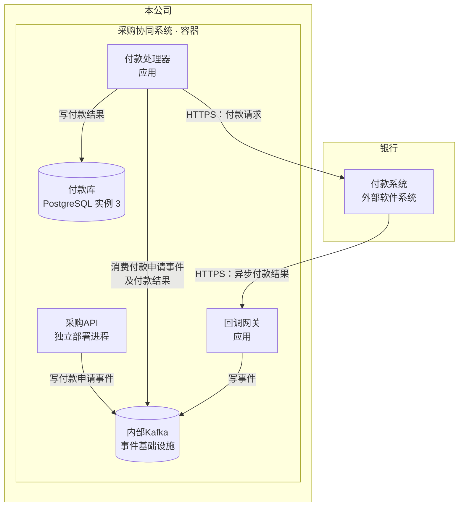
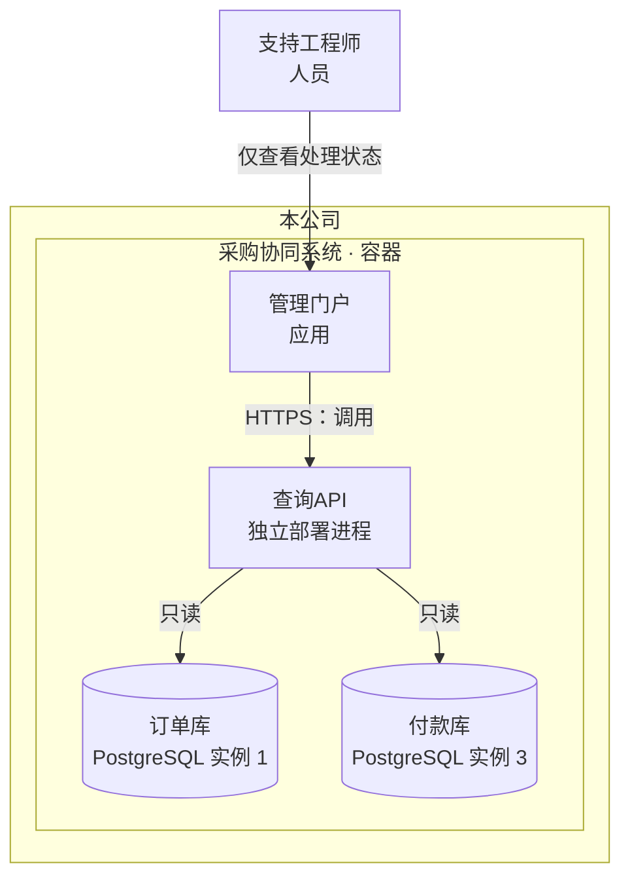

已查看四张渲染图：通信标签可辨，组织边界清楚。以下保留已检查的图源码。

### C1：系统与组织边界

面向业务负责人：展示系统归属与跨组织往来。连线表示系统层面的业务通信，具体执行单元见 C2。

### C2：内部运行单元与关键通信

面向工程师：将采购协同系统的容器视图按业务链路分成三个局部视图。**同名节点是同一个运行单元，三个视图合起来覆盖全部已确认通信。**

系统边界内的应用、进程和数据存储均为 C4 容器；供应商与银行保持为边界外的软件系统。数据库箭头表示访问方向；“消费”箭头从消费者指向 Kafka，表示读取事件。

#### 订单发送与交付处理

#### 付款申请与异步结果

采购API写入付款申请事件；付款处理器消费申请并请求银行付款。银行异步结果经回调网关写入 Kafka，由付款处理器消费并写入付款库。

#### 处理状态查询

支持工程师仅通过管理门户查看处理状态；查询API只读订单库与付款库。

| 部署边界 | 已确认约束 |
|---|---|
| 采购API、查询API | 两个独立部署进程 |
| 订单库、Outbox库、付款库 | 三个独立 PostgreSQL 实例 |
| 供应商系统、银行付款系统 | 属于各自组织，内部容器未规定 |

视图止于 C2 容器层，未展开组件，也未添加缓存、身份服务、补偿／重试或 Kafka 具体主题。