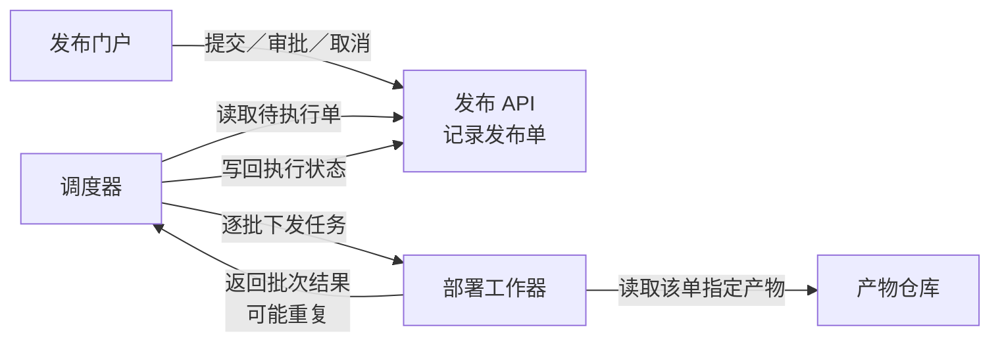
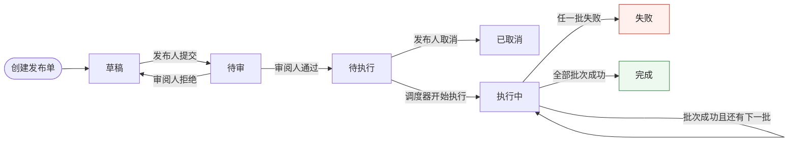
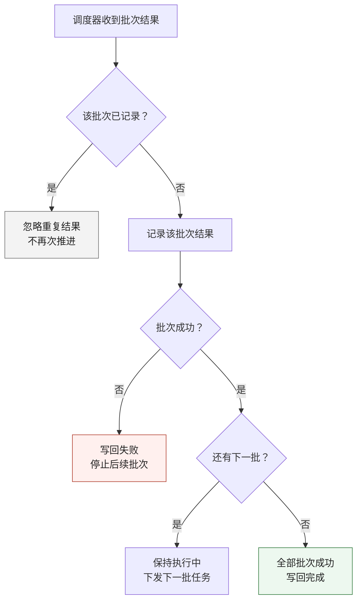

### 1. 各部分怎样协作

每张发布单关联且仅关联一个**不可变构建产物**；同一产物可被多个发布单使用。

### 2. 发布状态怎样演变

箭头标明动作及责任角色。**待执行可取消，执行中不能取消**。

执行中的状态推进均由调度器负责。任一批失败后，**停止后续批次，已成功批次不自动回滚**。

### 3. 批次结果如何处理

调度器先将发布单置为执行中，再按服务批次逐批下发任务。工作器读取指定产物、部署并返回结果；调度器按下图处理每一条结果。

重复检查针对**结果所属批次**，即使已推进到下一批，旧批次的重复结果也会被忽略。“忽略”仅结束对该条结果的处理，不终止发布。

### 4. 审批约束落在哪里

门户提供操作入口，API 接收操作并记录发布单；具体权限校验实现位置未提供。审批资格受**角色、发布状态和该单提交人身份**共同约束。

| 主体 | 允许动作 | 约束 |
|---|---|---|
| 发布人 | 提交、取消 | 草稿可提交；仅待执行可取消 |
| 审阅人 | 审批通过、拒绝 | 仅待审可审批；不能审批自己提交的同一单 |
| 调度器 | 推进执行状态 | 只执行待执行单；依据批次结果推进 |

一个人可以同时拥有发布人和审阅人角色，但**同一单的提交人仍不能审批该单**。

未提供数据库、消息队列、通知、超时、自动重试或失败后恢复方案，以上未补设这些机制。

前两图沿用已看到的渲染画面；第三图已缩短流程、移除长回路线，新稿尚未检查实际渲染。