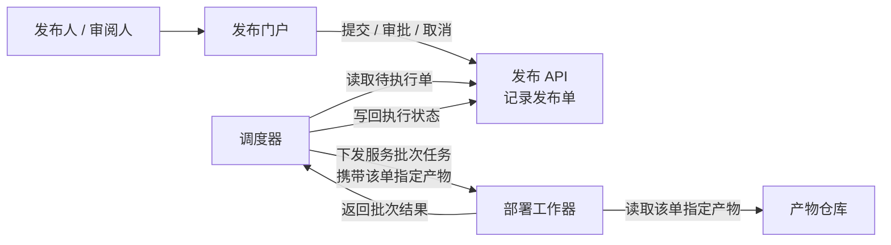
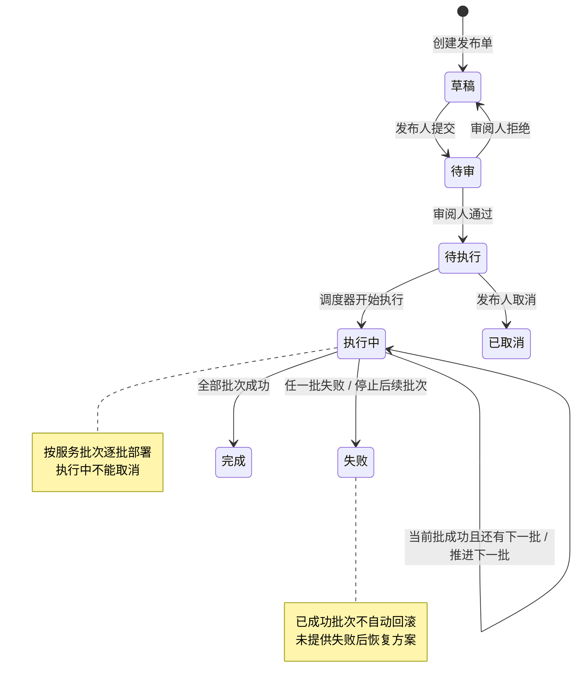
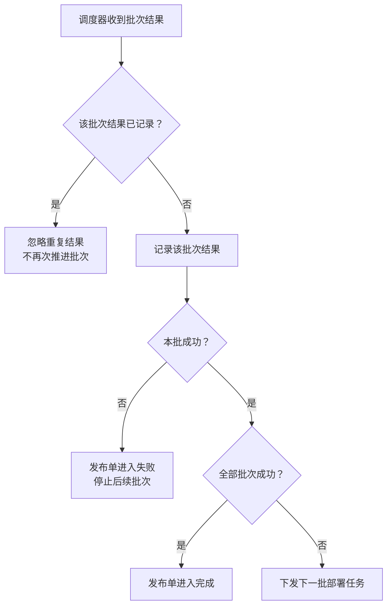

### 组件协作

发布单关联且仅关联一个**不可变构建产物**；同一产物可供多个发布单使用。

### 发布状态与异常

调度器只从**待执行**开始执行，并先将发布单置为**执行中**。批次结果的处理如下：

### 审批与权限边界

门户提供操作入口；发布 API 接收这些操作，约束应在其接受操作、变更发布单时校验。

| 操作者 | 允许操作 | 必须满足的约束 |
|---|---|---|
| 发布人 | 提交、取消 | 草稿可提交；仅待执行可取消 |
| 审阅人 | 审批通过、拒绝 | 仅待审可审批；操作者不能是该单提交人 |
| 调度器 | 推进执行状态 | 仅待执行可启动；按批次结果推进至失败或完成 |
| 部署工作器 | 执行批次、返回结果 | 不直接更新发布状态，由调度器更新 |

**一个人可以同时拥有发布人和审阅人角色，但仍不能审批自己提交的那张发布单。** 这项限制按“操作者与该单提交人是否相同”判断，不能只检查角色。

以上仅呈现已确认机制；未提供数据库、消息队列、通知、超时、自动重试或失败后恢复方案。