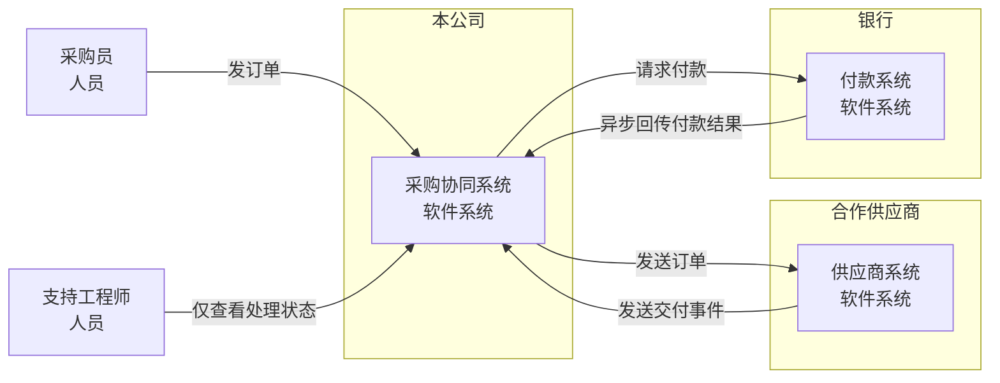
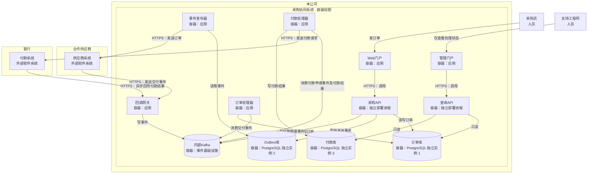

两张视图分别展示 **C1 系统上下文**与 **C2 容器**。这里的“容器”指独立运行的应用或数据存储，不限定为 Docker 容器。

### C1：系统与组织边界

面向业务负责人：明确系统归属，以及跨组织的业务往来。此层的系统间连线表示整体业务通信，具体执行单元见 C2。

### C2：采购协同系统内部运行单元与通信

面向工程师：展开本公司系统的容器；供应商与银行仍保留为外部软件系统，不推定其内部结构。箭头表示调用、投递或数据访问方向；“读取／消费”箭头从执行该操作的容器指向数据源。

采购API与查询API是两个独立部署进程；三个 PostgreSQL 库分别是独立实例。图中未展开组件层，也未添加未规定的内部容器、主题或通信。