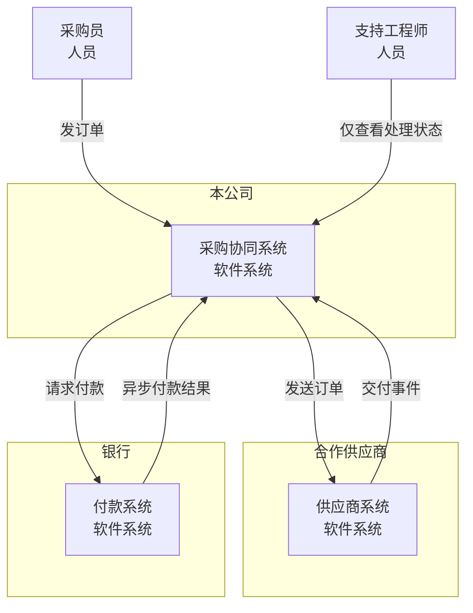
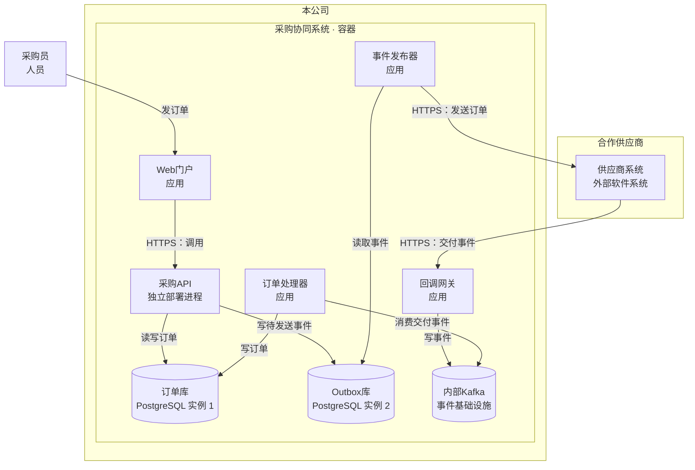
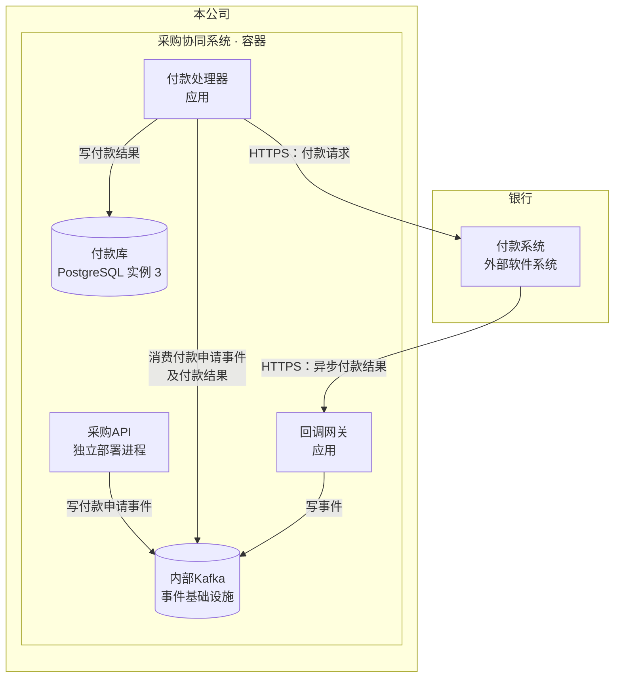
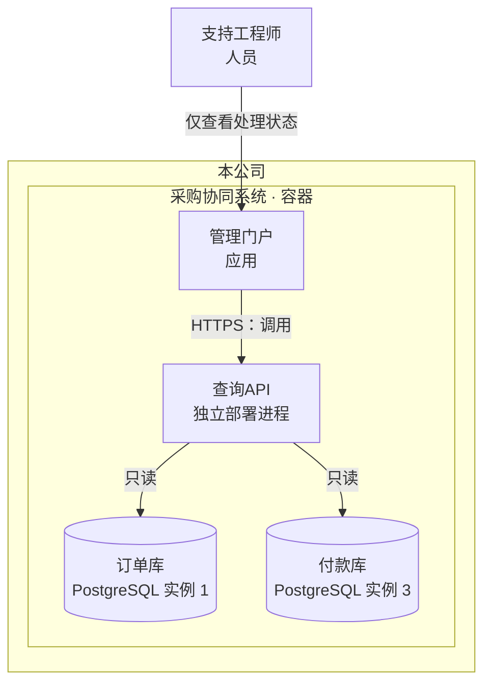

### C1：系统与组织边界

业务负责人关注系统归属与跨组织往来。系统间的连线表示业务通信，内部执行单元在 C2 展开。

### C2：内部运行单元与关键通信

为减少交叉线，将同一容器视图按业务链路拆为三个局部视图。**同名节点代表同一个运行单元**；外部系统保持系统层级，位于本公司边界之外。

容器指运行中的应用或数据存储，不限定为 Docker 容器。数据库箭头表示访问方向；Kafka 的“消费”箭头从消费者指向 Kafka，表示读取事件。

#### 订单发送与交付处理

#### 付款申请与异步结果

采购API写入付款申请事件；付款处理器消费申请并向银行请求付款。银行结果经回调网关进入 Kafka，由付款处理器消费并落库。

#### 处理状态查询

支持工程师仅通过管理门户查看状态，查询API只读订单库与付款库。

采购API与查询API分别独立部署；订单库、Outbox库、付款库是三个独立 PostgreSQL 实例。以上视图只展开到容器层，不引入组件、外部系统内部结构或 Kafka 主题。