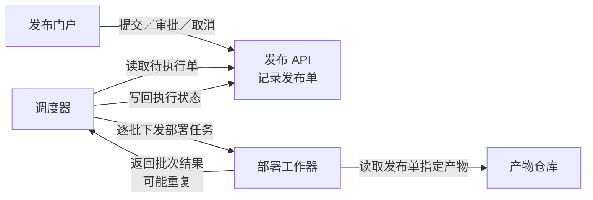
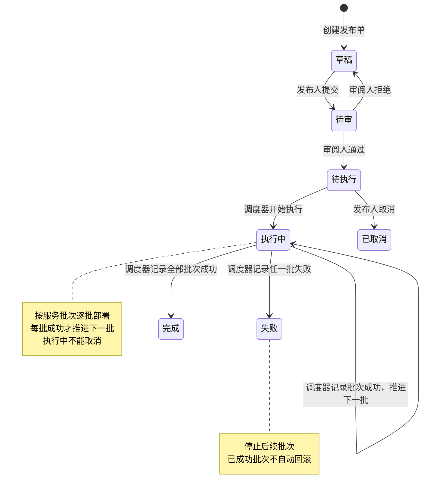
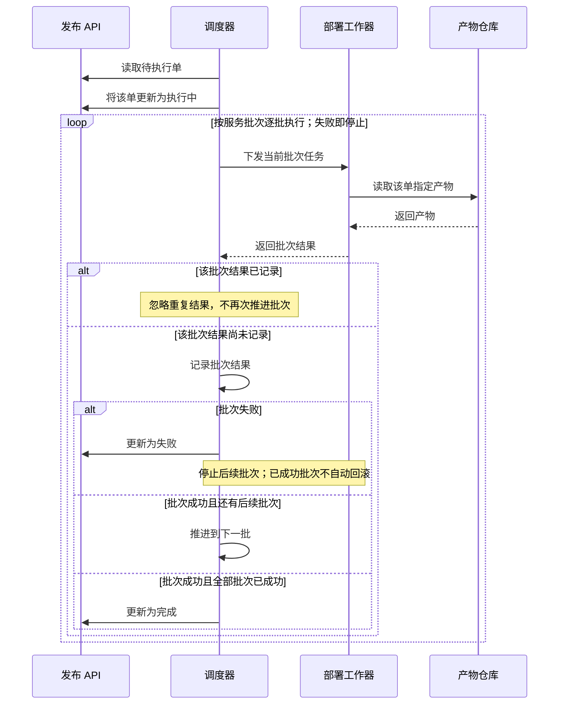

### 1. 各部分怎样协作

发布单关联且仅关联一个**不可变构建产物**；同一产物可供多个发布单使用。

### 2. 发布状态与失败边界

箭头标明动作及其责任角色；调度器只从**待执行**开始执行。

### 3. 批次结果如何推进状态

重复结果的判断与处理在**调度器**：已记录批次的结果被忽略，不再次推进批次。

### 4. 审批约束落在哪里

门户是操作入口，发布 API 接收这些操作并记录发布单。以下权限和同单约束适用于提交、审批、取消入口；具体鉴权实现位置未提供。

| 主体 | 允许的动作 | 重要约束 |
|---|---|---|
| 发布人 | 提交、取消 | 草稿可提交；仅待执行可取消 |
| 审阅人 | 审批：通过或拒绝 | 仅待审可审批；不能审批自己提交的同一单 |
| 调度器 | 推进执行状态 | 只执行待执行单；依据批次结果推进状态 |

一个人可同时拥有发布人和审阅人角色，但**双角色不豁免同单提交人与审批人的分离约束**。

未提供数据库、消息队列、通知、超时、自动重试或失败后恢复方案，图中未补设。以上为待渲染草稿，尚未检查实际画面。