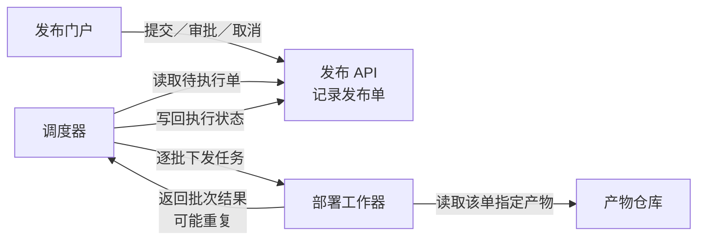
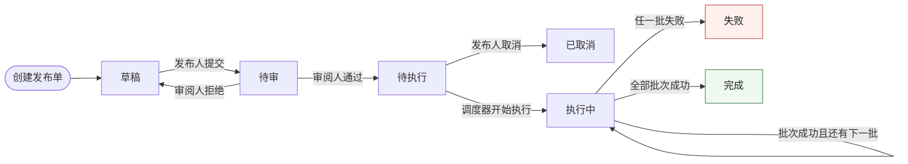
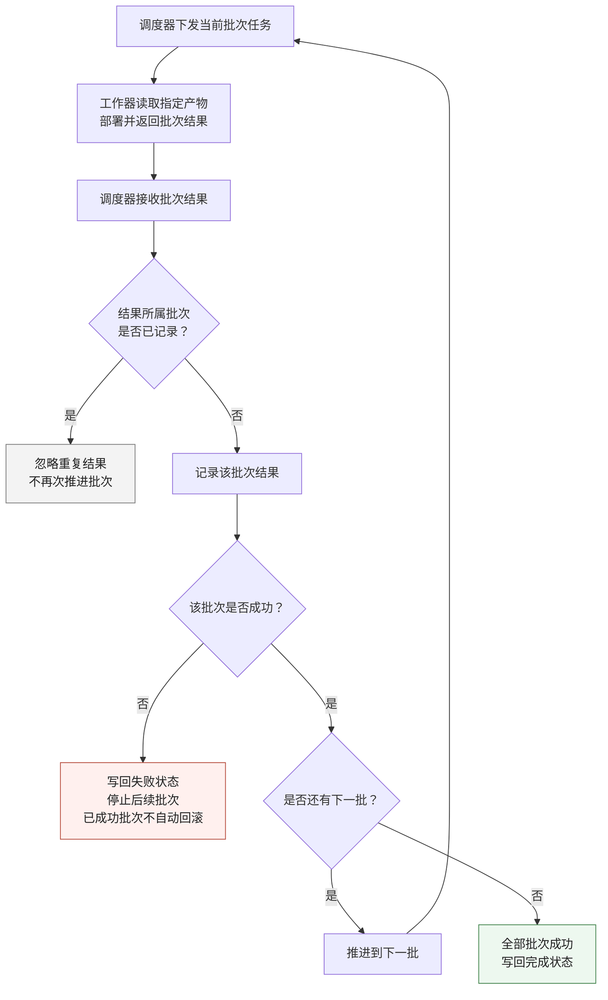

### 1. 各部分怎样协作

每张发布单关联且仅关联一个**不可变构建产物**；同一产物可被多个发布单使用。

### 2. 发布状态怎样演变

箭头标明动作及责任角色。**待执行可取消，执行中不能取消**。

执行中的状态推进均由调度器负责。任一批失败后，**停止后续批次，已成功批次不自动回滚**。

### 3. 调度器怎样处理批次与重复结果

下图展开“执行中”的处理逻辑。重复结果检查针对**结果所属批次**，不论该结果到达时已推进到哪一批。

“忽略”只结束对这条重复结果的处理，不终止正在进行的发布。

### 4. 审批约束落在哪里

门户提供操作入口，API 接收操作并记录发布单；具体权限校验实现位置未提供。审批资格取决于**角色、发布状态和该单提交人身份**。

| 主体 | 允许动作 | 约束 |
|---|---|---|
| 发布人 | 提交、取消 | 草稿可提交；仅待执行可取消 |
| 审阅人 | 审批通过、拒绝 | 仅待审可审批；不能审批自己提交的同一单 |
| 调度器 | 推进执行状态 | 只执行待执行单；按批次结果推进 |

一个人可以同时拥有发布人和审阅人角色，但**同一单的提交人仍不能审批该单**。

未提供数据库、消息队列、通知、超时、自动重试或失败后恢复方案，以上图文未补设这些机制。