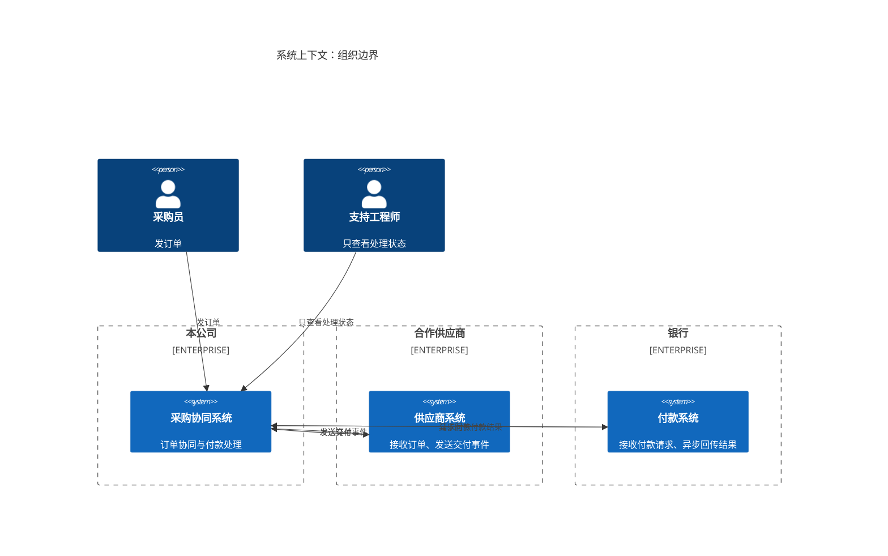
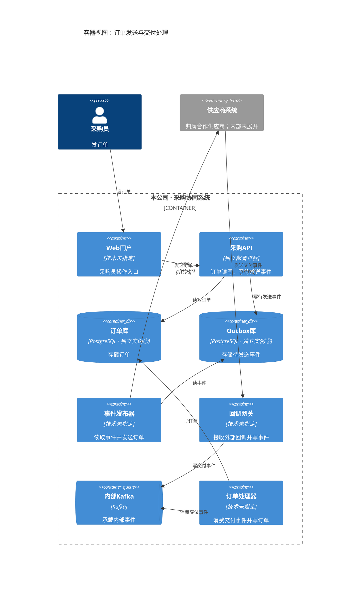
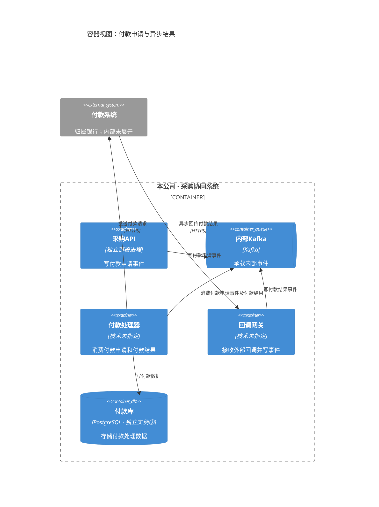
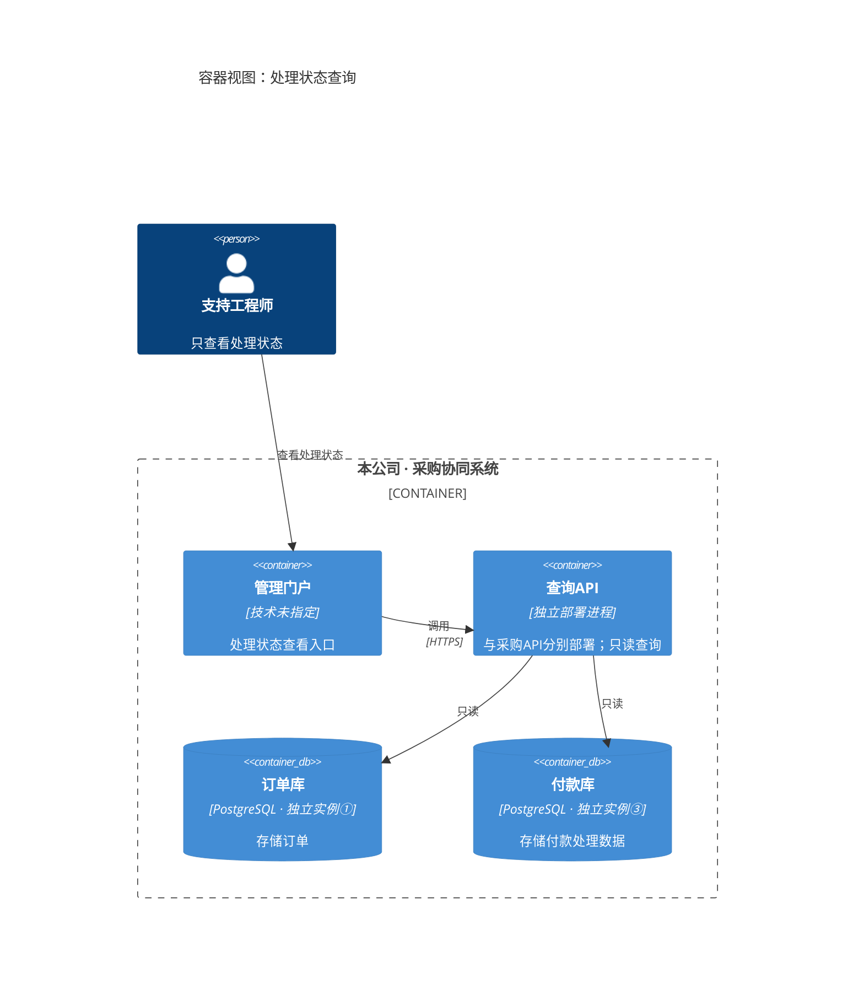

以下按 C4 的系统上下文层和容器层展开。容器指独立运行单元；重复出现的同名容器是同一单元。容器图箭头表示调用或读写的发起方向，“消费”表示从 Kafka 读取事件。

### 1. 系统上下文：组织归属与跨组织通信

采购协同系统属于本公司；供应商系统和付款系统分别属于合作供应商和银行。

### 2. 容器视图：订单发送与交付处理

订单库与 Outbox 库是两个独立 PostgreSQL 实例。事件发布器读取 Outbox；交付事件经过回调网关与 Kafka，由订单处理器写入订单库。

### 3. 容器视图：付款申请与异步结果

采购API写付款申请事件，付款处理器消费后向银行请求付款。银行异步回传结果，经回调网关与 Kafka，由付款处理器写入第三个独立 PostgreSQL 实例。

### 4. 容器视图：支持工程师只读查询

支持工程师只通过管理门户查看处理状态。查询API与采购API是两个独立部署进程；查询API只读订单库和付款库。

以上为可编辑草稿，尚未检查实际渲染画面。