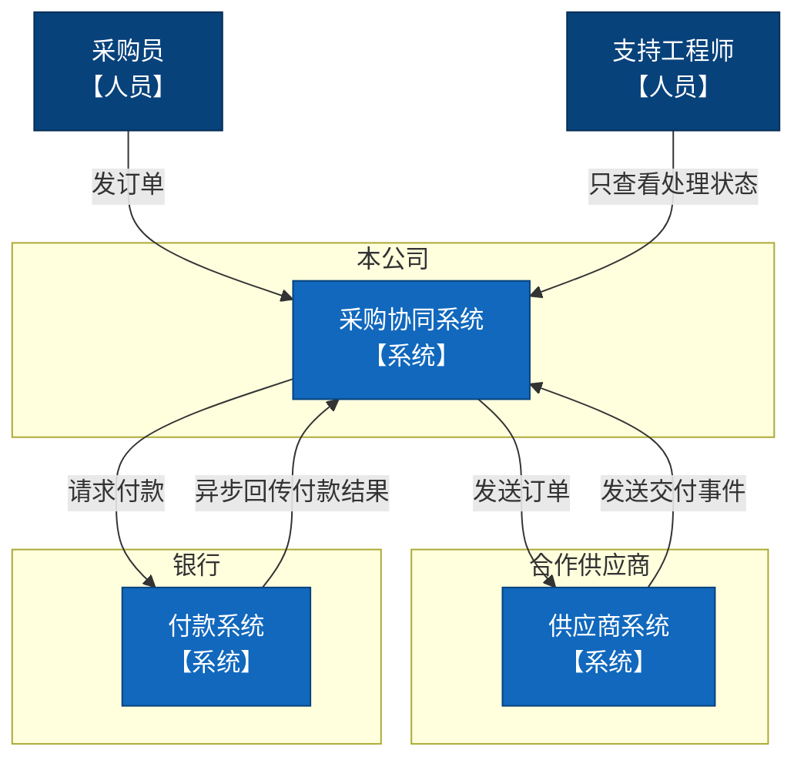
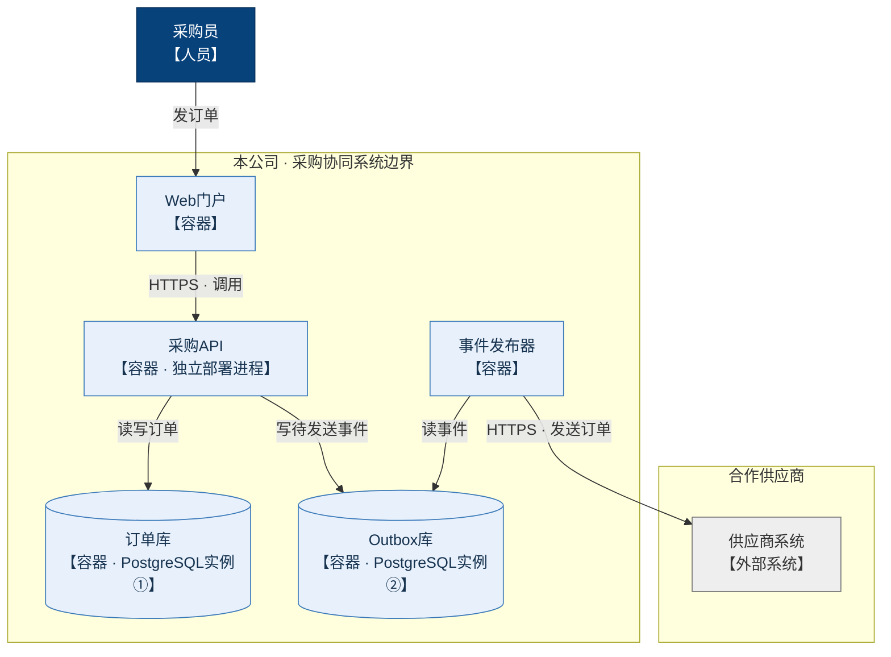
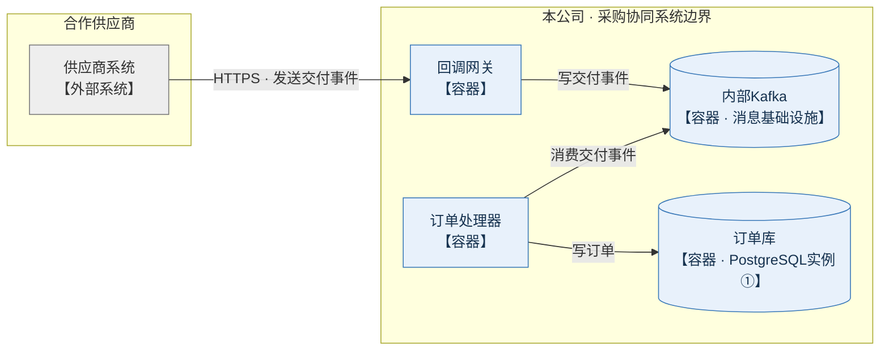
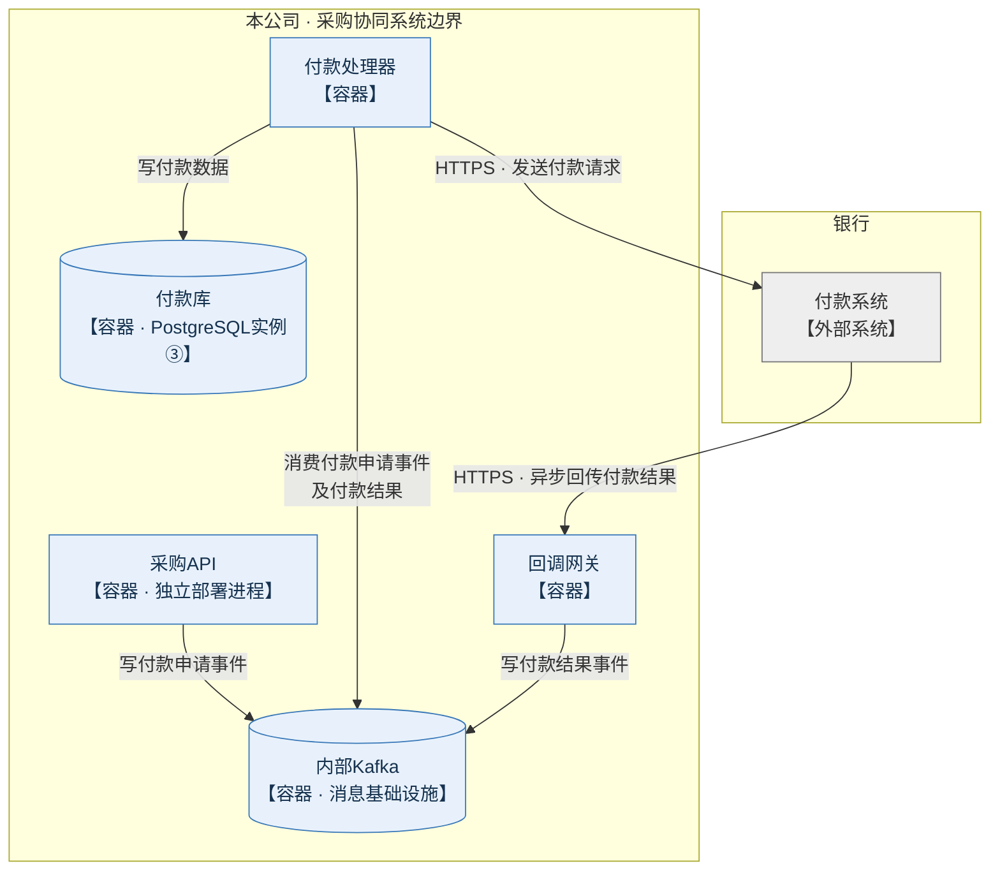
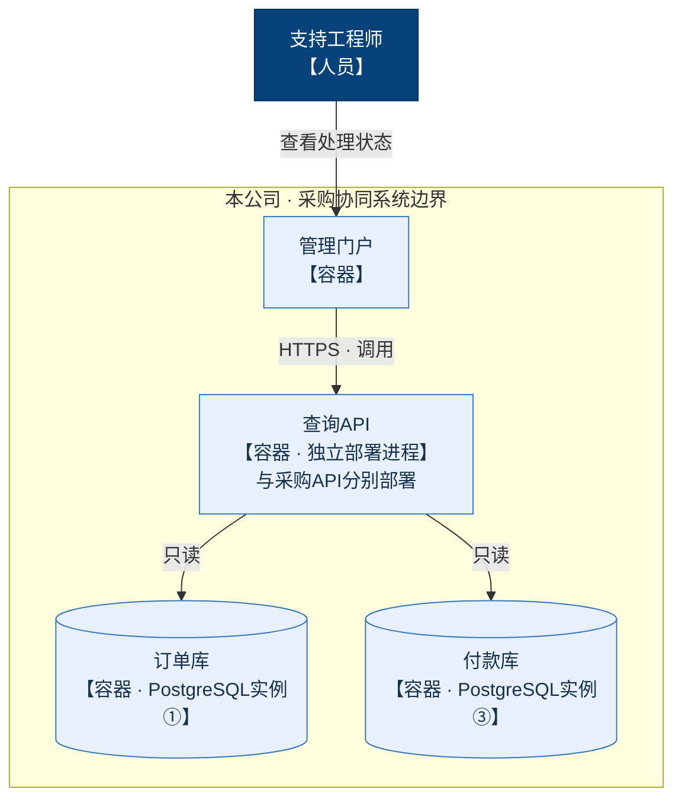

上一版的系统间连线重叠，部分跨边界连线穿过节点。本版保留 C4 的层级与边界，用 Mermaid 流程图语法表达，并将订单发送与交付回调拆开。

**读图约定：**节点标明“人员 / 系统 / 容器”；容器图中的箭头表示调用或读写的发起方向。“读”和“消费”的箭头指向数据源。同名容器在不同视图中代表同一个运行单元。

### 1. 系统上下文：组织边界

业务负责人关注三个系统的归属，以及跨组织的订单、交付和付款通信。

### 2. 容器视图：订单发送

采购API读写订单库，并向 Outbox 库写待发送事件；事件发布器读取 Outbox 后向供应商发送订单。两个数据库是独立 PostgreSQL 实例。

### 3. 容器视图：交付事件处理

供应商通过 HTTPS 向回调网关发送交付事件。网关写入 Kafka，订单处理器消费事件并写订单库。

### 4. 容器视图：付款申请与异步结果

采购API写付款申请事件；付款处理器消费申请并请求银行付款。银行异步回传结果，付款处理器通过 Kafka 消费结果后写付款库。

### 5. 容器视图：只读查看处理状态

支持工程师只通过管理门户查看状态。查询API与采购API分别部署，只读订单库与付款库。

三个 PostgreSQL 实例彼此独立；供应商和银行保持系统级黑盒。未指定的内部通信协议与 Kafka 主题未补充。本版调整后的实际画面仍待渲染检查。