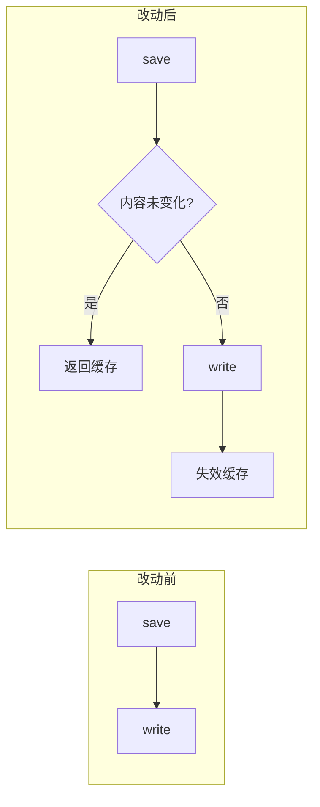

```mermaid
flowchart LR
    subgraph Before[改动前]
        A[save] --> B[write]
    end
    subgraph After[改动后]
        C[save] --> D{内容未变化?}
        D -->|是| E[返回缓存]
        D -->|否| F[write]
        F --> G[失效缓存]
    end
```
左侧是原逻辑，右侧增加未变化分支，并在写入后失效缓存。
