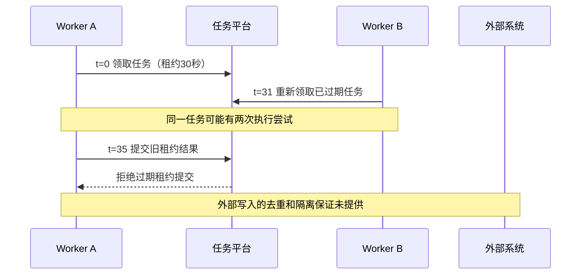

```mermaid
sequenceDiagram
    participant A as Worker A
    participant P as 任务平台
    participant B as Worker B
    participant E as 外部系统
    A->>P: t=0 领取任务（租约30秒）
    B->>P: t=31 重新领取已过期任务
    Note over A,B: 同一任务可能有两次执行尝试
    A->>P: t=35 提交旧租约结果
    P-->>A: 拒绝过期租约提交
    Note over A,E: 外部写入的去重和隔离保证未提供
```
不能保证只执行一次：A与B可能都执行任务。拒绝A的提交不等于撤销外部副作用，外部写入能否重复尚未确认。
