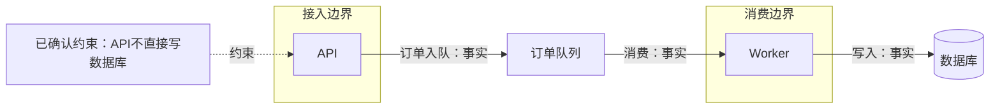

```mermaid
flowchart LR
    subgraph Ingress[接入边界]
        API[API]
    end
    Q[订单队列]
    subgraph Processing[消费边界]
        W[Worker]
    end
    DB[(数据库)]
    API -->|订单入队：事实| Q
    Q -->|消费：事实| W
    W -->|写入：事实| DB
    C[已确认约束：API不直接写数据库]
    C -.->|约束| API
```
图中执行路径来自题目；API不直写数据库来自ADR。选择队列的原因未知，吞吐或故障隔离只能作为待确认假设。
