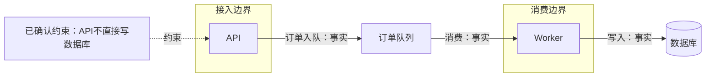

```mermaid
flowchart LR
    subgraph Ingress[接入边界]
        API[API]
    end
    Q[订单队列]
    subgraph Processing[消费边界]
        W[Worker]
    end
    DB[(数据库)]
    API -->|订单入队：事实| Q
    Q -->|消费：事实| W
    W -->|写入：事实| DB
    C[已确认约束：API不直接写数据库]
    C -.->|约束| API
```
**事实**：入队、消费和写入来自题目；**已确认意图**：ADR禁止API直写数据库。**未确认原因**：为什么选队列；不能据路径推断吞吐或故障隔离目的。未渲染验证。此图不另建Wiki；需要长期保存约束时引用已有ADR。
