# diagram-design、show-me 与 0.4.2：原生输出比较

**这两题支持把 diagram-design 作为精细 HTML/SVG 排版的可选补充，暂不足以替换默认入口。** 三组均保留关键内容；diagram-design 的画面风格统一、分图整齐，但源码和本轮生成量更大。0.4.2 在复杂题也主动选择 HTML/SVG，三张图集中表达了关系；show-me 最简洁，复杂架构的纵向图偏长，仍有连线穿过边界标题。

不要把检查器通过算成画面无误：发现了跨独立 SVG 的几何误报，以及 CSS 箭头没有被识别的问题。diagram-design 初稿曾让 API→Kafka 连线穿过 Web 节点，检查器没有检出；图片反馈后修正。实际渲染与人工看图仍有价值。

若后续接入，建议维持一个入口：按表达需求选择 Mermaid 或 HTML/SVG，需要精细页面与图形排版时按需使用 diagram-design。当前只保存比较结果，没有修改 Skill 的调用规则或增加默认依赖。

每组两题、每题一条独立轨迹；每条轨迹三阶段、两次真实图片反馈。相同模型，允许三组各自选择 Mermaid 或 HTML/SVG。没有把 diagram-design 强制改为 Mermaid。详见 [协议与限制](README.md)。

## 产出规模

| 题目 | Skill | 最终图数 | 原生格式 | 图源码字符 | 全部代码块字符 | 三次调用输出 tokens | 最后反馈后仍改图 |
|---|---|---:|---|---:|---:|---:|---|
| 01-mixed | show-me | 2 | Mermaid | 684 | 933 | 5,961 | 否，模型已收到相同图源码的画面 |
| 01-mixed | visual-explanation 0.4.2 | 3 | Mermaid | 1,157 | 1,157 | 6,597 | 是，最终画面由评审查看 |
| 01-mixed | diagram-design | 3 | HTML/SVG | 14,431 | 14,431 | 36,316 | 否，模型已收到相同图源码的画面 |
| 02-c4 | show-me | 4 | Mermaid | 2,597 | 2,597 | 7,401 | 否，模型已收到相同图源码的画面 |
| 02-c4 | visual-explanation 0.4.2 | 3 | HTML/SVG | 10,851 | 10,851 | 27,831 | 否，模型已收到相同图源码的画面 |
| 02-c4 | diagram-design | 4 | HTML/SVG | 18,655 | 18,655 | 44,367 | 否，模型已收到相同图源码的画面 |

图数按实际主 SVG/Mermaid 图计数，一份 HTML 可能含多图；伪代码不计作图片，但计入全部代码块。HTML 包含页面样式、文字与表格，Mermaid 源不含外围 Markdown，因此源码字符只反映各自交付物规模。token 是本轮 CLI 用量，含修订，不代表价格或正常按需读取的最低消耗。未测真实需求变更工时。

## 发布协作、状态与批次

本题三组均保留关键事实。diagram-design 的页面、图形和颜色更统一；show-me 的图与源码更紧凑；0.4.2 把批次判断画出来，但图偏长。本样本没有证明较重 Skill 的正确性更高。

### show-me

[最终原始回答](outputs/show-me/01-mixed.md) · [初稿](trajectories/show-me/01-mixed/stage0/answer.md) · [第一次修订](trajectories/show-me/01-mixed/stage1/answer.md) · [最终阶段](trajectories/show-me/01-mixed/stage2/answer.md)

**内容：** 一个产物的绑定约束、七种状态、取消守卫、逐批推进、失败停止且不回滚、结果去重、角色及禁自审均保留，组件图有六条已知关系。

**忠实性：** 这一轮没有虚构 API 校验位置；上一轮的问题不能套到本样本。

**实际画面：** 组件图可读，横向状态图很浅；批次判断用伪代码，整体最简洁，但没有把全部批次分支画成图。

**检查闭环：** 最终图源码与模型已收到的 stage1 图片一致。

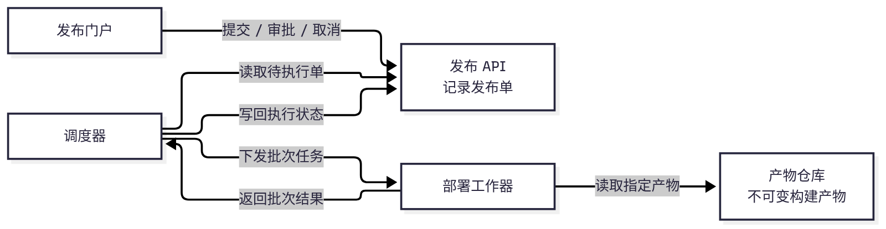

[可编辑 Mermaid](trajectories/show-me/01-mixed/render-inputs/stage1-1.mmd) · [SVG](trajectories/show-me/01-mixed/rendered/stage1-1.svg)

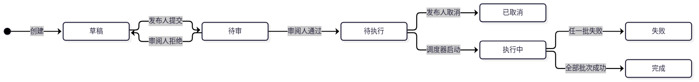

[可编辑 Mermaid](trajectories/show-me/01-mixed/render-inputs/stage1-2.mmd) · [SVG](trajectories/show-me/01-mixed/rendered/stage1-2.svg)

查看初稿实际画面

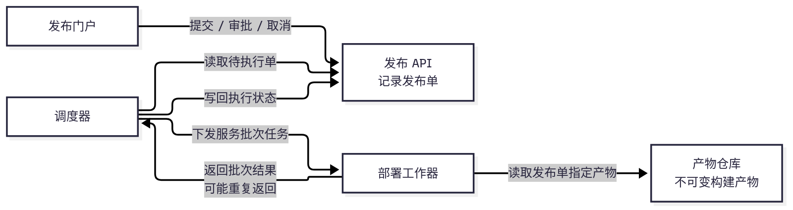

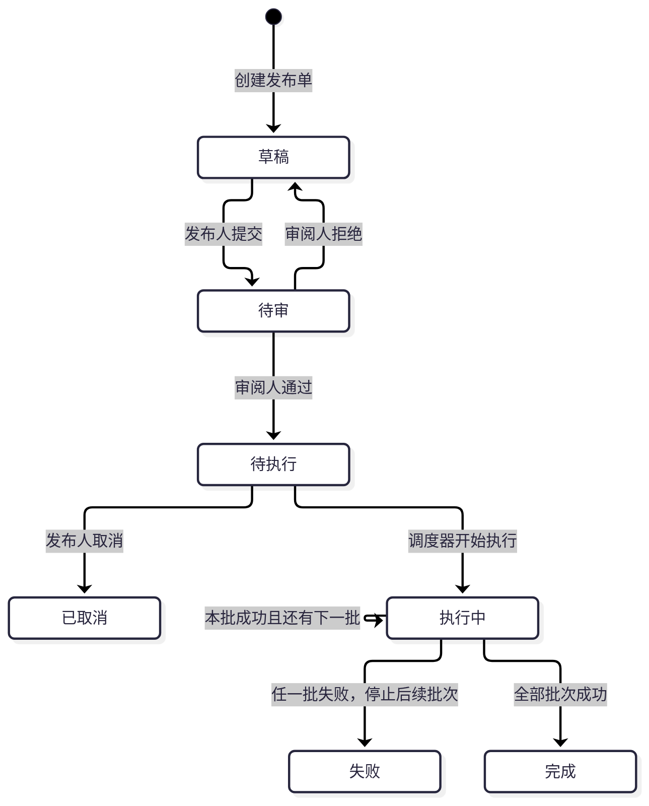

### visual-explanation 0.4.2

[最终原始回答](outputs/v042/01-mixed.md) · [初稿](trajectories/v042/01-mixed/stage0/answer.md) · [第一次修订](trajectories/v042/01-mixed/stage1/answer.md) · [最终阶段](trajectories/v042/01-mixed/stage2/answer.md)

**内容：** 三张图与权限表、正文保留相同关键事实和六条组件关系，明确校验实现位置未知。

**忠实性：** 未发现实质性虚构组件或机制，禁自审同时覆盖通过和拒绝。

**实际画面：** 组件图清楚。最终状态图和批次结果图偏高，判断菱形、间距较大；逻辑更视觉化，但不如另外两组紧凑。

**检查闭环：** 最后反馈后仍改了状态图、结果图；模型明确标为未看过的新稿，评审随后独立渲染并查看。

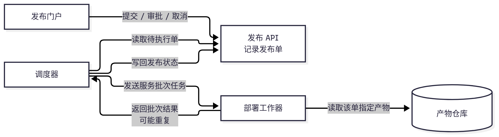

[可编辑 Mermaid](trajectories/v042/01-mixed/render-inputs/stage2-1.mmd) · [SVG](trajectories/v042/01-mixed/rendered/stage2-1.svg)

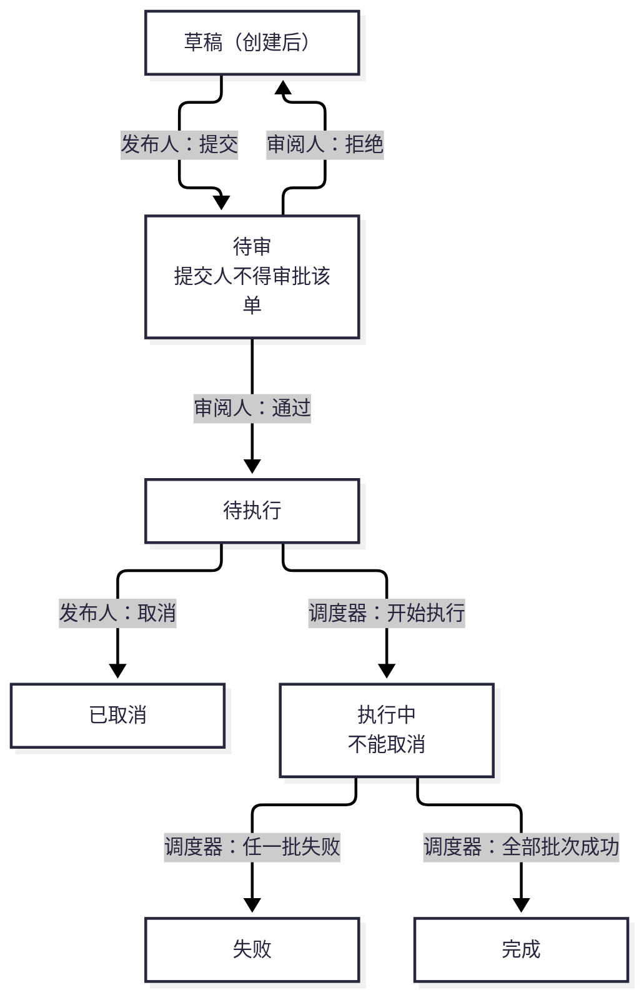

[可编辑 Mermaid](trajectories/v042/01-mixed/render-inputs/stage2-2.mmd) · [SVG](trajectories/v042/01-mixed/rendered/stage2-2.svg)

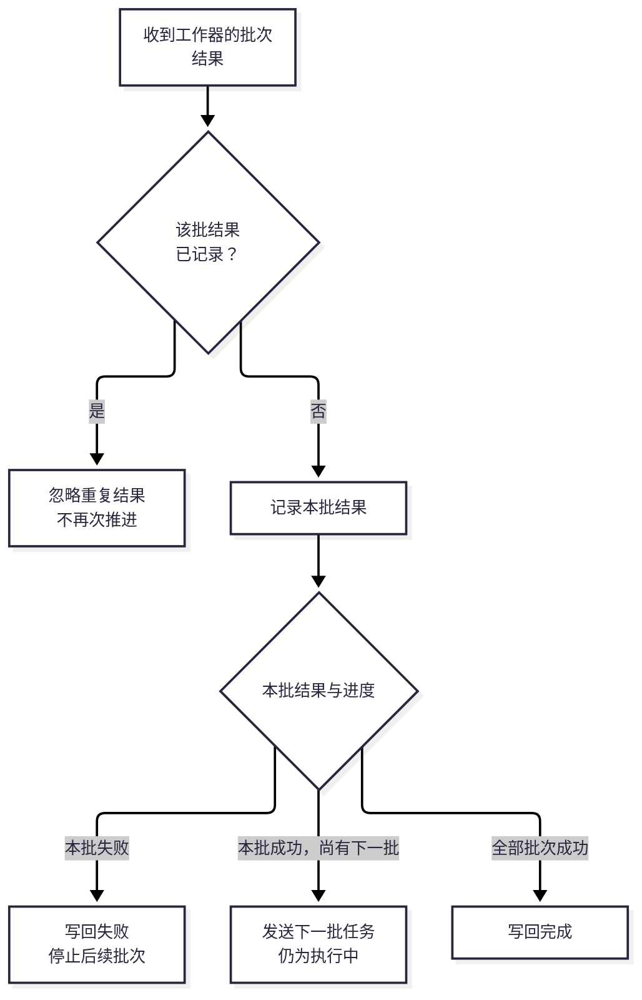

[可编辑 Mermaid](trajectories/v042/01-mixed/render-inputs/stage2-3.mmd) · [SVG](trajectories/v042/01-mixed/rendered/stage2-3.svg)

查看初稿实际画面

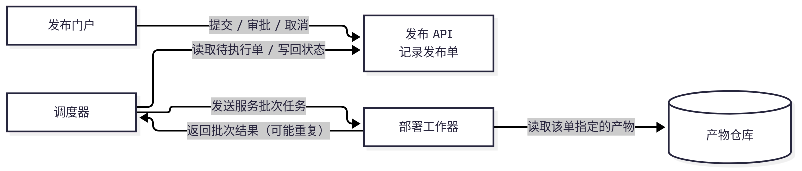

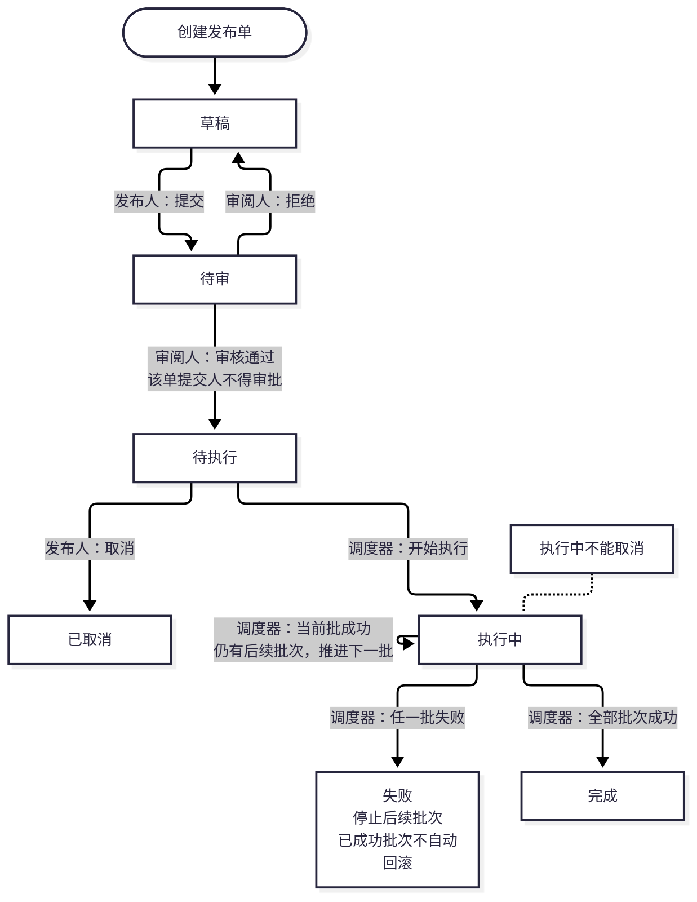

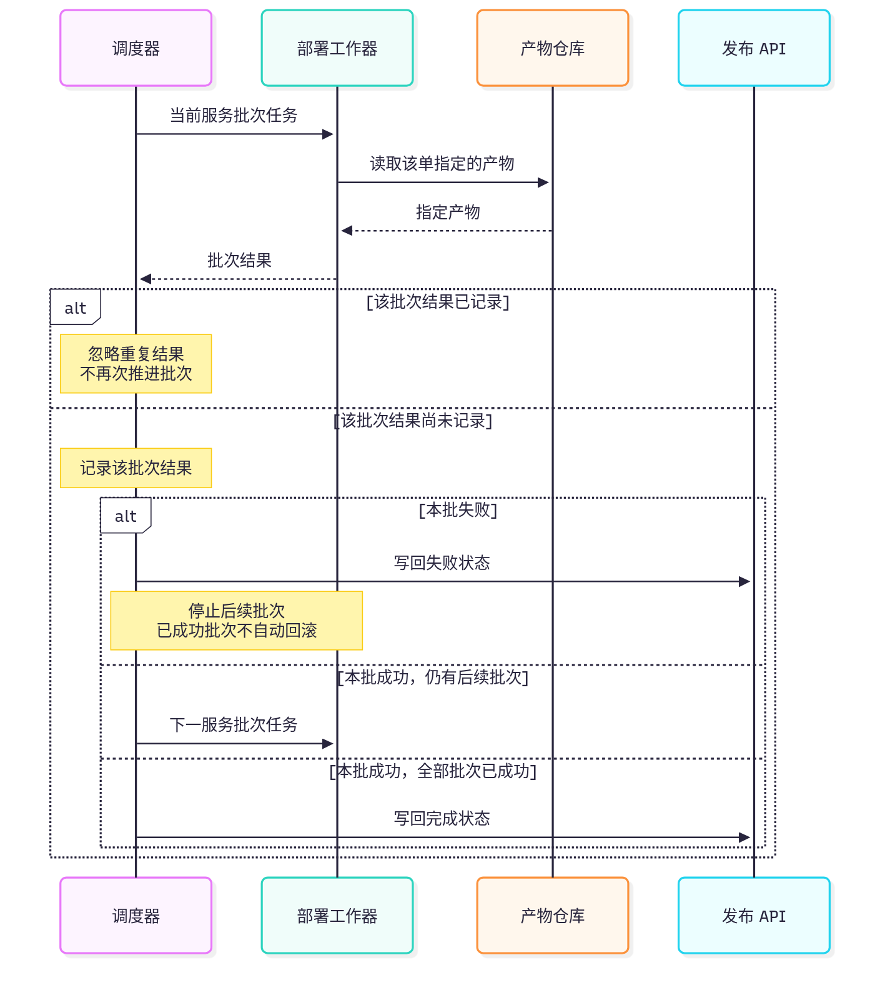

### diagram-design

[最终原始回答](outputs/diagram-design/01-mixed.md) · [初稿](trajectories/diagram-design/01-mixed/stage0/answer.md) · [第一次修订](trajectories/diagram-design/01-mixed/stage1/answer.md) · [最终阶段](trajectories/diagram-design/01-mixed/stage2/answer.md)

**内容：** 三个 SVG、正文及权限表保留同样的关键事实、六条组件关系和七种状态，逐批推进、失败与去重均说明。

**忠实性：** 不补设存储、校验位置、队列、重试或恢复。时序图用文字面板列出首次结果分支，没有逐分支消息箭头。

**实际画面：** 三个 1280×720 视图排布整齐、线条可追踪、配色一致；留白较多，正文标签较小。窄屏使用图内横向滚动。

**检查闭环：** 最终源码与 stage1 已反馈图片一致。浏览器、自检通过。初稿整页几何检查的三处失败属于跨 SVG 误报，逐图复核均通过；模型调整布局和图例后整页检查通过。

**检查器限制：** 检查脚本没有分隔独立 SVG 的坐标空间，详见 geometry-scope-review.json。

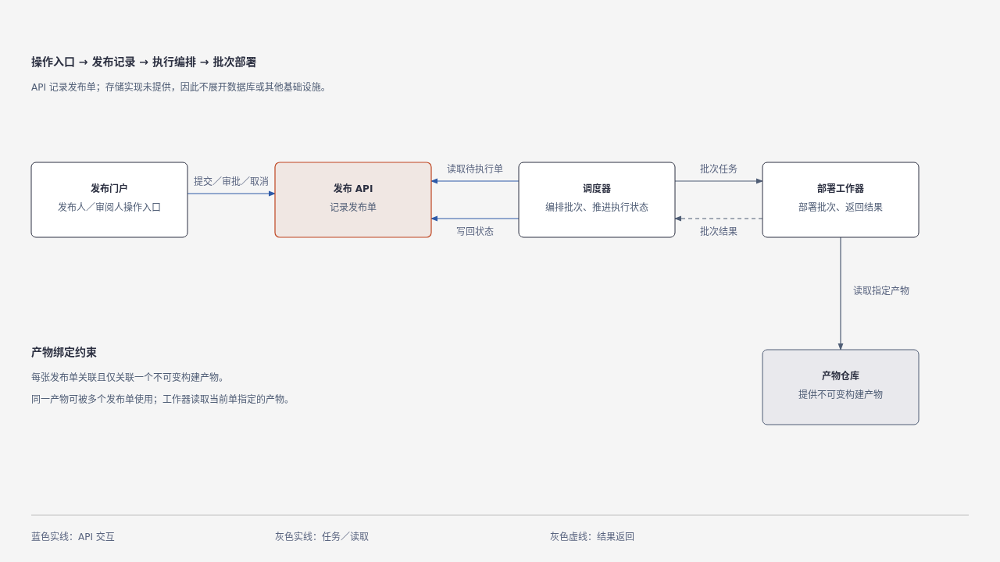

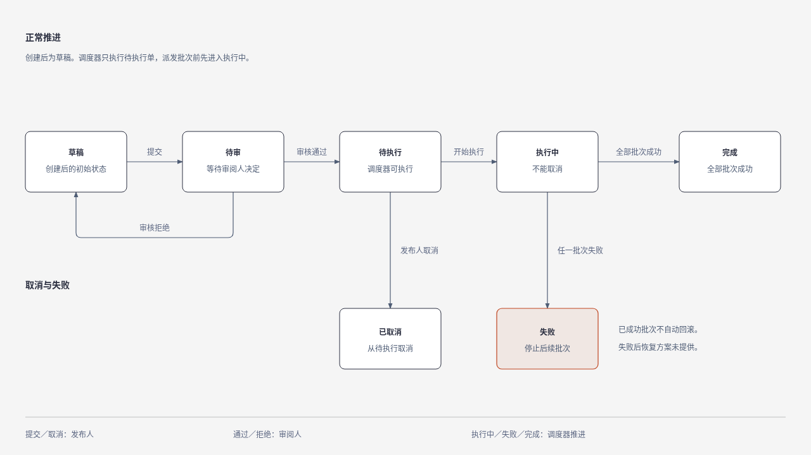

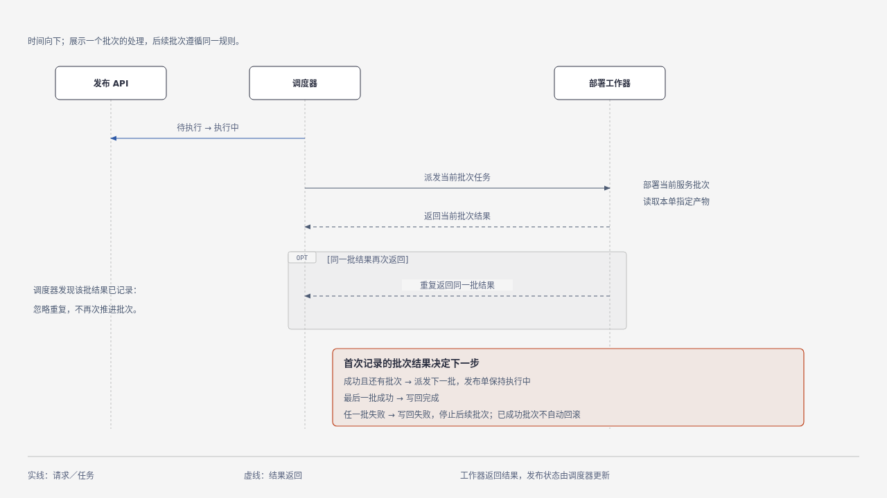

[可编辑 HTML](trajectories/diagram-design/01-mixed/render-inputs/stage1-1.html) · [完整桌面页](trajectories/diagram-design/01-mixed/rendered/stage1-1-desktop.png) · [移动截图](trajectories/diagram-design/01-mixed/rendered/stage1-1-mobile.png)

GitHub 不直接执行 HTML；下载 HTML 后用浏览器打开即可查看原生页面。

查看初稿实际画面

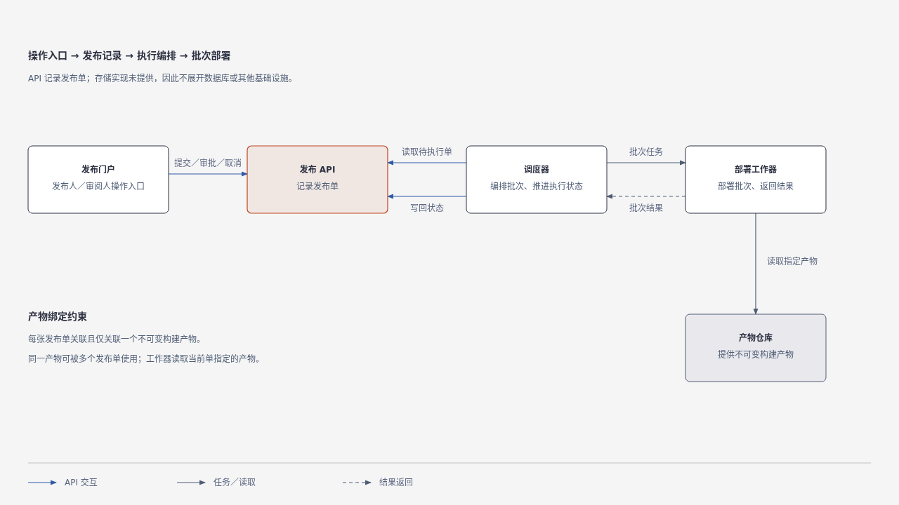

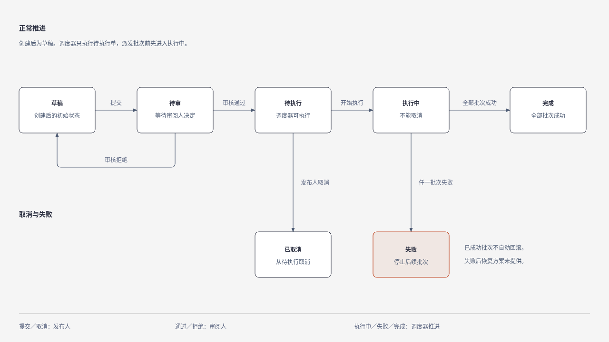

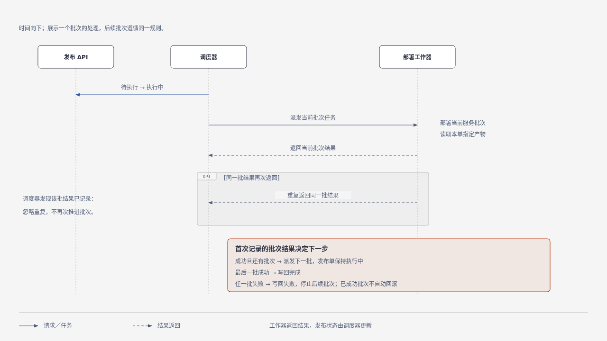

## 跨组织 C4 与运行单元

三组均保留已知系统关系和关键约束。diagram-design 的四张 SVG 拆图整齐，0.4.2 的三张 SVG 更集中且较紧凑；show-me 的 Mermaid 更短、可维护，但纵向图偏长并残留入线穿边界标题。diagram-design 没有独占 HTML 能力，也没有在这题取得明确的语义正确性优势。

### show-me

[最终原始回答](outputs/show-me/02-c4.md) · [初稿](trajectories/show-me/02-c4/stage0/answer.md) · [第一次修订](trajectories/show-me/02-c4/stage1/answer.md) · [最终阶段](trajectories/show-me/02-c4/stage2/answer.md)

**内容：** 12 个内部运行单元、17 对容器/外部系统通信端点、支持工程师→管理门户，以及 6 条上下文关系保留。付款申请与结果消费采用两条标签不同的同端点连线。三个独立 DB、独立 API、查询只读均保留。

**忠实性：** 不加载另外两组指引也能表达 C4 的上下文/容器层级。未发现新增服务、主题、重试或外部容器；采购员→Web 是门户使用的补充解释，题目只明确采购员使用本系统。

**实际画面：** 从初稿两个图改为最终四张 Mermaid 图，订单/付款/查询分开后更可读。整体偏高、嵌套组织与系统边界留白较多。订单与查询图的入线仍穿过居中的边界标题“本公司”（订单还经过系统标题）；这是剩余排版问题，不能称为完全无干扰。

**检查闭环：** 最终图源码与反馈 stage1 相同；生成器已看过，但仍未修掉边界标题与入线重合。Mermaid 语法和实际渲染通过不等于布局无瑕疵。

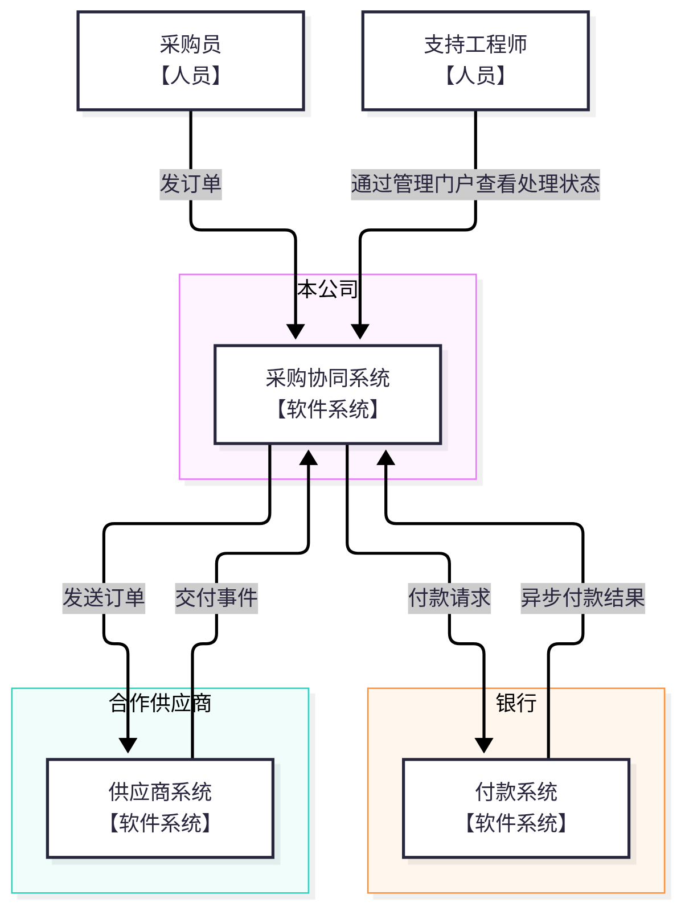

[可编辑 Mermaid](trajectories/show-me/02-c4/render-inputs/stage1-1.mmd) · [SVG](trajectories/show-me/02-c4/rendered/stage1-1.svg)

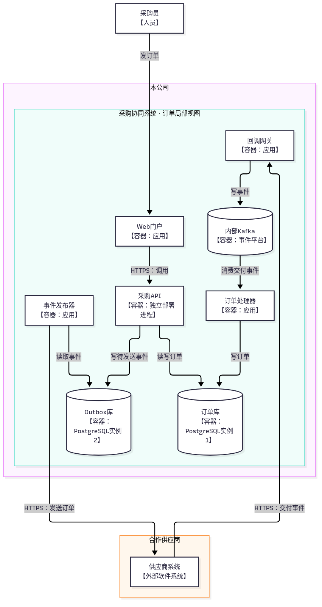

[可编辑 Mermaid](trajectories/show-me/02-c4/render-inputs/stage1-2.mmd) · [SVG](trajectories/show-me/02-c4/rendered/stage1-2.svg)

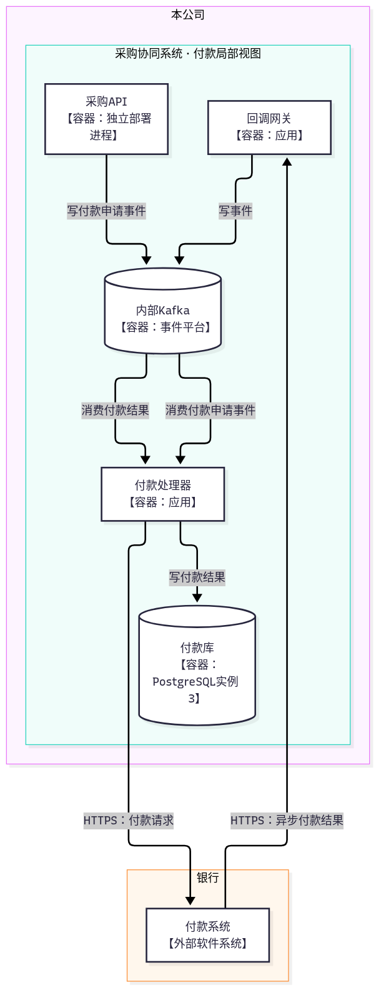

[可编辑 Mermaid](trajectories/show-me/02-c4/render-inputs/stage1-3.mmd) · [SVG](trajectories/show-me/02-c4/rendered/stage1-3.svg)

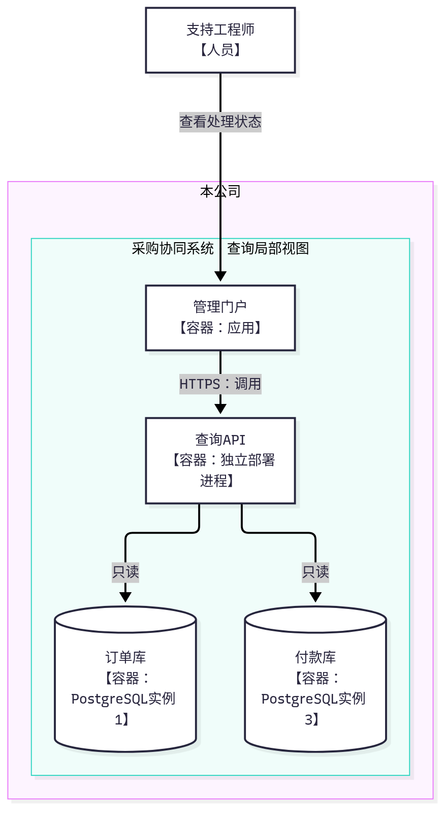

[可编辑 Mermaid](trajectories/show-me/02-c4/render-inputs/stage1-4.mmd) · [SVG](trajectories/show-me/02-c4/rendered/stage1-4.svg)

查看初稿实际画面

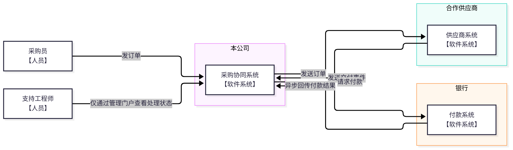

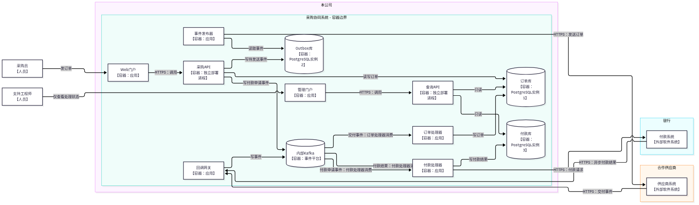

### visual-explanation 0.4.2

[最终原始回答](outputs/v042/02-c4.md) · [初稿](trajectories/v042/02-c4/stage0/answer.md) · [第一次修订](trajectories/v042/02-c4/stage1/answer.md) · [最终阶段](trajectories/v042/02-c4/stage2/answer.md)

**内容：** 12 个内部运行单元、17 对容器/外部系统通信端点、支持工程师→管理门户，以及 6 条上下文关系均保留。三个数据库实例独立，两种 API 独立部署，查询只读。

**忠实性：** 没有新增内部服务、主题、重试、恢复或鉴权。图分上下文及两个容器视图；外部系统保留系统层级。

**实际画面：** 主动选择 HTML/SVG：三张图分别为 1200×400、1200×1000、1200×320。交易图较密，但经过反馈给交叉线留间隙、分开标签，连线可追踪；上下文和查询视图紧凑。窄屏图内横向滚动。

**检查闭环：** 最终仅修改 HTML 验证说明，SVG 和 CSS 与已反馈 stage1 一致；驱动因 HTML 文档变动再次渲染。模型的“图源码不变”说法成立。自检通过；几何脚本未识别 CSS 箭头，不能视为连线检查通过。

[可编辑 HTML](trajectories/v042/02-c4/render-inputs/stage2-1.html) · [完整桌面页](trajectories/v042/02-c4/rendered/stage2-1-desktop.png) · [移动截图](trajectories/v042/02-c4/rendered/stage2-1-mobile.png)

GitHub 不直接执行 HTML；下载 HTML 后用浏览器打开即可查看原生页面。

查看初稿实际画面

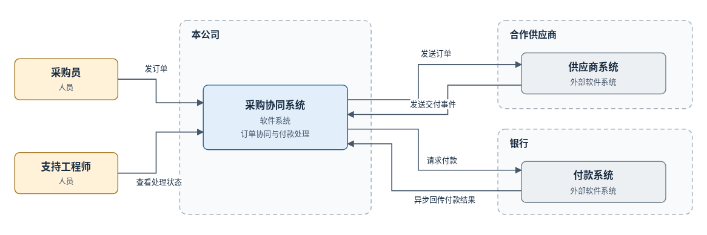

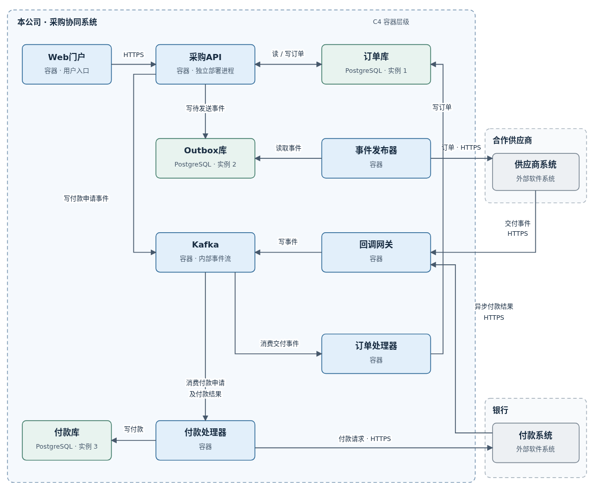

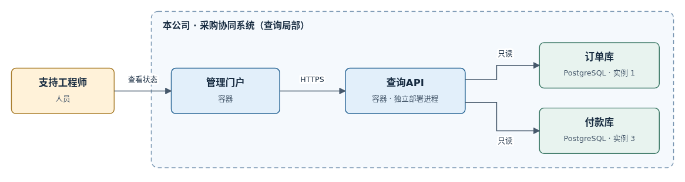

### diagram-design

[最终原始回答](outputs/diagram-design/02-c4.md) · [初稿](trajectories/diagram-design/02-c4/stage0/answer.md) · [第一次修订](trajectories/diagram-design/02-c4/stage1/answer.md) · [最终阶段](trajectories/diagram-design/02-c4/stage2/answer.md)

**内容：** 12 个内部运行单元、17 对容器/外部系统通信端点及支持工程师→管理门户的访问均保留；上下文有 6 条人员/系统关系。Kafka→付款处理器在申请/结果两个分视图重复，是同一端点关系。采购员在上下文出现，Web 节点注明采购员使用；题目没有单独明确采购员直达 Web 的访问关系，因此不把这条补充标注列作必需通信。三个独立数据库实例、两个独立 API 进程、查询只读均保留。

**忠实性：** 没有新增服务、主题、恢复、重试、鉴权或外部实现。SVG 保持 C4 上下文/容器分层，Kafka 消费采用已说明的事件交付箭头。

**实际画面：** 四张 1280×720 图。初稿采购 API→Kafka 连线穿过 Web 门户，可能误读主体；图片反馈后改为 API 底部绕行，并连接回调入口与内部容器的系统边界。最终线路清楚、标签分离，但留白较多、字号较小；窄屏横向滚动。

**检查闭环：** 最终 SVG 与 stage1 已反馈图片一致，浏览器、自检及几何脚本返回通过；修订后脚本识别到 19 条含图例的箭头。初稿用 CSS 箭头时识别数为零，穿节点问题未检出，因此初稿的脚本通过不算连线验证。

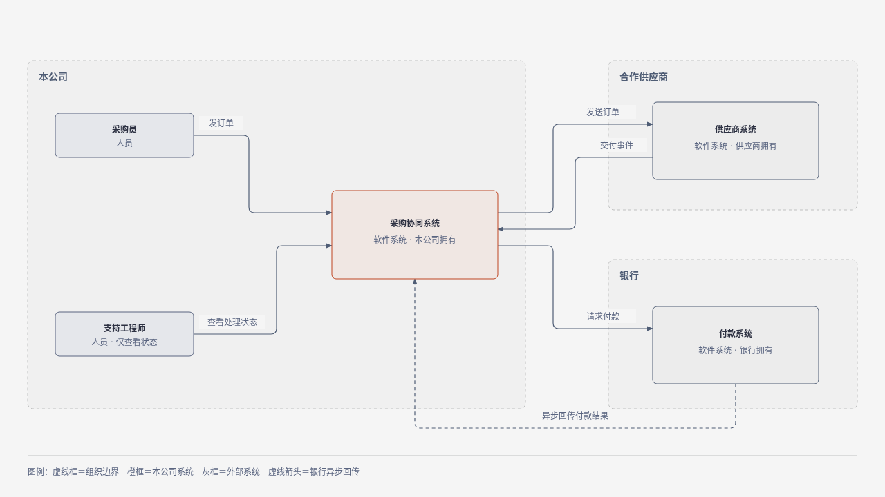

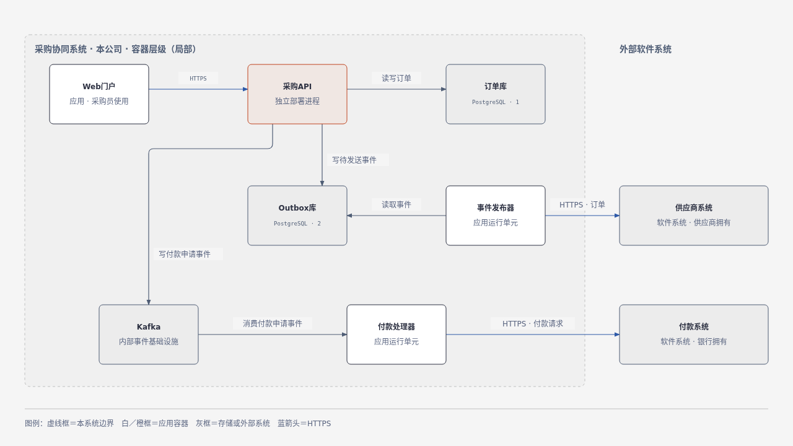

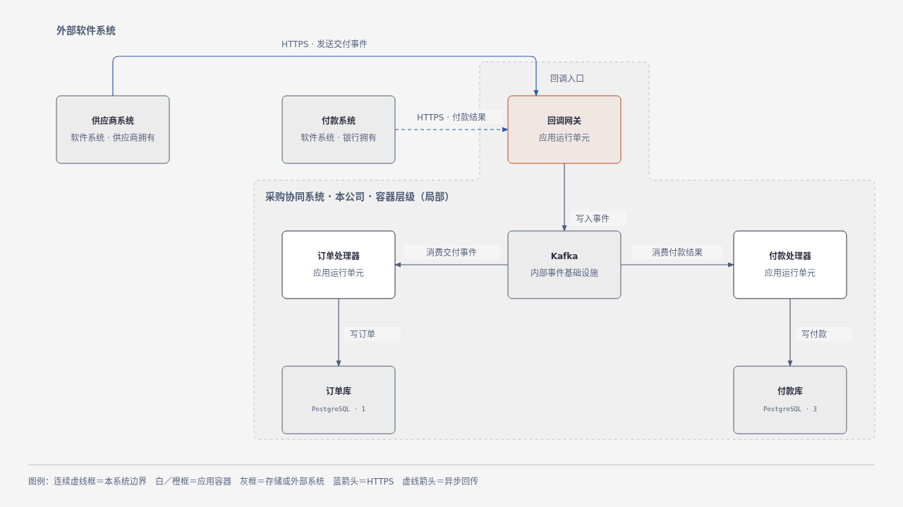

[可编辑 HTML](trajectories/diagram-design/02-c4/render-inputs/stage1-1.html) · [完整桌面页](trajectories/diagram-design/02-c4/rendered/stage1-1-desktop.png) · [移动截图](trajectories/diagram-design/02-c4/rendered/stage1-1-mobile.png)

GitHub 不直接执行 HTML；下载 HTML 后用浏览器打开即可查看原生页面。

查看初稿实际画面

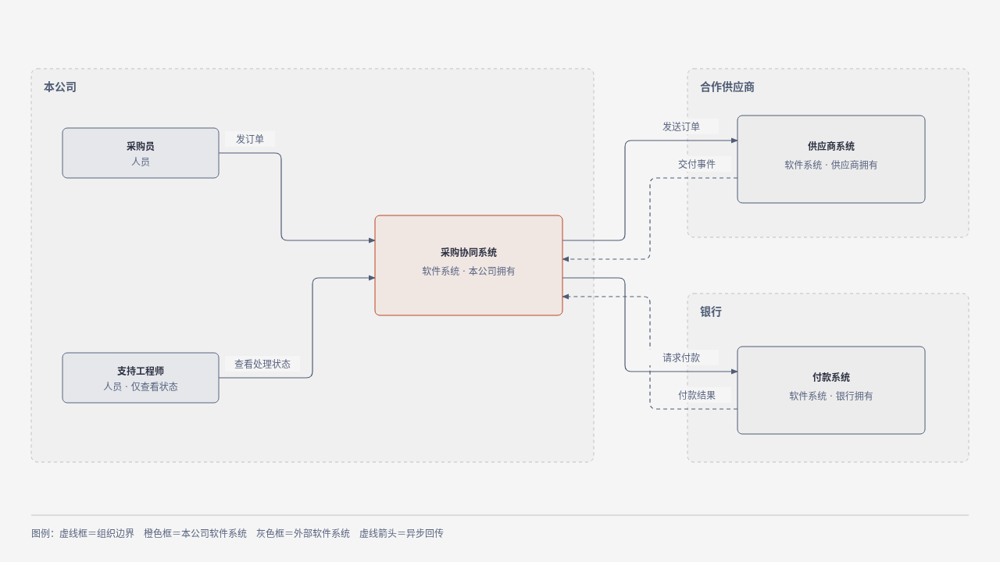

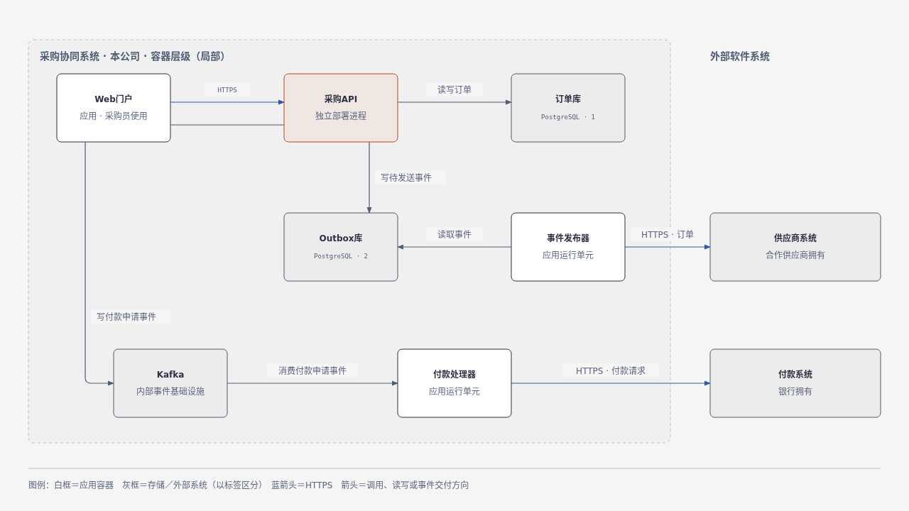

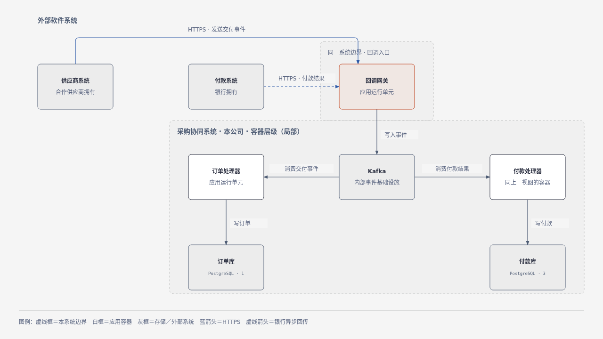

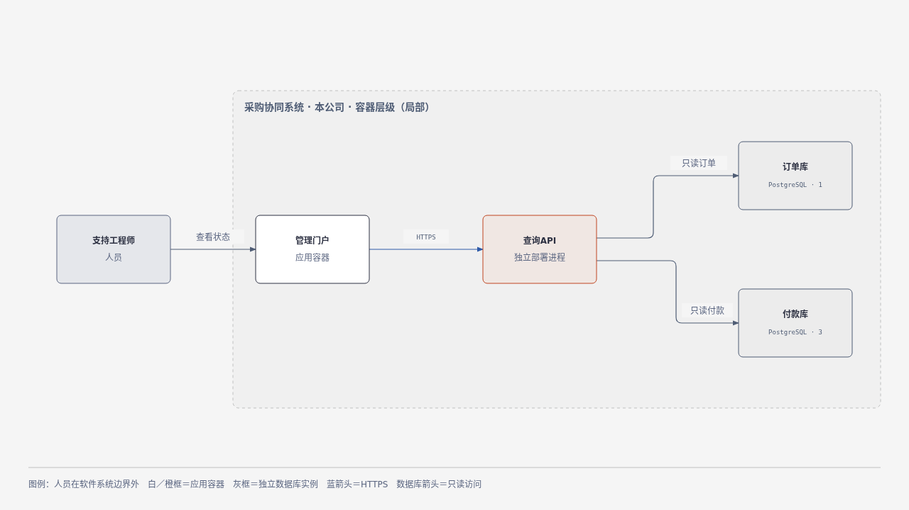

## 证据与限制

六条轨迹独立容器、独立会话、无其他组输出挂载；各阶段实际模型与源码哈希见 [runs.json](runs.json)。生成不调用工具，渲染由控制器完成，不测客户端自动加载。每题每组一个样本，主 Agent 知道组别后评审；不能据此宣布普遍排名。

[内容评审](content-review.json) · [用量与修订规模](metrics.json) · [Mermaid 语法检查](syntax-results.json) · [输入及输出完整性](integrity-results.json) · [跨 SVG 几何误报复核](geometry-scope-review.json)

首次启动因命令行单参数长度失败，发生在模型调用前；恢复使用标准输入，已完成的样本没有重跑。原始驱动、恢复驱动和失败记录保留。
