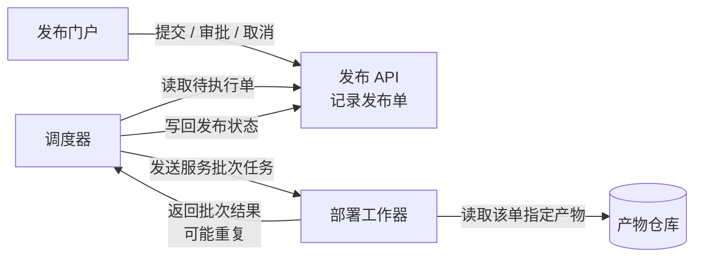
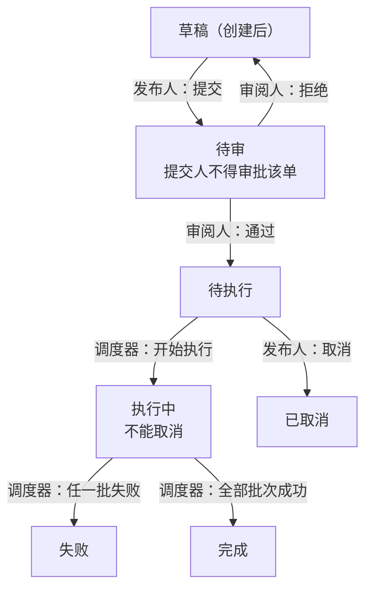
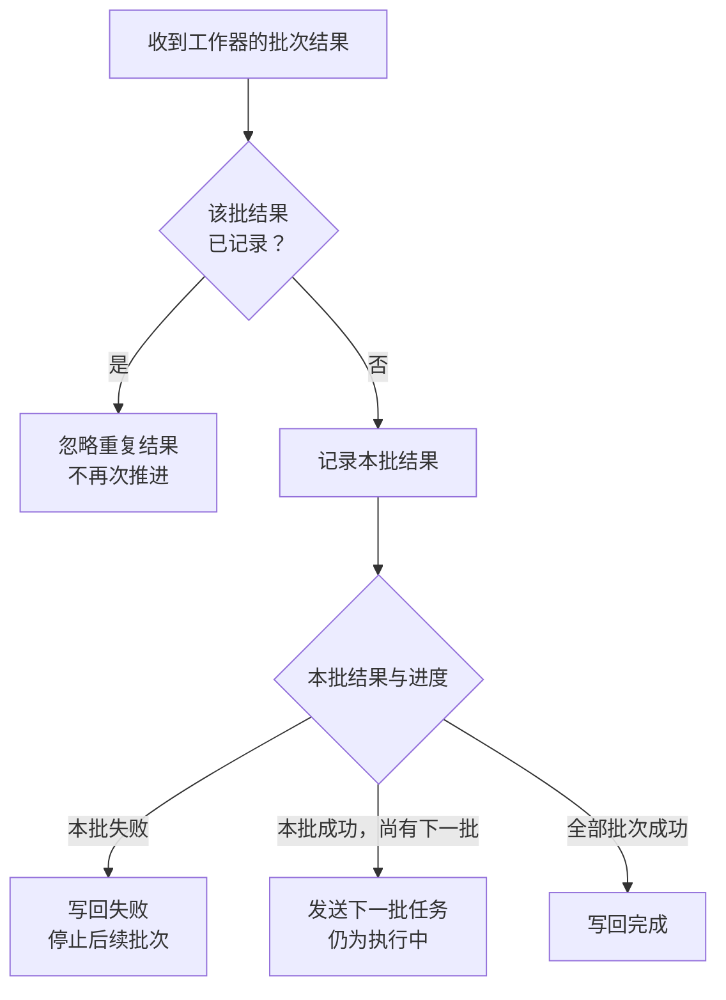

采用三个视图：组件协作、发布状态、批次结果处理，另附权限表。宽度自适应，建议阅读宽度约 1000 px。

已查看上一版实际画面：组件图清楚，状态图过宽，批次图过长。本版保留组件图，调整后两图；**调整后的图尚未检查实际渲染**。

### 1．各部分怎样协作

每个发布单**关联且仅关联一个不可变构建产物**；同一产物可以被多个发布单使用。

### 2．发布状态怎样演变

箭头标明负责角色。审批资格约束同时适用于“通过”和“拒绝”。

调度器**只执行待执行单，先将其改为执行中，再发送首批任务**。审批资格的具体校验实现位置未提供。

### 3．批次结果怎样决定下一步

批次按顺序部署；每批成功才推进下一批。下图从调度器收到结果开始，所有判断和后续动作均由调度器负责。

失败时，**已成功批次不自动回滚**。发送下一批后，工作器继续部署并返回结果；每次收到结果都先检查该批是否已记录，重复返回不会再次推进。

### 操作权限与审批资格

| 身份 | 允许的动作 | 约束 |
|---|---|---|
| 发布人 | 提交、取消 | 草稿可提交；待执行可取消；执行中不能取消 |
| 审阅人 | 审批通过、拒绝 | 仅审批待审单；不得审批自己提交的同一单 |
| 调度器 | 推进执行状态 | 仅从待执行开始，根据批次结果推进执行 |

一个人可以同时拥有发布人和审阅人角色，但**双角色不能绕过同单提交人禁审规则**。

未提供数据库、消息队列、通知、超时、自动重试或失败后恢复方案，以上视图不补设这些机制。