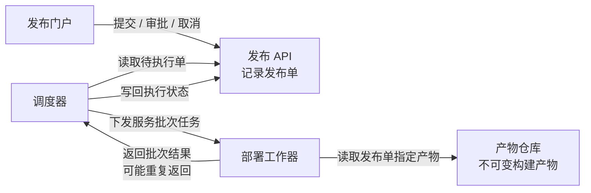
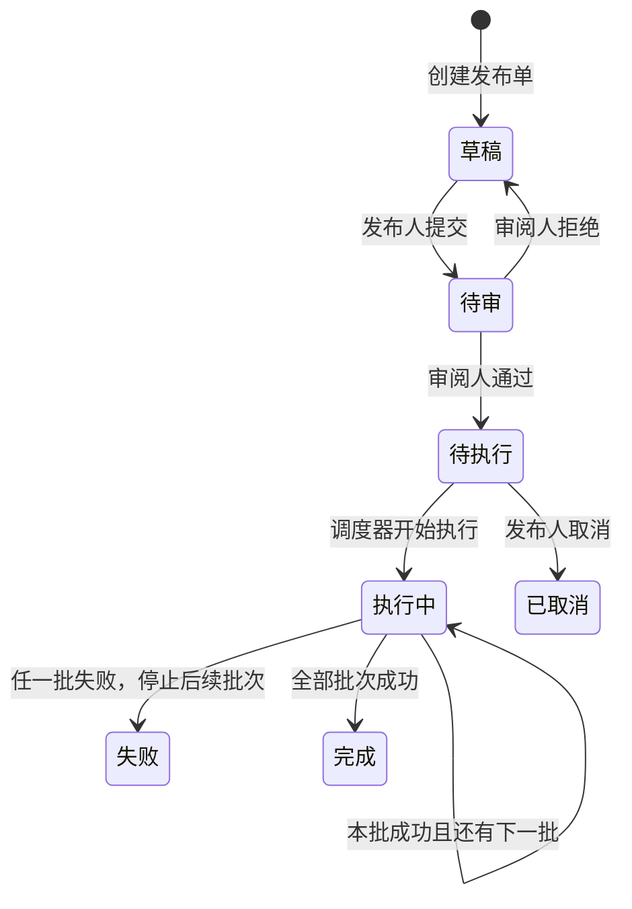

采用三个视图：组件协作图、发布状态图、批次执行伪代码；附审批权限表。使用可编辑 Mermaid，宽度随文档适配。

### 1．各部分怎样协作



**每个发布单关联且仅关联一个不可变构建产物；同一产物可被多个发布单使用。** 工作器返回批次结果，由调度器更新发布状态。

### 2．发布状态怎样演变



**执行中不能取消。** 失败时，已成功批次不自动回滚。重复结果不触发状态变化，也不再次推进批次。

### 3．调度器怎样逐批推进

```text
开始执行(发布单)
  仅接受“待执行”的发布单
  将发布状态改为“执行中”
  向工作器下发第一批任务

收到批次结果(发布单, 批次, 结果)
  如果该批结果已经记录
    忽略本次重复结果
    返回，不再次推进批次

  记录该批结果

  如果本批失败
    将发布状态改为“失败”
    停止后续批次
    保留已成功批次，不自动回滚
    返回

  如果还有下一批
    向工作器下发下一批任务
  否则
    将发布状态改为“完成”
```

### 审批约束落在哪里

门户把操作送到 API；审批是否允许，取决于**操作者角色、发布单状态、该单提交人**。

| 操作者 | 允许的操作 | 状态与约束 |
|---|---|---|
| 发布人 | 提交、取消 | 草稿可提交；仅待执行可取消 |
| 审阅人 | 审批：通过或拒绝 | 仅待审；不能审批自己提交的单 |
| 调度器 | 推进执行状态 | 只从待执行开始，按批次结果推进 |

一个人可以同时拥有发布人和审阅人角色，但**双角色不解除“同一单的提交人不能审批该单”这一限制**。

以上只描述已确认体系；数据库、消息队列、通知、超时、自动重试及失败后恢复方案均未提供。