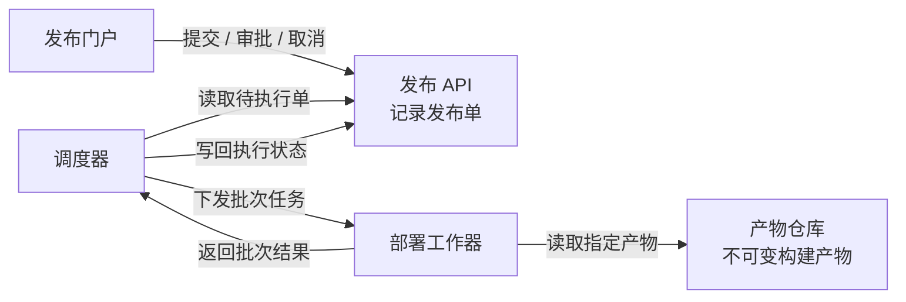
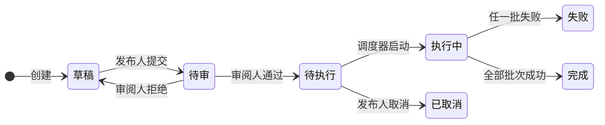

采用组件协作图、发布状态图和批次执行伪代码。两张图横向布局，宽度随文档适配；批次细节单独展开，避免状态图过长。

### 1．各部分怎样协作



**每个发布单关联且仅关联一个不可变构建产物；同一产物可供多个发布单使用。** 工作器只返回批次结果，调度器据此更新发布状态。

### 2．发布状态怎样演变



**执行中不能取消。** 尚有批次时，本批成功后仍处于执行中，才推进下一批；任一批失败即停止后续批次，已成功批次不自动回滚。

### 3．逐批执行与重复结果处理

```text
开始执行(发布单)
  仅接受“待执行”的发布单
  先将发布状态改为“执行中”
  再向工作器下发第一批服务部署任务

收到批次结果(发布单, 批次, 结果)
  如果该批结果已经记录
    忽略重复结果
    返回，不再次推进批次

  记录该批结果

  如果本批失败
    将发布状态改为“失败”
    停止后续批次
    已成功批次不自动回滚
    返回

  如果还有下一批
    保持“执行中”
    向工作器下发下一批任务
  否则
    将发布状态改为“完成”
```

### 4．审批约束落在哪里

门户向 API 发起操作。判断一次审批是否允许，需要同时看**操作者角色、发布单状态和该单提交人**。

| 操作者 | 允许的操作 | 必须满足的约束 |
|---|---|---|
| 发布人 | 提交、取消 | 草稿可提交；仅待执行可取消 |
| 审阅人 | 审批通过、拒绝 | 仅待审；操作者不能是该单提交人 |
| 调度器 | 推进执行状态 | 只执行待执行单，按批次结果推进 |

一个人可以同时拥有发布人和审阅人角色，但**仍不能审批自己提交的发布单**。角色并存不解除同单限制。

数据库、消息队列、通知、超时、自动重试及失败后恢复方案均未提供，以上不作补充假设。