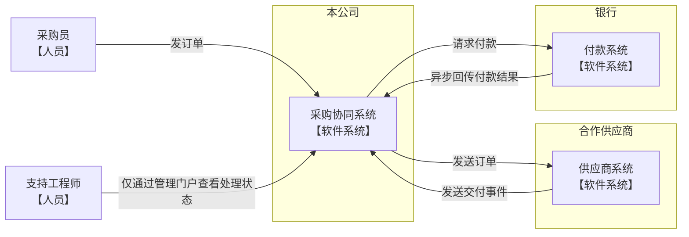
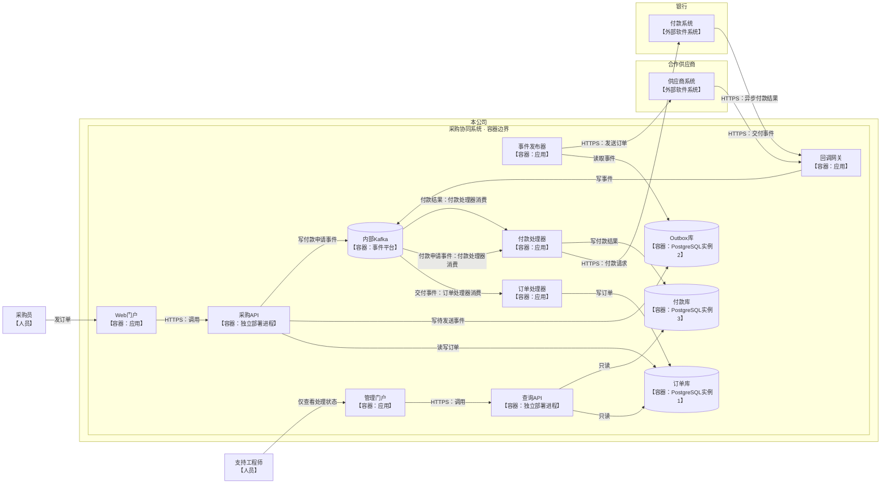

选择两张 C4 视图：**C1 系统上下文图**面向业务负责人，**C2 容器图**面向工程师。均采用文档宽度、自适应高度；以下 Mermaid 块可编辑。

### C1 · 系统与组织边界

此视图把采购协同系统作为整体，展示跨组织通信；不展开内部运行单元。

### C2 · 本公司系统内部运行单元与关键通信

C4 中的“容器”指独立运行的应用或数据存储，不特指 Docker。系统边界内均为容器级元素；供应商与银行仍以外部系统表示，不展开其内部结构。箭头表示调用、写入或事件传递方向；消费箭头从 Kafka 指向消费者。

三座 PostgreSQL 数据库是**三个独立实例**；采购 API 与查询 API 是**两个独立部署进程**。此处不增加组件级视图，也不补充未规定的协议、Kafka 主题或其他运行单元。