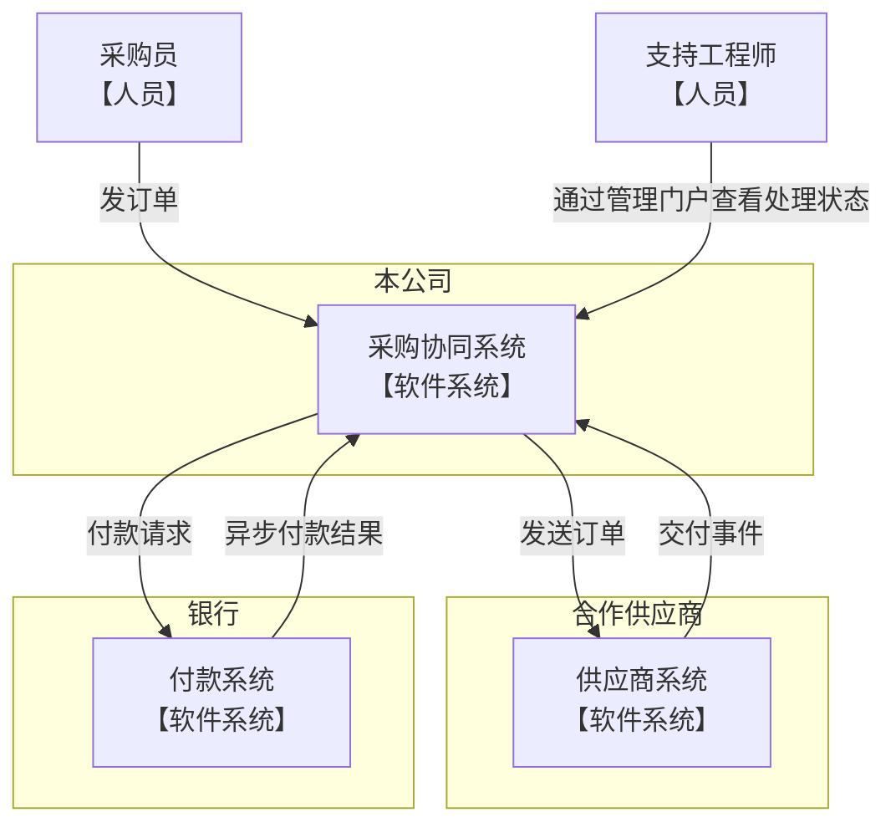
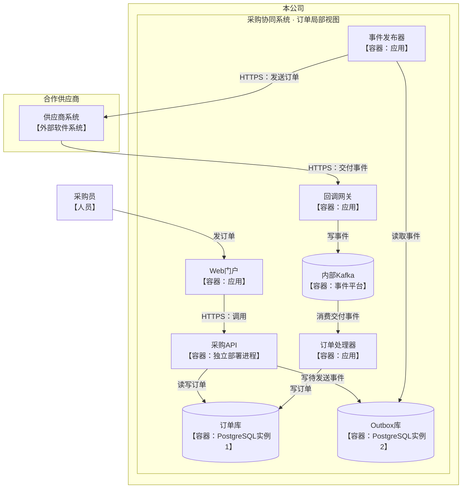
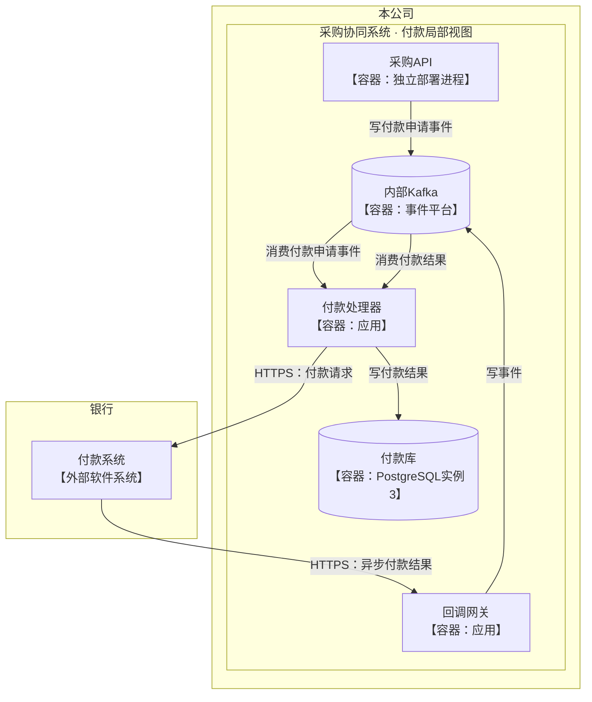
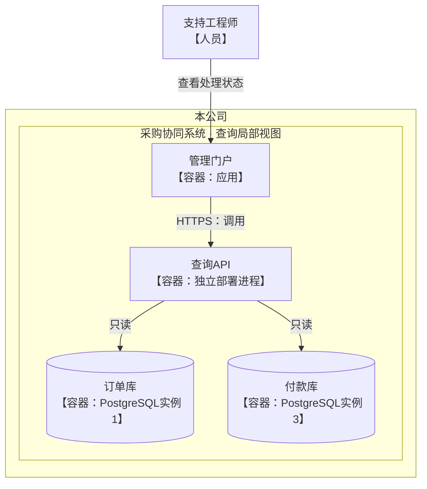

采用 **C1 系统上下文图 + C2 容器图的三个局部视图**，均为文档宽度、自适应高度。将订单、付款、状态查询分别展开，改善上一版标签重叠与容器图文字过小的问题。各局部视图中的同名节点表示同一个运行单元。

### C1 · 系统与组织边界

面向业务负责人：本公司、合作供应商、银行各自拥有自己的系统。

### C2 · 订单发送与交付处理

面向工程师：采购 API 写入订单与待发送事件；事件发布器读取 Outbox，向供应商发送订单。交付事件经回调网关、Kafka 到达订单处理器。

### C2 · 付款申请与异步结果

采购 API 向 Kafka 写付款申请事件；付款处理器消费申请并调用银行。银行异步回传结果，经回调网关与 Kafka 交给付款处理器写入付款库。

### C2 · 处理状态查询

支持工程师只通过管理门户查看处理状态；查询 API 只读订单库与付款库。

C2 中的“容器”表示独立运行的应用或数据存储。**订单库、Outbox 库、付款库是三个独立 PostgreSQL 实例；采购 API 与查询 API 是两个独立部署进程。**读取箭头由读取方指向数据库；Kafka 箭头指向消费者。供应商与银行保留在系统级，未展开其内部容器。