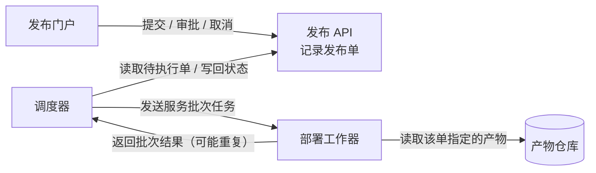
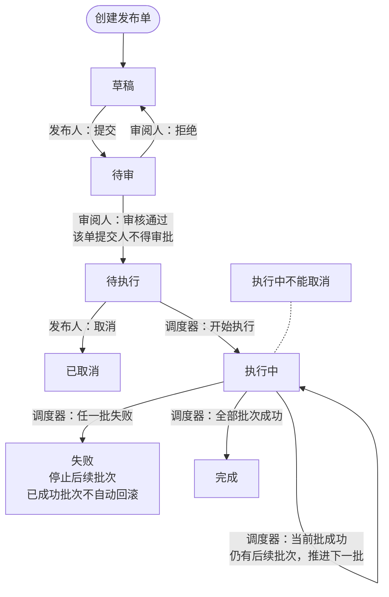
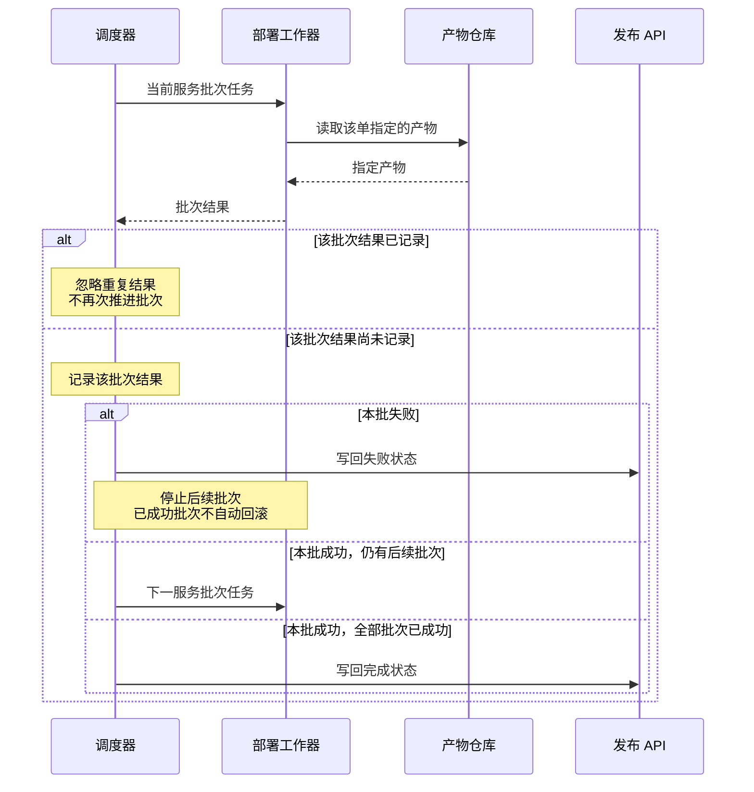

采用三个视图：组件协作、发布状态、批次结果处理，另附权限表。使用可编辑 Mermaid，宽度随容器自适应，建议阅读宽度约 1000 px。

### 1．各部分怎样协作

每个发布单**关联且仅关联一个不可变构建产物**；同一产物可供多个发布单使用。

### 2．发布状态与异常

箭头标明触发动作及负责角色；审批资格约束落在“待审 → 待执行”的审核通过动作上。

调度器只从**待执行**单开始执行，并先将其改为**执行中**。批次按顺序部署，每批成功才推进下一批。

### 3．批次结果怎样影响执行

以下展开执行中的结果处理；重复结果不会再次触发批次推进。

### 审批与操作权限

| 身份 | 允许的动作 | 重要约束 |
|---|---|---|
| 发布人 | 提交、取消 | 取消仅适用于待执行单；执行中不能取消 |
| 审阅人 | 审批：通过或拒绝 | 同一单的提交人不能审批该单 |
| 调度器 | 推进执行状态 | 只执行待执行单，根据批次结果推进或停止 |

一个人可以同时拥有发布人和审阅人角色，但仍受**同单提交人不得审批**的限制。该限制针对具体发布单，拥有审阅人角色并不能绕过它；具体校验实现位置未提供。

未提供数据库、消息队列、通知、超时、自动重试或失败后恢复方案，以上视图不补设这些机制。