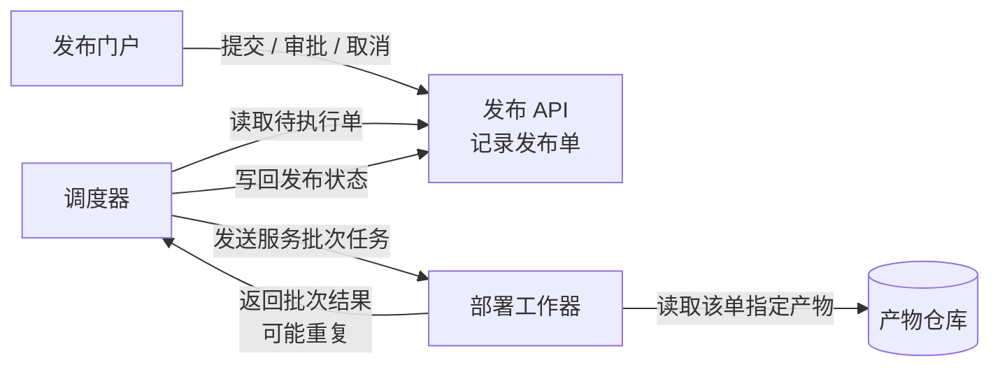
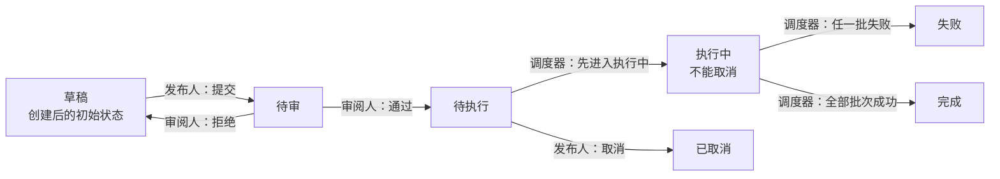
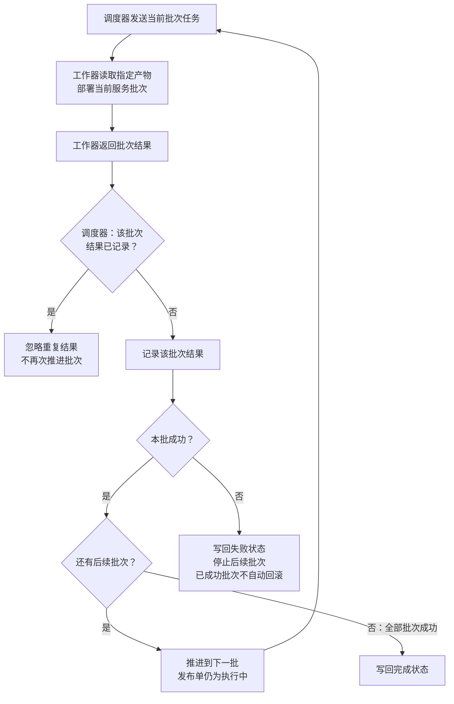

采用三个视图：组件协作、发布状态、批次处理，配一张权限表。图宽自适应，建议阅读宽度约 1000–1200 px。本版将批次细节集中到第三图，缩短状态图；同单提交人禁审约束同时适用于通过和拒绝。

### 1．各部分怎样协作

每个发布单**关联且仅关联一个不可变构建产物**；同一产物可以被多个发布单使用。

### 2．发布状态怎样演变

创建后即为草稿。箭头标明操作及负责角色，批次处理见第三图。

**审批约束作用于待审单的通过、拒绝两个动作：该单提交人均不得执行。** 具体由哪个组件校验，已提供信息未说明。

### 3．批次推进、失败与重复结果

调度器只执行待执行单。进入执行中后，按服务批次逐批部署；下面展开执行中的处理逻辑。

重复结果也走同一个“是否已记录”判断。忽略该次重复返回，不改变已有批次推进结果。

### 操作权限与审批资格

| 身份 | 允许的动作 | 约束 |
|---|---|---|
| 发布人 | 提交、取消 | 草稿可提交；待执行可取消；执行中不能取消 |
| 审阅人 | 审批通过、拒绝 | 仅审批待审单；不能审批自己提交的同一单 |
| 调度器 | 推进执行状态 | 仅从待执行开始；依据批次结果推进、失败或完成 |

一个人可以同时拥有发布人和审阅人角色，但**双角色不能绕过同单提交人禁审规则**。

未提供数据库、消息队列、通知、超时、自动重试或失败后恢复方案，图中不补设这些机制。