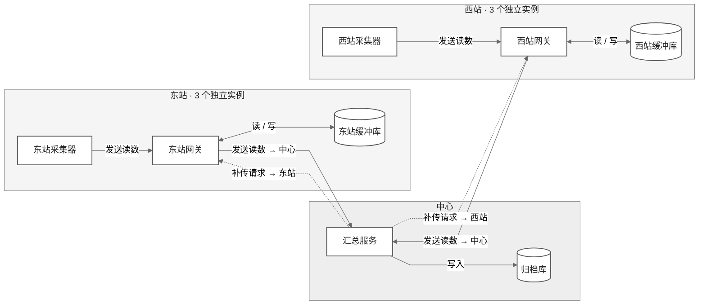

采用站点分区架构图，建议画布约 **1100 × 650 px**。实线表示读数或库读写，虚线表示反向的补传请求；各节点均为独立实例。

```mermaid
%%{init: {"theme":"neutral","themeVariables":{"fontFamily":"system-ui, sans-serif"},"flowchart":{"curve":"linear"}}}%%
flowchart LR
    subgraph EAST["东站 · 3 个独立实例"]
        direction TB
        EC["东站采集器"]
        EG["东站网关"]
        EB[("东站缓冲库")]
        EC -->|"发送读数"| EG
        EG <-->|"读 / 写"| EB
    end

    subgraph CENTER["中心"]
        direction TB
        S["汇总服务"]
        A[("归档库")]
        S -->|"写入"| A
    end

    subgraph WEST["西站 · 3 个独立实例"]
        direction TB
        WC["西站采集器"]
        WG["西站网关"]
        WB[("西站缓冲库")]
        WC -->|"发送读数"| WG
        WG <-->|"读 / 写"| WB
    end

    EG -->|"发送读数 → 中心"| S
    S -.->|"补传请求 → 东站"| EG
    WG -->|"发送读数 → 中心"| S
    S -.->|"补传请求 → 西站"| WG

    classDef instance fill:#ffffff,stroke:#555555,color:#222222,stroke-width:1.5px;
    class EC,EG,EB,WC,WG,WB,S,A instance;
    style EAST fill:#f5f5f5,stroke:#888888,color:#222222
    style WEST fill:#f5f5f5,stroke:#888888,color:#222222
    style CENTER fill:#eeeeee,stroke:#888888,color:#222222
```

传输协议、认证方式、是否采用消息队列均待定，图中不作假设。