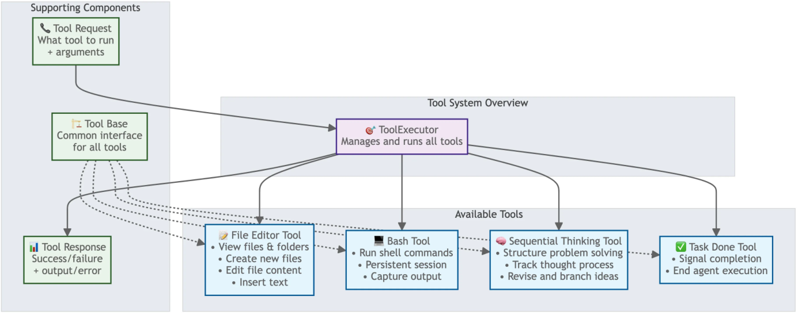
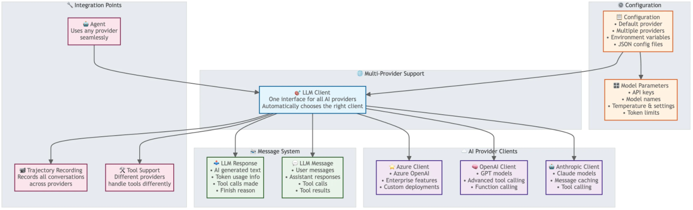
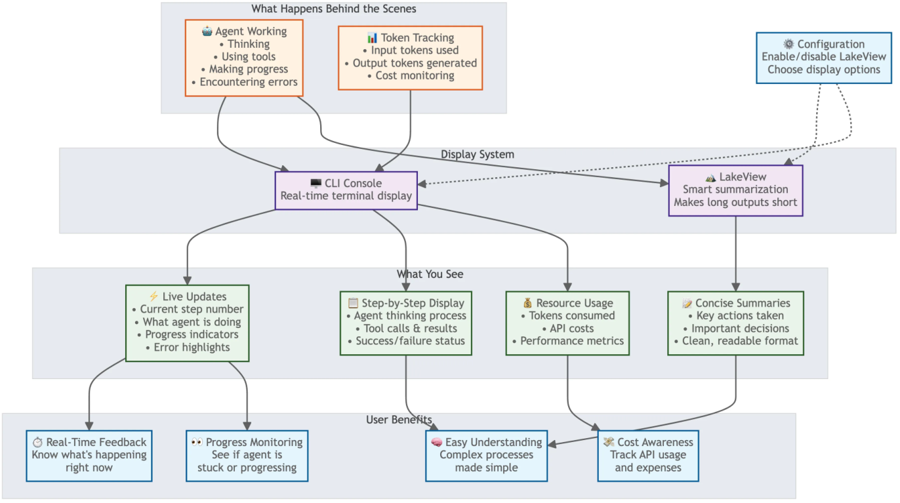
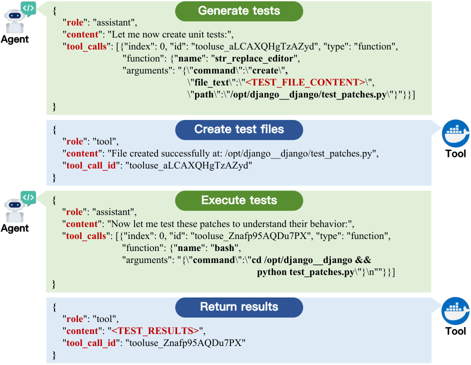
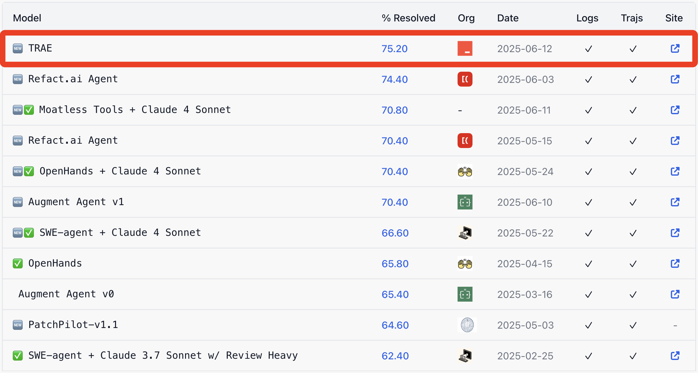

# 归档图片

下列为网页中可公开获取的图片；文件名对应来源 URL 的哈希。未保存的资源见资料库 image-downloads.json。

## 图片 1

[图片来源](https://arxiv.org/static/base/1.0.1/images/icons/smileybones-small.svg)

## 图片 2

[图片来源](https://arxiv.org/html/2507.23370v1/trae_overview.png)

## 图片 3

[图片来源](https://arxiv.org/html/2507.23370v1/tool.png)

## 图片 4

[图片来源](https://arxiv.org/html/2507.23370v1/multi-llm.png)

## 图片 5

[图片来源](https://arxiv.org/html/2507.23370v1/trajectory.png)

## 图片 6

[图片来源](https://arxiv.org/html/2507.23370v1/tool_use.png)

## 图片 7

[图片来源](https://arxiv.org/html/2507.23370v1/figs/trae_agent_top1.png)

