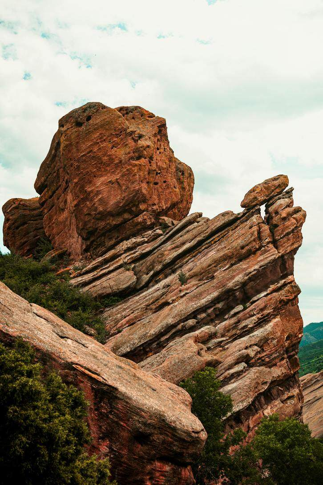

# 归档图片

下列为网页中可公开获取的图片；文件名对应来源 URL 的哈希。未保存的资源见资料库 image-downloads.json。

## 图片 1

[图片来源](https://static001.infoq.cn/resource/image/ec/ac/ecd1yya366d0e152243ee0053a42fdac.jpg?x-oss-process=image/resize,w_726)

## 图片 2

[图片来源](https://static001.geekbang.org/infoq/e7/e700953a7c01d330b599f13b667ee493.jpeg)

## 图片 3

[图片来源](https://static001.infoq.cn/resource/image/55/38/55cd81623e36f5ab7a7db74d60b74838.png)

## 图片 4

[图片来源](https://static001.infoq.cn/resource/image/95/13/95fe851c02c86120e9037eada6a36d13.png)

## 图片 5

[图片来源](https://static001.infoq.cn/resource/image/2a/3e/2aa440b6d94e94f64c508f16da38933e.png)

## 图片 6

[图片来源](https://static001.infoq.cn/resource/image/4e/1e/4e737ce82bc7c8a1c2f2307bcea9a11e.png)

