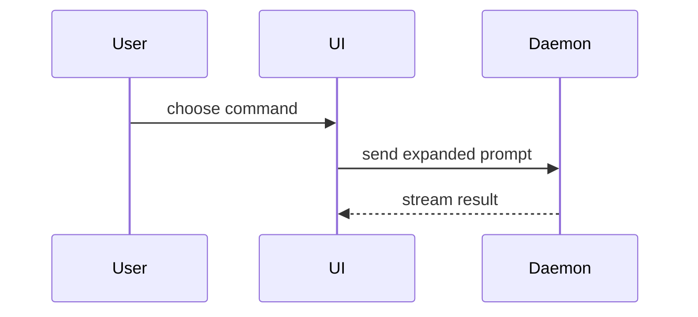

# 用视觉表达帮助理解

目标是把当前内容表达清楚。只处理表达方式，不开展内容研究、作领域决策或管理工作流程。以下规则补充 show-me 原文；有冲突时以本地规则为准。上游正文完整保留，便于核对和更新。

## 本地规则

1. **选最小而充分的视图。** 按当前问题、读者和内容选择表达方式，不要求用户指定图种。省去无关信息，保留理解所需的条件和细节；复杂内容可分为总览与局部视图。文字简短，沿用对话语言和原有术语。按需读取 [视图选择指引](references/view-guide.md)。
2. **忠实表达原意。** 主体、关系、方向、顺序、数量和条件须与提供的内容一致；保留原文的假设、建议和未知，不画成已确认事实。不为画完整图补造关系、执行者、原因或保证。歧义影响理解时保留未知或请求必要澄清。
3. **检查可读性。** 标签、分组和箭头说明关系，不能只靠颜色。图文及各层视图保持术语一致；正文补充图不适合承载的细节，不重复逐项读图。节点过密时拆分，不把长文塞进节点。图形约定见 [示例](references/diagram-patterns.md)。
4. **检查并交付。** 有工具时检查语法、渲染和显示；未完成的检查如实说明，普通文本、伪代码和 diff 无需渲染提示。默认在会话中展示，按调用者要求输出文件或保存可编辑源，不制定保存策略。上游打开 HTML 的步骤仅在环境支持且任务授权允许时执行，否则交付文件位置与查看方式。

## 使用绘图能力

可按需使用环境中可调用的 mermaid-diagrams 或其他绘图能力生成、校验或渲染；没有时直接给出合适的视图，不要求安装特定工具。委托时保留内容、关键条件、假设及输出要求，拿回结果后检查表达是否忠实。完成视图后返回当前任务，不推进它所属的研究、设计、决策或验证流程。

## show-me 上游正文（完整保留）

Help the user understand the current topic of conversation visually. Skip the preamble and keep prose brief. Pick the smallest view that makes the key point clear.

- Show logic or an algorithm as pseudocode:

```text
on(save)
  if content is unchanged
    return cached result
  write new content
  return fresh result
```

- Show runtime control flow as a call tree:

```text
submitForm
  createSession
    persistPrompt
    launchAgent
  navigateToSession
```

- Show UI structure as a component tree, including state and module boundaries that matter:

```tsx
<SessionPage> (apps/example/src/routes/session.tsx)
  useSessionEvents()
  <SessionToolbar>
    <RunSkillButton> (packages/ui)
```

- Show file responsibility or a broad refactor as a shallow file tree:

```text
src/
├── commands/       # parses user actions
├── sessions/       # owns session state
└── transport/      # sends API requests
```

- Show component interaction, control flow, or data flow with Mermaid:



- Use `diff` when the point is what changes and the surrounding shape already exists. Match the diff shape to the topic.

For a component change:

```diff
 <SessionPage>
   useSessionEvents()
   <SessionToolbar>
+    <RunSkillButton />
   <SessionTimeline>
+    <SkillResultCard />
```

For a file-layout change:

```diff
 src/
 ├── commands/
+│   └── show-me.ts       # expands the slash command
 ├── sessions/
-└── transport.ts
+└── transport/
+    ├── client.ts
+    └── stream.ts
```

For a call-tree or call-stack change:

```diff
 submitForm
   createSession
     persistPrompt
+    expandSkillMention
     launchAgent
-  navigateToSession
+  navigateToSession
+    subscribeToEvents
```

For a state or control-flow change:

```diff
 on(save)
-  write content
+  if content is unchanged
+    return cached result
+  write new content
+  invalidate cache
```

- Show the whole block when most of it is new, when omitted context would hide ownership or order, or when the user needs a copyable target shape:

```ts
function expandSkill(command: string): string {
  const skillName = command.slice(1)
  return `use the ${skillName} skill`
}
```

- For a visual UI, layout, state comparison, or concept too dense for Mermaid, write one focused HTML file — a diagram, an infographic, or a short slide deck, whichever fits the point. Match the product's colors, type, spacing, and components; use real labels and data; support desktop and mobile. Then open it for the user:

```
Bash(open path/to/show-me-{description}.html)
```

### guidance

Place each visual next to the short text it supports. Keep only the calls, files, props, states, and boundaries needed to answer the user's current question or the options to resolve the current discussion point.

You may use one of these, you may use several, it is unlikely you will use all of them. Use your judgement and don't overwhelm the user.
