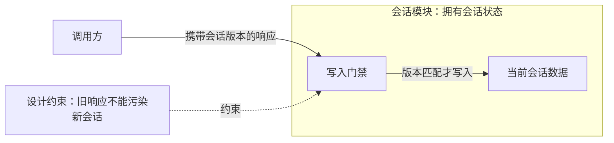
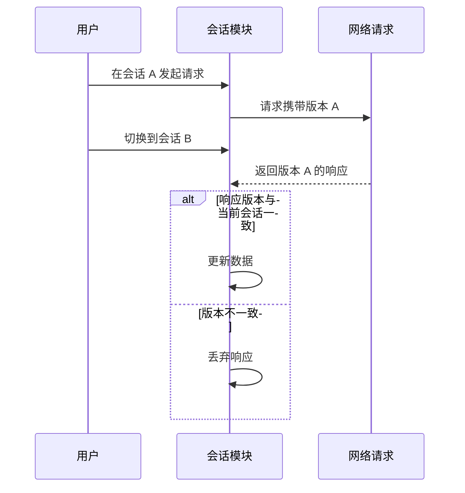

# 图形约定与示例

这些图只示范表达方式；实际画图时使用当前内容给出的主体、关系和条件。

## 边界与所有权

虚线含义必须由标签说明；不能默认所有虚线都表示假设。保留内容原有的确认状态。

## 时序中的竞争

这是候选设计，不能据此断言某个真实系统已具备门禁。

## 大图拆分

先用总览呈现职责和边界，复杂时序或状态另画局部图。总览引用局部图，局部图沿用总览术语。每张图解释一个问题，避免展开不相关的实现细节。

离线 HTML 优先内嵌 SVG 和必要样式。使用 CDN 时明确外部依赖，不称其为完全离线自包含文件。
