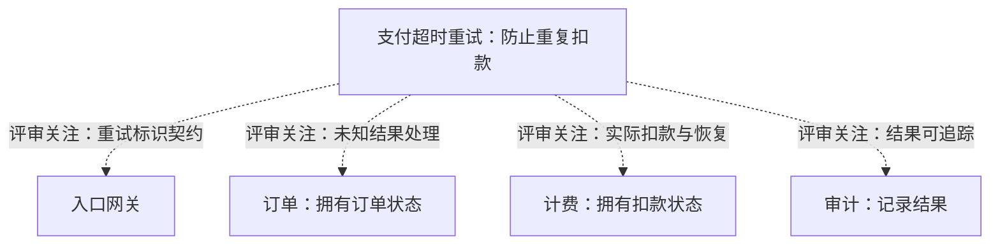

# 0.3.2 候选：表达目标

此文件保留实验设计与对照入口；当前默认Skill使用0.3.0，不加载这里的实验要求。

以 0.3.0 为骨架，吸收 0.3.1 的关键批注思路；去掉“图独立解释主要判断”的强要求。主文件仍保留四条本地规则，详细指引按需加载。完整 show-me 正文保持不变。

以下是维护者人工编写的目标表达示例，**不是 Skill 独立生成的测试结果，也不用于证明版本优劣**。

## 05-scope：职责已知，缺幂等资料

输入已确认订单拥有订单状态、计费拥有扣款状态、审计记录结果；要求支付超时可重试，防止重复扣款。输入没有给出调用链，也没有现成幂等设计资料。

虚线表示评审关注，不是模块调用链。先查现有重试标识、去重和恢复契约；缺资料不等于缺实现。已有机制则补查并发重试、外部已扣款但本地提交前崩溃的验证证据；确认缺口后再作设计决策。本地记录唯一不能直接证明外部只扣一次。

图未渲染验证。审计只被描述为记录结果，未赋予其状态所有权。下一步用短文说明，不另附一张待办流程图。

## 尚未证明的部分

本例展示维护者希望的表达方式，不能证明 Agent 会稳定这样输出。0.3.1 的职责错误保留在原始评估中；新增核对要求不能视为错误已消除。编写本例时0.3.2尚未独立回归，之后已完成下列扩展比较；用户阅读测试和客户端自动调用仍未验证。

后续验证应覆盖缺资料与已有设计两类任务，并加入不同领域的问题，检查未经依据扩展职责、图文重复、关键条件遗漏和过密图。保留未改写的原始回答，比较准确性与实际阅读效果，不以篇幅、语法通过或版本号代替质量判断。

## 新增场景的独立生成示例

以下链接来自新会话生成的原始回答，不是维护者人工示例。每题对照show-me、mermaid-diagrams、0.3.0、0.3.1和0.3.2候选版；完整方法和第二轮输出见[扩展比较报告](../../evaluations/visual-skills/2026-10-09-expanded/README.md)。

- [故障分析：已知时间线与候选因果](../../evaluations/visual-skills/2026-10-09-expanded/new-cases-comparison.md#07-incident)
- [方案取舍：延迟、容量与维护约束](../../evaluations/visual-skills/2026-10-09-expanded/new-cases-comparison.md#08-tradeoff)
- [领域关系：数量关系与价格快照](../../evaluations/visual-skills/2026-10-09-expanded/new-cases-comparison.md#09-domain)
- [滚动发布：混合版本与回滚风险](../../evaluations/visual-skills/2026-10-09-expanded/new-cases-comparison.md#10-rollout)

原始回答的错误也保留：其中两份领域关系图解析失败，修正副本单独提供，不替换原文。
