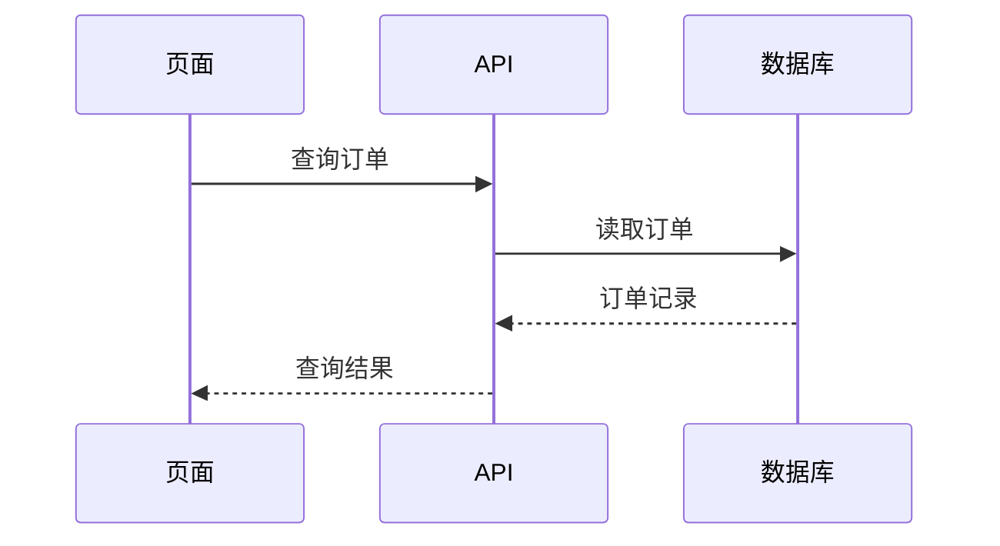

# 视觉解释

帮助读者理解当前话题。上下文足够时直接展示，省去选图前言，短说明紧邻视图。选能把关键点讲清的最小表达，复杂内容保留必要深度。

## 默认：就地展示

利用已有材料，只展示与当前问题有关的调用、文件、状态、参数和边界。只有歧义会改变含义时才追问。下面是表达示例，名称和行为按实际材料替换；每次选择有用的形式即可。

**逻辑或算法：伪代码。** 面向开发者可直接展示判断与动作；分支本身是重点或读者不熟悉代码时，用决策图。

```text
on(load)
  if cached item is still valid
    return cached item
  fetch current item
  update cache
  return current item
```

**运行时控制流：调用树。** 缩进表达调用归属，同层顺序按材料表达。

```text
publish
  prepareDocument
    validate
    render
  saveDocument
```

**UI 结构：组件树。** 标出与问题有关的状态、props 和模块边界。

```text
<EditorPage> (src/EditorPage.tsx)
  useDraft()                  # 状态归页面所有
  <Editor value={draft} />
  <SaveButton onSave={save} /> (packages/ui)
```

**文件职责或整体重构：浅层目录树。** 在路径旁说明职责。

```text
src/
├── api/       # 接收请求
├── jobs/      # 管理任务状态
└── storage/   # 读写任务记录
```

**组件交互、控制流或数据流：关系图或 Mermaid。** 跨参与者的先后顺序重要时用时序图，例如：



**已有上下文中的变化：diff。** diff 可表达代码，也可表达组件、目录、调用树和状态逻辑；沿用原有结构，使新增、删除和移动的位置清楚。

组件变化：

```diff
 <EditorPage>
   <Editor />
+  <SaveButton />
```

文件布局变化：

```diff
 src/
-└── storage.ts
+└── storage/
+    ├── reader.ts
+    └── writer.ts
```

调用顺序变化：

```diff
 submit
   validate
+  normalize
   send
```

状态或控制逻辑变化：

```diff
 on(cancel)
-  remove job
+  if job is running
+    request stop
+  else
+    remove job
```

**需要完整目标时：给完整块。** 大部分内容是新的、省略会隐藏归属或顺序，或用户需要可复制的结果时，给完整代码/结构块。结构示意与可运行代码明确区分。例如完整函数：

```python
def display_name(name: str) -> str:
    return name.strip() or "未命名"
```

**一个视图已回答问题就交付。** 文本树、伪代码、diff、代码块和表格可以独立完成解释；它们只需核对含义，无需加载渲染或工具指引，也无需报告渲染状态。

## 按需展开，并保留含义

- 根据问题补充表达：对象的状态与转换用状态图，实体及基数用概念关系图或 ER 图，属性或权限比较用表格，数值与时间用对应的数据图。局部 diff 难以表达的关系重组可用前后图。
- 以读者的问题决定深度。只有不同问题、不同层级或难以在一处读清的细节，才需要额外视图；复杂内容可先给总览，再展开相关部分。每个视图承担明确用途，同一对象跨图使用一致名称。
- 精简先去掉装饰、重复和无关细节；保留决定结论的主体、关系、条件、数量和边界。用实际字号、追线难度和阅读路径判断是否拆图，而非固定节点或面板数。
- 已知事实、提议和未知应可区分。图中的调用、先后、因果和实现位置都需要材料支持；材料未给出的内容保持未知。
- 关键约束放在读者作判断的位置：转换线上、节点旁或对应表格单元。总览可以省略细节，但应指向承载这些细节的视图或说明。

当分支条件、状态/权限、重复事件、消息顺序与角色交接、架构边界、实体基数或数据刻度决定解释是否正确时，读取 [语义要点](references/semantics.md) 的对应部分。其余任务直接核对当前材料。

## 再选载体与生成方式

尊重用户指定的格式和交付位置。表达形式与文件格式分开选择：同一状态图既可嵌入文档，也可放进 HTML。

- 默认在当前对话或目标文档内展示。常见关系、状态和时序可用 Mermaid；需要语法指导时才查对应资料。
- 视觉 UI、布局、状态对比，或 Mermaid 难以读清且需要自由排版的概念，可直接做一个聚焦问题的 HTML 文件；按用途选图解、信息图或短幻灯片。独立图也可用 SVG。页面组织、交互、分享或导出是选择载体的依据，复杂程度本身不决定格式。
- 页面样式以用户明确要求为先，其次沿用已有产品的颜色、字体、间距和组件；缺少这些依据时使用中性样式与系统字体。使用真实标签与数据，兼顾桌面和窄屏。交互应帮助比较、追踪或探索，静态总览应能表达核心结论。
- 重复布局可交给已有的渲染器，模型负责内容和关系。先确认组件能忠实表达所需语义；不适合时换一种实现，保留必要条件和数据尺度。
- 精确数据分析或出版图表优先用标准绘图库，保留数据与生成源。

已选择 HTML 且需要现成排版，或需要专用 skill 补足语法与布局时，读取 [能力接入](references/integrations.md)，按其中的默认后端与适用边界执行。其余任务直接完成。

## 核对与交付

对照材料检查决定结论的事实与关系。实际图形按 [渲染与交付](references/rendering.md) 的对应部分检查画面；语法通过只能证明可解析。修复影响理解的问题后查看最终版本，画面已清楚即可交付。

行内视图直接展示，文件产物提供可访问链接与可编辑源。宿主支持且符合用户偏好时，用其预览或打开能力展示 HTML；无图形界面时交付链接。说明只补充读者理解或使用结果所需的信息；无法检查实际图形时简短说明这一限制。

以后设计实测时可参考 [行为验收场景](references/evaluation.md)；普通解释任务无需加载。
